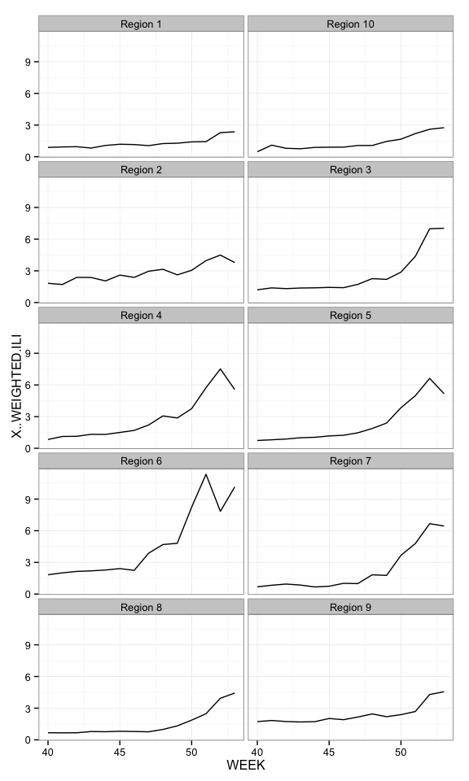

The CDC's FluView is a Flash portal and the only way to get flu season data is to use GUI controls, making it tedious to retrieve updates. This package uses the same API the portal does to programmatically retrieve data.

The following functions are implemented:

-   `get_flu_data` : retrieve flu data

The following data sets are included:

### News

-   Version 0.1 released

### Installation

``` r
devtools::install_github("hrbrmstr/cdcfluview")
```

### Usage

``` r
library(cdcfluview)
```

    ## Loading required package: httr

``` r
library(ggplot2)

# current verison
packageVersion("cdcfluview")
```

    ## [1] '0.1'

``` r
flu <- get_flu_data("hhs", sub_region=1:10, "ilinet", years=2014)

dplyr::glimpse(flu)
```

    ## Variables:
    ## $ REGION.TYPE       (chr) "HHS Regions", "HHS Regions", "HHS Regions", "HHS Regions", "HHS Regions", "HHS Regions",...
    ## $ REGION            (chr) "Region 1", "Region 2", "Region 3", "Region 4", "Region 5", "Region 6", "Region 7", "Regi...
    ## $ YEAR              (int) 2014, 2014, 2014, 2014, 2014, 2014, 2014, 2014, 2014, 2014, 2014, 2014, 2014, 2014, 2014,...
    ## $ WEEK              (int) 40, 40, 40, 40, 40, 40, 40, 40, 40, 40, 41, 41, 41, 41, 41, 41, 41, 41, 41, 41, 42, 42, 4...
    ## $ ILITOTAL          (int) 352, 2239, 1689, 1173, 1083, 1843, 217, 348, 1201, 61, 386, 2108, 1735, 1501, 1117, 2163,...
    ## $ TOTAL.PATIENTS    (int) 50896, 134096, 128589, 127408, 106896, 103717, 50032, 36991, 85312, 10868, 50711, 129275,...
    ## $ NUM..OF.PROVIDERS (int) 142, 253, 242, 299, 266, 236, 83, 117, 227, 53, 148, 242, 238, 305, 277, 246, 83, 114, 24...
    ## $ X..WEIGHTED.ILI   (dbl) 0.8825503, 1.8170454, 1.2055377, 0.8357537, 0.7384711, 1.8292926, 0.6895413, 0.6733888, 1...
    ## $ X.UNWEIGHTED.ILI  (dbl) 0.6916064, 1.6696993, 1.3134872, 0.9206643, 1.0131343, 1.7769507, 0.4337224, 0.9407694, 1...
    ## $ AGE.0.4           (int) 101, 872, 395, 330, 358, 465, 50, 82, 261, 22, 109, 837, 404, 353, 339, 560, 57, 58, 281,...
    ## $ AGE.5.24          (int) 185, 758, 627, 530, 400, 710, 97, 152, 532, 30, 199, 675, 664, 763, 443, 807, 124, 146, 5...
    ## $ AGE.25.64         (lgl) NA, NA, NA, NA, NA, NA, NA, NA, NA, NA, NA, NA, NA, NA, NA, NA, NA, NA, NA, NA, NA, NA, N...
    ## $ AGE.25.49         (int) 44, 351, 451, 187, 181, 469, 42, 87, 202, 7, 37, 338, 461, 248, 182, 509, 54, 87, 216, 20...
    ## $ AGE.50.64         (int) 13, 150, 126, 80, 80, 121, 15, 19, 101, 1, 24, 148, 131, 73, 105, 187, 17, 23, 117, 10, 2...
    ## $ AGE.65            (int) 9, 108, 90, 46, 64, 78, 13, 8, 105, 1, 17, 110, 75, 64, 48, 100, 11, 12, 97, 3, 8, 108, 8...

``` r
gg <- ggplot(flu, aes(x=WEEK, y=X..WEIGHTED.ILI, group=REGION))
gg <- gg + geom_line()
gg <- gg + facet_wrap(~REGION, ncol=2)
gg <- gg + theme_bw()
```



### Test Results

``` r
library(cdcfluview)
library(testthat)

date()
```

    ## [1] "Sat Jan 10 20:25:05 2015"

``` r
test_dir("tests/")
```

    ## basic functionality :
