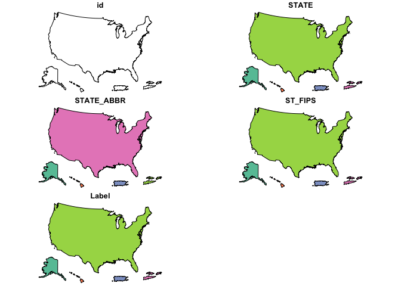

[](https://cran.r-project.org/package=cdcfluview)
[](https://travis-ci.org/hrbrmstr/cdcfluview)
[](https://codecov.io/github/hrbrmstr/cdcfluview?branch=master)

I M P O R T A N T
=================

The CDC migrated to a new non-Flash portal and back-end APIs changed.
This is a complete reimagining of the package and — as such — all your
code is going to break. Please use GitHub issues to identify previous
API functionality you would like ported over. There’s a [release
candidate for
0.5.2](https://github.com/hrbrmstr/cdcfluview/releases/tag/v0.5.2) which
uses the old API but it likely to break in the near future given the
changes to the hidden API. You can do what with
`devtools::install_github("hrbrmstr/cdcfluview", ref="58c172b")`.

All folks providing feedback, code or suggestions will be added to the
DESCRIPTION file. Please include how you would prefer to be cited in any
issues you file.

If there’s a particular data set from
<https://www.cdc.gov/flu/weekly/fluviewinteractive.htm> that you want
and that isn’t in the package, please file it as an issue and be as
specific as you can (screen shot if possible).

:mask: cdcfluview
=================

Retrieve U.S. Flu Season Data from the CDC FluView Portal

Description
-----------

The U.S. Centers for Disease Control (CDC) maintains a portal
<http://gis.cdc.gov/grasp/fluview/fluportaldashboard.html> for accessing
state, regional and national influenza statistics as well as Mortality
Surveillance Data. The Flash interface makes it difficult and
time-consuming to select and retrieve influenza data. This package
provides functions to access the data provided by the portal’s
underlying API.

What’s Inside The Tin
---------------------

The following functions are implemented:

-   `agd_ipt`: Age Group Distribution of Influenza Positive Tests
    Reported by Public Health Laboratories
-   `cdc_coverage_map`: Retrieve CDC U.S. Coverage Map
-   `geographic_spread`: State and Territorial Epidemiologists Reports
    of Geographic Spread of Influenza
-   `hospitalizations`: Laboratory-Confirmed Influenza Hospitalizations
-   `ilinet`: Retrieve ILINet Surveillance Data
-   `ili_weekly_activity_indicators`: Retrieve weekly state-level ILI
    indicators per-state for a given season
-   `pi_mortality`: Pneumonia and Influenza Mortality Surveillance
-   `state_data_providers`: Retrieve metadata about U.S. State CDC
    Provider Data
-   `surveillance_areas`: Retrieve a list of valid sub-regions for each
    surveillance area.
-   `who_nrevss`: Retrieve WHO/NREVSS Surveillance Data

The following data sets are included:

-   `hhs_regions` HHS Region Table (a data frame with 59 rows and 4
    variables)
-   `census_regions` Census Region Table (a data frame with 51 rows and
    2 variables)

Installation
------------

``` r
devtools::install_github("hrbrmstr/cdcfluview")
```

Usage
-----

``` r
library(cdcfluview)
library(tidyverse)

# current verison
packageVersion("cdcfluview")
```

    ## [1] '0.7.0'

### Age Group Distribution of Influenza Positive Tests Reported by Public Health Laboratories

``` r
glimpse(agd_ipt())
```

    ## Observations: 36,144
    ## Variables: 13
    ## $ sea_label         <chr> "1997-98", "1997-98", "1997-98", "1997-98", "1997-98", "1997-98", "1997-98", "1997-98", "...
    ## $ age_label         <chr> "0-4 yr", "0-4 yr", "0-4 yr", "0-4 yr", "0-4 yr", "0-4 yr", "0-4 yr", "0-4 yr", "0-4 yr",...
    ## $ vir_label         <chr> "A (Subtyping not Performed)", "A (Subtyping not Performed)", "A (Subtyping not Performed...
    ## $ count             <int> 0, 1, 0, 0, 0, 0, 0, 3, 0, 6, 0, 1, 1, 2, 11, 8, 18, 26, 22, 19, 2, 5, 2, 1, 4, 0, 0, 0, ...
    ## $ mmwrid            <int> 1866, 1867, 1868, 1869, 1870, 1871, 1872, 1873, 1874, 1875, 1876, 1877, 1878, 1879, 1880,...
    ## $ seasonid          <int> 37, 37, 37, 37, 37, 37, 37, 37, 37, 37, 37, 37, 37, 37, 37, 37, 37, 37, 37, 37, 37, 37, 3...
    ## $ publishyearweekid <int> 2913, 2913, 2913, 2913, 2913, 2913, 2913, 2913, 2913, 2913, 2913, 2913, 2913, 2913, 2913,...
    ## $ sea_description   <chr> "Season 1997-98", "Season 1997-98", "Season 1997-98", "Season 1997-98", "Season 1997-98",...
    ## $ sea_startweek     <int> 1866, 1866, 1866, 1866, 1866, 1866, 1866, 1866, 1866, 1866, 1866, 1866, 1866, 1866, 1866,...
    ## $ sea_endweek       <int> 1918, 1918, 1918, 1918, 1918, 1918, 1918, 1918, 1918, 1918, 1918, 1918, 1918, 1918, 1918,...
    ## $ vir_description   <chr> "A-Unk", "A-Unk", "A-Unk", "A-Unk", "A-Unk", "A-Unk", "A-Unk", "A-Unk", "A-Unk", "A-Unk",...
    ## $ vir_startmmwrid   <int> 1397, 1397, 1397, 1397, 1397, 1397, 1397, 1397, 1397, 1397, 1397, 1397, 1397, 1397, 1397,...
    ## $ vir_endmmwrid     <int> 3131, 3131, 3131, 3131, 3131, 3131, 3131, 3131, 3131, 3131, 3131, 3131, 3131, 3131, 3131,...

### Retrieve CDC U.S. Coverage Map

``` r
plot(cdc_coverage_map())
```



### State and Territorial Epidemiologists Reports of Geographic Spread of Influenza

``` r
glimpse(geographic_spread())
```

    ## Observations: 25,795
    ## Variables: 7
    ## $ statename         <chr> "Alabama", "Alabama", "Alabama", "Alabama", "Alabama", "Alabama", "Alabama", "Alabama", "...
    ## $ url               <chr> "http://adph.org/influenza/", "http://adph.org/influenza/", "http://adph.org/influenza/",...
    ## $ website           <chr> "Influenza Surveillance", "Influenza Surveillance", "Influenza Surveillance", "Influenza ...
    ## $ activity_estimate <chr> "No Activity", "No Activity", "No Activity", "Local Activity", "Sporadic", "Sporadic", "S...
    ## $ weekend           <date> 2003-10-04, 2003-10-11, 2003-10-18, 2003-10-25, 2003-11-01, 2003-11-08, 2003-11-15, 2003...
    ## $ season            <chr> "2003-04", "2003-04", "2003-04", "2003-04", "2003-04", "2003-04", "2003-04", "2003-04", "...
    ## $ weeknumber        <chr> "40", "41", "42", "43", "44", "45", "46", "47", "48", "49", "50", "51", "52", "53", "1", ...

### Laboratory-Confirmed Influenza Hospitalizations

``` r
surveillance_areas()
```

    ##    surveillance_area               region
    ## 1            flusurv       Entire Network
    ## 2                eip           California
    ## 3                eip             Colorado
    ## 4                eip          Connecticut
    ## 5                eip       Entire Network
    ## 6                eip              Georgia
    ## 7                eip             Maryland
    ## 8                eip            Minnesota
    ## 9                eip           New Mexico
    ## 10               eip    New York - Albany
    ## 11               eip New York - Rochester
    ## 12               eip               Oregon
    ## 13               eip            Tennessee
    ## 14              ihsp       Entire Network
    ## 15              ihsp                Idaho
    ## 16              ihsp                 Iowa
    ## 17              ihsp             Michigan
    ## 18              ihsp                 Ohio
    ## 19              ihsp             Oklahoma
    ## 20              ihsp         Rhode Island
    ## 21              ihsp         South Dakota
    ## 22              ihsp                 Utah

``` r
glimpse(hospitalizations("flusurv"))
```

    ## Observations: 1,476
    ## Variables: 20
    ## $ mmwrid            <int> 2545, 2546, 2547, 2548, 2549, 2550, 2551, 2552, 2553, 2554, 2555, 2556, 2557, 2558, 2559,...
    ## $ weeknumber        <int> 40, 41, 42, 43, 44, 45, 46, 47, 48, 49, 50, 51, 52, 1, 2, 3, 4, 5, 6, 7, 8, 9, 10, 11, 12...
    ## $ rate              <dbl> 0.0, 0.0, 0.0, 0.1, 0.1, 0.2, 0.3, 0.3, 0.4, 0.6, 0.8, 1.3, 1.7, 2.2, 2.8, 3.6, 4.4, 5.4,...
    ## $ weeklyrate        <dbl> 0.0, 0.0, 0.0, 0.0, 0.1, 0.0, 0.1, 0.1, 0.1, 0.2, 0.2, 0.4, 0.4, 0.5, 0.5, 0.8, 0.8, 1.0,...
    ## $ age               <int> 3, 3, 3, 3, 3, 3, 3, 3, 3, 3, 3, 3, 3, 3, 3, 3, 3, 3, 3, 3, 3, 3, 3, 3, 3, 3, 3, 3, 3, 3,...
    ## $ season            <int> 50, 50, 50, 50, 50, 50, 50, 50, 50, 50, 50, 50, 50, 50, 50, 50, 50, 50, 50, 50, 50, 50, 5...
    ## $ weekend           <chr> "2010-10-09", "2010-10-16", "2010-10-23", "2010-10-30", "2010-11-06", "2010-11-13", "2010...
    ## $ weekstart         <chr> "2010-10-03", "2010-10-10", "2010-10-17", "2010-10-24", "2010-10-31", "2010-11-07", "2010...
    ## $ year              <int> 2010, 2010, 2010, 2010, 2010, 2010, 2010, 2010, 2010, 2010, 2010, 2010, 2010, 2011, 2011,...
    ## $ yearweek          <int> 201040, 201041, 201042, 201043, 201044, 201045, 201046, 201047, 201048, 201049, 201050, 2...
    ## $ seasonid          <int> 50, 50, 50, 50, 50, 50, 50, 50, 50, 50, 50, 50, 50, 50, 50, 50, 50, 50, 50, 50, 50, 50, 5...
    ## $ weekendlabel      <chr> "Oct 09, 2010", "Oct 16, 2010", "Oct 23, 2010", "Oct 30, 2010", "Nov 06, 2010", "Nov 13, ...
    ## $ weekendlabel2     <chr> "Oct-09-2010", "Oct-16-2010", "Oct-23-2010", "Oct-30-2010", "Nov-06-2010", "Nov-13-2010",...
    ## $ age_label         <chr> "18-49 yr", "18-49 yr", "18-49 yr", "18-49 yr", "18-49 yr", "18-49 yr", "18-49 yr", "18-4...
    ## $ sea_label         <chr> "2010-11", "2010-11", "2010-11", "2010-11", "2010-11", "2010-11", "2010-11", "2010-11", "...
    ## $ sea_description   <chr> "Season 2010-11", "Season 2010-11", "Season 2010-11", "Season 2010-11", "Season 2010-11",...
    ## $ sea_startweek     <int> 2545, 2545, 2545, 2545, 2545, 2545, 2545, 2545, 2545, 2545, 2545, 2545, 2545, 2545, 2545,...
    ## $ sea_endweek       <int> 2596, 2596, 2596, 2596, 2596, 2596, 2596, 2596, 2596, 2596, 2596, 2596, 2596, 2596, 2596,...
    ## $ surveillance_area <chr> "FluSurv-NET", "FluSurv-NET", "FluSurv-NET", "FluSurv-NET", "FluSurv-NET", "FluSurv-NET",...
    ## $ region            <chr> "Entire Network", "Entire Network", "Entire Network", "Entire Network", "Entire Network",...

``` r
glimpse(hospitalizations("eip"))
```

    ## Observations: 2,385
    ## Variables: 20
    ## $ mmwrid            <int> 2545, 2546, 2547, 2548, 2549, 2550, 2551, 2552, 2553, 2554, 2555, 2556, 2557, 2558, 2559,...
    ## $ weeknumber        <int> 40, 41, 42, 43, 44, 45, 46, 47, 48, 49, 50, 51, 52, 1, 2, 3, 4, 5, 6, 7, 8, 9, 10, 11, 12...
    ## $ rate              <dbl> 0.0, 0.0, 0.0, 0.1, 0.1, 0.1, 0.2, 0.3, 0.4, 0.5, 0.8, 1.1, 1.4, 1.9, 2.3, 2.8, 3.6, 4.5,...
    ## $ weeklyrate        <dbl> 0.0, 0.0, 0.0, 0.0, 0.1, 0.0, 0.1, 0.1, 0.1, 0.1, 0.2, 0.4, 0.3, 0.4, 0.4, 0.5, 0.8, 1.0,...
    ## $ age               <int> 3, 3, 3, 3, 3, 3, 3, 3, 3, 3, 3, 3, 3, 3, 3, 3, 3, 3, 3, 3, 3, 3, 3, 3, 3, 3, 3, 3, 3, 3,...
    ## $ season            <int> 50, 50, 50, 50, 50, 50, 50, 50, 50, 50, 50, 50, 50, 50, 50, 50, 50, 50, 50, 50, 50, 50, 5...
    ## $ weekend           <chr> "2010-10-09", "2010-10-16", "2010-10-23", "2010-10-30", "2010-11-06", "2010-11-13", "2010...
    ## $ weekstart         <chr> "2010-10-03", "2010-10-10", "2010-10-17", "2010-10-24", "2010-10-31", "2010-11-07", "2010...
    ## $ year              <int> 2010, 2010, 2010, 2010, 2010, 2010, 2010, 2010, 2010, 2010, 2010, 2010, 2010, 2011, 2011,...
    ## $ yearweek          <int> 201040, 201041, 201042, 201043, 201044, 201045, 201046, 201047, 201048, 201049, 201050, 2...
    ## $ seasonid          <int> 50, 50, 50, 50, 50, 50, 50, 50, 50, 50, 50, 50, 50, 50, 50, 50, 50, 50, 50, 50, 50, 50, 5...
    ## $ weekendlabel      <chr> "Oct 09, 2010", "Oct 16, 2010", "Oct 23, 2010", "Oct 30, 2010", "Nov 06, 2010", "Nov 13, ...
    ## $ weekendlabel2     <chr> "Oct-09-2010", "Oct-16-2010", "Oct-23-2010", "Oct-30-2010", "Nov-06-2010", "Nov-13-2010",...
    ## $ age_label         <chr> "18-49 yr", "18-49 yr", "18-49 yr", "18-49 yr", "18-49 yr", "18-49 yr", "18-49 yr", "18-4...
    ## $ sea_label         <chr> "2010-11", "2010-11", "2010-11", "2010-11", "2010-11", "2010-11", "2010-11", "2010-11", "...
    ## $ sea_description   <chr> "Season 2010-11", "Season 2010-11", "Season 2010-11", "Season 2010-11", "Season 2010-11",...
    ## $ sea_startweek     <int> 2545, 2545, 2545, 2545, 2545, 2545, 2545, 2545, 2545, 2545, 2545, 2545, 2545, 2545, 2545,...
    ## $ sea_endweek       <int> 2596, 2596, 2596, 2596, 2596, 2596, 2596, 2596, 2596, 2596, 2596, 2596, 2596, 2596, 2596,...
    ## $ surveillance_area <chr> "EIP", "EIP", "EIP", "EIP", "EIP", "EIP", "EIP", "EIP", "EIP", "EIP", "EIP", "EIP", "EIP"...
    ## $ region            <chr> "Entire Network", "Entire Network", "Entire Network", "Entire Network", "Entire Network",...

``` r
glimpse(hospitalizations("eip", "Colorado"))
```

    ## Observations: 2,385
    ## Variables: 20
    ## $ mmwrid            <int> 2545, 2546, 2547, 2548, 2549, 2550, 2551, 2552, 2553, 2554, 2555, 2556, 2557, 2558, 2559,...
    ## $ weeknumber        <int> 40, 41, 42, 43, 44, 45, 46, 47, 48, 49, 50, 51, 52, 1, 2, 3, 4, 5, 6, 7, 8, 9, 10, 11, 12...
    ## $ rate              <dbl> 0.0, 0.1, 0.1, 0.1, 0.3, 0.3, 0.4, 0.4, 0.5, 0.6, 0.8, 1.3, 1.8, 2.1, 2.6, 3.4, 4.2, 5.6,...
    ## $ weeklyrate        <dbl> 0.0, 0.1, 0.0, 0.0, 0.2, 0.0, 0.1, 0.1, 0.1, 0.1, 0.2, 0.5, 0.4, 0.4, 0.4, 0.9, 0.8, 1.4,...
    ## $ age               <int> 3, 3, 3, 3, 3, 3, 3, 3, 3, 3, 3, 3, 3, 3, 3, 3, 3, 3, 3, 3, 3, 3, 3, 3, 3, 3, 3, 3, 3, 3,...
    ## $ season            <int> 50, 50, 50, 50, 50, 50, 50, 50, 50, 50, 50, 50, 50, 50, 50, 50, 50, 50, 50, 50, 50, 50, 5...
    ## $ weekend           <chr> "2010-10-09", "2010-10-16", "2010-10-23", "2010-10-30", "2010-11-06", "2010-11-13", "2010...
    ## $ weekstart         <chr> "2010-10-03", "2010-10-10", "2010-10-17", "2010-10-24", "2010-10-31", "2010-11-07", "2010...
    ## $ year              <int> 2010, 2010, 2010, 2010, 2010, 2010, 2010, 2010, 2010, 2010, 2010, 2010, 2010, 2011, 2011,...
    ## $ yearweek          <int> 201040, 201041, 201042, 201043, 201044, 201045, 201046, 201047, 201048, 201049, 201050, 2...
    ## $ seasonid          <int> 50, 50, 50, 50, 50, 50, 50, 50, 50, 50, 50, 50, 50, 50, 50, 50, 50, 50, 50, 50, 50, 50, 5...
    ## $ weekendlabel      <chr> "Oct 09, 2010", "Oct 16, 2010", "Oct 23, 2010", "Oct 30, 2010", "Nov 06, 2010", "Nov 13, ...
    ## $ weekendlabel2     <chr> "Oct-09-2010", "Oct-16-2010", "Oct-23-2010", "Oct-30-2010", "Nov-06-2010", "Nov-13-2010",...
    ## $ age_label         <chr> "18-49 yr", "18-49 yr", "18-49 yr", "18-49 yr", "18-49 yr", "18-49 yr", "18-49 yr", "18-4...
    ## $ sea_label         <chr> "2010-11", "2010-11", "2010-11", "2010-11", "2010-11", "2010-11", "2010-11", "2010-11", "...
    ## $ sea_description   <chr> "Season 2010-11", "Season 2010-11", "Season 2010-11", "Season 2010-11", "Season 2010-11",...
    ## $ sea_startweek     <int> 2545, 2545, 2545, 2545, 2545, 2545, 2545, 2545, 2545, 2545, 2545, 2545, 2545, 2545, 2545,...
    ## $ sea_endweek       <int> 2596, 2596, 2596, 2596, 2596, 2596, 2596, 2596, 2596, 2596, 2596, 2596, 2596, 2596, 2596,...
    ## $ surveillance_area <chr> "EIP", "EIP", "EIP", "EIP", "EIP", "EIP", "EIP", "EIP", "EIP", "EIP", "EIP", "EIP", "EIP"...
    ## $ region            <chr> "Colorado", "Colorado", "Colorado", "Colorado", "Colorado", "Colorado", "Colorado", "Colo...

``` r
glimpse(hospitalizations("ihsp"))
```

    ## Observations: 1,476
    ## Variables: 20
    ## $ mmwrid            <int> 2545, 2546, 2547, 2548, 2549, 2550, 2551, 2552, 2553, 2554, 2555, 2556, 2557, 2558, 2559,...
    ## $ weeknumber        <int> 40, 41, 42, 43, 44, 45, 46, 47, 48, 49, 50, 51, 52, 1, 2, 3, 4, 5, 6, 7, 8, 9, 10, 11, 12...
    ## $ rate              <dbl> 0.0, 0.0, 0.1, 0.2, 0.2, 0.3, 0.3, 0.4, 0.6, 0.9, 1.1, 1.9, 2.8, 3.9, 4.9, 6.8, 7.6, 9.0,...
    ## $ weeklyrate        <dbl> 0.0, 0.0, 0.0, 0.1, 0.0, 0.0, 0.0, 0.1, 0.2, 0.4, 0.2, 0.8, 0.9, 1.1, 1.0, 2.0, 0.8, 1.4,...
    ## $ age               <int> 3, 3, 3, 3, 3, 3, 3, 3, 3, 3, 3, 3, 3, 3, 3, 3, 3, 3, 3, 3, 3, 3, 3, 3, 3, 3, 3, 3, 3, 3,...
    ## $ season            <int> 50, 50, 50, 50, 50, 50, 50, 50, 50, 50, 50, 50, 50, 50, 50, 50, 50, 50, 50, 50, 50, 50, 5...
    ## $ weekend           <chr> "2010-10-09", "2010-10-16", "2010-10-23", "2010-10-30", "2010-11-06", "2010-11-13", "2010...
    ## $ weekstart         <chr> "2010-10-03", "2010-10-10", "2010-10-17", "2010-10-24", "2010-10-31", "2010-11-07", "2010...
    ## $ year              <int> 2010, 2010, 2010, 2010, 2010, 2010, 2010, 2010, 2010, 2010, 2010, 2010, 2010, 2011, 2011,...
    ## $ yearweek          <int> 201040, 201041, 201042, 201043, 201044, 201045, 201046, 201047, 201048, 201049, 201050, 2...
    ## $ seasonid          <int> 50, 50, 50, 50, 50, 50, 50, 50, 50, 50, 50, 50, 50, 50, 50, 50, 50, 50, 50, 50, 50, 50, 5...
    ## $ weekendlabel      <chr> "Oct 09, 2010", "Oct 16, 2010", "Oct 23, 2010", "Oct 30, 2010", "Nov 06, 2010", "Nov 13, ...
    ## $ weekendlabel2     <chr> "Oct-09-2010", "Oct-16-2010", "Oct-23-2010", "Oct-30-2010", "Nov-06-2010", "Nov-13-2010",...
    ## $ age_label         <chr> "18-49 yr", "18-49 yr", "18-49 yr", "18-49 yr", "18-49 yr", "18-49 yr", "18-49 yr", "18-4...
    ## $ sea_label         <chr> "2010-11", "2010-11", "2010-11", "2010-11", "2010-11", "2010-11", "2010-11", "2010-11", "...
    ## $ sea_description   <chr> "Season 2010-11", "Season 2010-11", "Season 2010-11", "Season 2010-11", "Season 2010-11",...
    ## $ sea_startweek     <int> 2545, 2545, 2545, 2545, 2545, 2545, 2545, 2545, 2545, 2545, 2545, 2545, 2545, 2545, 2545,...
    ## $ sea_endweek       <int> 2596, 2596, 2596, 2596, 2596, 2596, 2596, 2596, 2596, 2596, 2596, 2596, 2596, 2596, 2596,...
    ## $ surveillance_area <chr> "IHSP", "IHSP", "IHSP", "IHSP", "IHSP", "IHSP", "IHSP", "IHSP", "IHSP", "IHSP", "IHSP", "...
    ## $ region            <chr> "Entire Network", "Entire Network", "Entire Network", "Entire Network", "Entire Network",...

``` r
glimpse(hospitalizations("ihsp", "Oklahoma"))
```

    ## Observations: 390
    ## Variables: 20
    ## $ mmwrid            <int> 2545, 2546, 2547, 2548, 2549, 2550, 2551, 2552, 2553, 2554, 2555, 2556, 2557, 2558, 2559,...
    ## $ weeknumber        <int> 40, 41, 42, 43, 44, 45, 46, 47, 48, 49, 50, 51, 52, 1, 2, 3, 4, 5, 6, 7, 8, 9, 10, 11, 12...
    ## $ rate              <dbl> 0.0, 0.0, 0.0, 0.0, 0.0, 0.0, 0.2, 0.2, 0.4, 0.7, 0.7, 1.3, 2.2, 2.5, 3.4, 4.5, 5.8, 7.6,...
    ## $ weeklyrate        <dbl> 0.0, 0.0, 0.0, 0.0, 0.0, 0.0, 0.2, 0.0, 0.2, 0.2, 0.0, 0.7, 0.9, 0.2, 0.9, 1.1, 1.3, 1.8,...
    ## $ age               <int> 3, 3, 3, 3, 3, 3, 3, 3, 3, 3, 3, 3, 3, 3, 3, 3, 3, 3, 3, 3, 3, 3, 3, 3, 3, 3, 3, 3, 3, 3,...
    ## $ season            <int> 50, 50, 50, 50, 50, 50, 50, 50, 50, 50, 50, 50, 50, 50, 50, 50, 50, 50, 50, 50, 50, 50, 5...
    ## $ weekend           <chr> "2010-10-09", "2010-10-16", "2010-10-23", "2010-10-30", "2010-11-06", "2010-11-13", "2010...
    ## $ weekstart         <chr> "2010-10-03", "2010-10-10", "2010-10-17", "2010-10-24", "2010-10-31", "2010-11-07", "2010...
    ## $ year              <int> 2010, 2010, 2010, 2010, 2010, 2010, 2010, 2010, 2010, 2010, 2010, 2010, 2010, 2011, 2011,...
    ## $ yearweek          <int> 201040, 201041, 201042, 201043, 201044, 201045, 201046, 201047, 201048, 201049, 201050, 2...
    ## $ seasonid          <int> 50, 50, 50, 50, 50, 50, 50, 50, 50, 50, 50, 50, 50, 50, 50, 50, 50, 50, 50, 50, 50, 50, 5...
    ## $ weekendlabel      <chr> "Oct 09, 2010", "Oct 16, 2010", "Oct 23, 2010", "Oct 30, 2010", "Nov 06, 2010", "Nov 13, ...
    ## $ weekendlabel2     <chr> "Oct-09-2010", "Oct-16-2010", "Oct-23-2010", "Oct-30-2010", "Nov-06-2010", "Nov-13-2010",...
    ## $ age_label         <chr> "18-49 yr", "18-49 yr", "18-49 yr", "18-49 yr", "18-49 yr", "18-49 yr", "18-49 yr", "18-4...
    ## $ sea_label         <chr> "2010-11", "2010-11", "2010-11", "2010-11", "2010-11", "2010-11", "2010-11", "2010-11", "...
    ## $ sea_description   <chr> "Season 2010-11", "Season 2010-11", "Season 2010-11", "Season 2010-11", "Season 2010-11",...
    ## $ sea_startweek     <int> 2545, 2545, 2545, 2545, 2545, 2545, 2545, 2545, 2545, 2545, 2545, 2545, 2545, 2545, 2545,...
    ## $ sea_endweek       <int> 2596, 2596, 2596, 2596, 2596, 2596, 2596, 2596, 2596, 2596, 2596, 2596, 2596, 2596, 2596,...
    ## $ surveillance_area <chr> "IHSP", "IHSP", "IHSP", "IHSP", "IHSP", "IHSP", "IHSP", "IHSP", "IHSP", "IHSP", "IHSP", "...
    ## $ region            <chr> "Oklahoma", "Oklahoma", "Oklahoma", "Oklahoma", "Oklahoma", "Oklahoma", "Oklahoma", "Okla...

### Retrieve ILINet Surveillance Data

``` r
ilinet("national")
```

    ## # A tibble: 1,048 x 15
    ##    region_type region  year  week weighted_ili unweighted_ili age_0_4 age_25_49 age_25_64 age_5_24 age_50_64 age_65
    ##          <chr>  <chr> <int> <int>        <dbl>          <dbl>   <int>     <chr>     <chr>    <int>     <chr>  <int>
    ##  1    National   <NA>  1997    40      1.10148        1.21686     179      <NA>       157      205      <NA>     29
    ##  2    National   <NA>  1997    41      1.20007        1.28064     199      <NA>       151      242      <NA>     23
    ##  3    National   <NA>  1997    42      1.37876        1.23906     228      <NA>       153      266      <NA>     34
    ##  4    National   <NA>  1997    43      1.19920        1.14473     188      <NA>       193      236      <NA>     36
    ##  5    National   <NA>  1997    44      1.65618        1.26112     217      <NA>       162      280      <NA>     41
    ##  6    National   <NA>  1997    45      1.41326        1.28275     178      <NA>       148      281      <NA>     48
    ##  7    National   <NA>  1997    46      1.98680        1.44579     294      <NA>       240      328      <NA>     70
    ##  8    National   <NA>  1997    47      2.44749        1.64796     288      <NA>       293      456      <NA>     63
    ##  9    National   <NA>  1997    48      1.73901        1.67517     268      <NA>       206      343      <NA>     69
    ## 10    National   <NA>  1997    49      1.93919        1.61739     299      <NA>       282      415      <NA>    102
    ## # ... with 1,038 more rows, and 3 more variables: ilitotal <int>, num_of_providers <int>, total_patients <int>

``` r
ilinet("hhs")
```

    ## # A tibble: 10,480 x 15
    ##    region_type    region  year  week weighted_ili unweighted_ili age_0_4 age_25_49 age_25_64 age_5_24 age_50_64 age_65
    ##          <chr>     <chr> <int> <int>        <dbl>          <dbl>   <int>     <int>     <int>    <int>     <int>  <int>
    ##  1 HHS Regions  Region 1  1997    40     0.498535       0.623848      15        NA         7       22        NA      0
    ##  2 HHS Regions  Region 2  1997    40     0.374963       0.384615       0        NA         3        0        NA      0
    ##  3 HHS Regions  Region 3  1997    40     1.354280       1.341720       6        NA         7       15        NA      4
    ##  4 HHS Regions  Region 4  1997    40     0.400338       0.450010      12        NA        23       11        NA      0
    ##  5 HHS Regions  Region 5  1997    40     1.229260       0.901266      31        NA        24       30        NA      4
    ##  6 HHS Regions  Region 6  1997    40     1.018980       0.747384       2        NA         1        2        NA      0
    ##  7 HHS Regions  Region 7  1997    40     0.871791       1.152860       0        NA         4       18        NA      5
    ##  8 HHS Regions  Region 8  1997    40     0.516017       0.422654       2        NA         0        3        NA      0
    ##  9 HHS Regions  Region 9  1997    40     1.807610       2.258780      80        NA        76       74        NA     13
    ## 10 HHS Regions Region 10  1997    40     4.743520       4.825400      31        NA        12       30        NA      3
    ## # ... with 10,470 more rows, and 3 more variables: ilitotal <int>, num_of_providers <int>, total_patients <int>

``` r
ilinet("census")
```

    ## # A tibble: 9,432 x 15
    ##       region_type             region  year  week weighted_ili unweighted_ili age_0_4 age_25_49 age_25_64 age_5_24
    ##             <chr>              <chr> <int> <int>        <dbl>          <dbl>   <int>     <chr>     <chr>    <int>
    ##  1 Census Regions        New England  1997    40    0.4985350      0.6238480      15      <NA>         7       22
    ##  2 Census Regions       Mid-Atlantic  1997    40    0.8441440      1.3213800       4      <NA>         8       12
    ##  3 Census Regions East North Central  1997    40    0.7924860      0.8187380      28      <NA>        20       28
    ##  4 Census Regions West North Central  1997    40    1.7640500      1.2793900       3      <NA>         8       20
    ##  5 Census Regions     South Atlantic  1997    40    0.5026620      0.7233800      14      <NA>        22       14
    ##  6 Census Regions East South Central  1997    40    0.0542283      0.0688705       0      <NA>         3        0
    ##  7 Census Regions West South Central  1997    40    1.0189800      0.7473840       2      <NA>         1        2
    ##  8 Census Regions           Mountain  1997    40    2.2587800      2.2763300      87      <NA>        71       71
    ##  9 Census Regions            Pacific  1997    40    2.0488300      3.2349400      26      <NA>        17       36
    ## 10 Census Regions        New England  1997    41    0.6426690      0.8158010      14      <NA>        14       29
    ## # ... with 9,422 more rows, and 5 more variables: age_50_64 <chr>, age_65 <int>, ilitotal <int>,
    ## #   num_of_providers <int>, total_patients <int>

``` r
ilinet("state")
```

    ## # A tibble: 19,718 x 15
    ##    region_type               region  year  week weighted_ili unweighted_ili age_0_4 age_25_49 age_25_64 age_5_24
    ##          <chr>                <chr> <int> <int>        <chr>          <chr>   <chr>     <chr>     <chr>    <chr>
    ##  1      States              Alabama  2010    40         <NA>        2.13477    <NA>      <NA>      <NA>     <NA>
    ##  2      States               Alaska  2010    40         <NA>       0.875146    <NA>      <NA>      <NA>     <NA>
    ##  3      States              Arizona  2010    40         <NA>       0.674721    <NA>      <NA>      <NA>     <NA>
    ##  4      States             Arkansas  2010    40         <NA>       0.696056    <NA>      <NA>      <NA>     <NA>
    ##  5      States           California  2010    40         <NA>        1.95412    <NA>      <NA>      <NA>     <NA>
    ##  6      States             Colorado  2010    40         <NA>       0.660684    <NA>      <NA>      <NA>     <NA>
    ##  7      States          Connecticut  2010    40         <NA>      0.0783085    <NA>      <NA>      <NA>     <NA>
    ##  8      States             Delaware  2010    40         <NA>       0.100125    <NA>      <NA>      <NA>     <NA>
    ##  9      States District of Columbia  2010    40         <NA>        2.80877    <NA>      <NA>      <NA>     <NA>
    ## 10      States              Florida  2010    40         <NA>           <NA>    <NA>      <NA>      <NA>     <NA>
    ## # ... with 19,708 more rows, and 5 more variables: age_50_64 <chr>, age_65 <chr>, ilitotal <chr>,
    ## #   num_of_providers <chr>, total_patients <chr>

### Retrieve weekly state-level ILI indicators per-state for a given season

``` r
ili_weekly_activity_indicators(2017)
```

    ## # A tibble: 216 x 9
    ##    statename ili_activity_label ili_activity_group statefips stateabbr    weekend weeknumber  year seasonid
    ##        <chr>             <fctr>              <chr>     <chr>     <chr>     <date>      <int> <int>    <int>
    ##  1   Alabama            Level 2            Minimal        01        AL 2017-10-07         40  2017       57
    ##  2   Alabama            Level 2            Minimal        01        AL 2017-10-14         41  2017       57
    ##  3   Alabama            Level 2            Minimal        01        AL 2017-10-21         42  2017       57
    ##  4   Alabama            Level 3            Minimal        01        AL 2017-10-28         43  2017       57
    ##  5    Alaska            Level 1            Minimal        02        AK 2017-10-07         40  2017       57
    ##  6    Alaska            Level 2            Minimal        02        AK 2017-10-14         41  2017       57
    ##  7    Alaska            Level 4                Low        02        AK 2017-10-21         42  2017       57
    ##  8    Alaska            Level 3            Minimal        02        AK 2017-10-28         43  2017       57
    ##  9   Arizona            Level 2            Minimal        04        AZ 2017-10-07         40  2017       57
    ## 10   Arizona            Level 3            Minimal        04        AZ 2017-10-14         41  2017       57
    ## # ... with 206 more rows

``` r
ili_weekly_activity_indicators(2015)
```

    ## # A tibble: 2,807 x 9
    ##    statename ili_activity_label ili_activity_group statefips stateabbr    weekend weeknumber  year seasonid
    ##        <chr>             <fctr>              <chr>     <chr>     <chr>     <date>      <int> <int>    <int>
    ##  1   Alabama            Level 1            Minimal        01        AL 2015-10-10         40  2015       55
    ##  2   Alabama            Level 1            Minimal        01        AL 2015-10-17         41  2015       55
    ##  3   Alabama            Level 1            Minimal        01        AL 2015-10-24         42  2015       55
    ##  4   Alabama            Level 1            Minimal        01        AL 2015-10-31         43  2015       55
    ##  5   Alabama            Level 1            Minimal        01        AL 2015-11-07         44  2015       55
    ##  6   Alabama            Level 1            Minimal        01        AL 2015-11-14         45  2015       55
    ##  7   Alabama            Level 1            Minimal        01        AL 2015-11-21         46  2015       55
    ##  8   Alabama            Level 3            Minimal        01        AL 2015-11-28         47  2015       55
    ##  9   Alabama            Level 1            Minimal        01        AL 2015-12-05         48  2015       55
    ## 10   Alabama            Level 1            Minimal        01        AL 2015-12-12         49  2015       55
    ## # ... with 2,797 more rows

### Pneumonia and Influenza Mortality Surveillance

``` r
pi_mortality("national")
```

    ## # A tibble: 419 x 19
    ##    seasonid baseline threshold percent_pni percent_complete number_influenza number_pneumonia all_deaths total_pni
    ##       <chr>    <dbl>     <dbl>       <dbl>            <dbl>            <dbl>            <dbl>      <dbl>     <dbl>
    ##  1       57      5.8       6.1       0.054            0.763               10             1962      36283      1972
    ##  2       57      5.8       6.2       0.056            0.675               10             1795      32107      1805
    ##  3       56      5.9       6.3       0.059            1.000               18             3022      51404      3040
    ##  4       56      6.0       6.3       0.061            1.000               11             3193      52130      3204
    ##  5       56      6.1       6.4       0.062            1.000                7             3178      51443      3185
    ##  6       56      6.2       6.5       0.061            1.000               17             3129      51865      3146
    ##  7       56      6.3       6.6       0.060            1.000               16             3099      51753      3115
    ##  8       56      6.4       6.7       0.061            1.000               19             3208      52541      3227
    ##  9       56      6.5       6.8       0.060            1.000                7             3192      53460      3199
    ## 10       56      6.6       6.9       0.062            1.000               22             3257      53163      3279
    ## # ... with 409 more rows, and 10 more variables: weeknumber <chr>, geo_description <chr>, age_label <chr>,
    ## #   weekend <date>, weekstart <date>, year <int>, yearweek <int>, coverage_area <chr>, region_name <chr>, callout <chr>

``` r
pi_mortality("state")
```

    ## # A tibble: 21,788 x 19
    ##    seasonid baseline threshold percent_pni percent_complete number_influenza number_pneumonia all_deaths total_pni
    ##       <chr>    <dbl>     <dbl>       <dbl>            <dbl>            <dbl>            <dbl>      <dbl>     <dbl>
    ##  1       57       NA        NA       0.065            0.836                0               50        772        50
    ##  2       57       NA        NA       0.064            0.767                0               45        708        45
    ##  3       57       NA        NA       0.063            0.666                1                2         48         3
    ##  4       57       NA        NA       0.105            0.527                0                4         38         4
    ##  5       57       NA        NA       0.053            0.412                0               20        374        20
    ##  6       57       NA        NA       0.059            0.393                0               21        356        21
    ##  7       57       NA        NA       0.060            0.751                0               25        420        25
    ##  8       57       NA        NA       0.050            0.604                0               17        338        17
    ##  9       57       NA        NA       0.065            0.774                1              228       3510       229
    ## 10       57       NA        NA       0.059            0.758                2              201       3438       203
    ## # ... with 21,778 more rows, and 10 more variables: weeknumber <chr>, geo_description <chr>, age_label <chr>,
    ## #   weekend <date>, weekstart <date>, year <int>, yearweek <int>, coverage_area <chr>, region_name <chr>, callout <chr>

``` r
pi_mortality("region")
```

    ## # A tibble: 4,190 x 19
    ##    seasonid baseline threshold percent_pni percent_complete number_influenza number_pneumonia all_deaths total_pni
    ##       <chr>    <dbl>     <dbl>       <dbl>            <dbl>            <dbl>            <dbl>      <dbl>     <dbl>
    ##  1       57      6.0       6.7       0.051            0.735                0               85       1683        85
    ##  2       57      6.1       6.8       0.060            0.701                0               96       1605        96
    ##  3       57      6.0       6.5       0.061            0.608                1              154       2524       155
    ##  4       57      6.0       6.6       0.063            0.602                1              157       2497       158
    ##  5       57      5.3       5.8       0.045            0.511                1              115       2575       116
    ##  6       57      5.4       5.9       0.045            0.440                1               98       2215        99
    ##  7       57      5.6       6.0       0.051            0.744                3              394       7753       397
    ##  8       57      5.7       6.1       0.052            0.651                1              354       6778       355
    ##  9       57      5.5       5.9       0.052            0.914                1              403       7701       404
    ## 10       57      5.6       6.0       0.054            0.799                4              358       6733       362
    ## # ... with 4,180 more rows, and 10 more variables: weeknumber <chr>, geo_description <chr>, age_label <chr>,
    ## #   weekend <date>, weekstart <date>, year <int>, yearweek <int>, coverage_area <chr>, region_name <chr>, callout <chr>

### Retrieve metadata about U.S. State CDC Provider Data

``` r
state_data_providers()
```

    ## # A tibble: 59 x 5
    ##               statename                                  statehealthdeptname
    ##  *                <chr>                                                <chr>
    ##  1              Alabama                  Alabama Department of Public Health
    ##  2               Alaska           State of Alaska Health and Social Services
    ##  3              Arizona                Arizona Department of Health Services
    ##  4             Arkansas                        Arkansas Department of Health
    ##  5           California               California Department of Public Health
    ##  6             Colorado Colorado Department of Public Health and Environment
    ##  7          Connecticut              Connecticut Department of Public Health
    ##  8             Delaware                  Delaware Health and Social Services
    ##  9 District of Columbia            District of Columbia Department of Health
    ## 10              Florida                         Florida Department of Health
    ## # ... with 49 more rows, and 3 more variables: url <chr>, statewebsitename <chr>, statefluphonenum <chr>

### Retrieve WHO/NREVSS Surveillance Data

``` r
who_nrevss("national")
```

    ## $combined_prior_to_2015_16
    ## # A tibble: 940 x 13
    ##    region_type region  year  week total_specimens percent_positive a_2009_h1n1  a_h1  a_h3 a_subtyping_not_performed
    ##          <chr>  <chr> <int> <int>           <int>            <dbl>       <int> <int> <int>                     <int>
    ##  1    National   <NA>  1997    40            1291         0.000000           0     0     0                         0
    ##  2    National   <NA>  1997    41            1513         0.727032           0     0     0                        11
    ##  3    National   <NA>  1997    42            1552         1.095360           0     0     3                        13
    ##  4    National   <NA>  1997    43            1669         0.419413           0     0     0                         7
    ##  5    National   <NA>  1997    44            1897         0.527148           0     0     9                         1
    ##  6    National   <NA>  1997    45            2106         0.284900           0     0     0                         6
    ##  7    National   <NA>  1997    46            2204         0.362976           0     0     3                         4
    ##  8    National   <NA>  1997    47            2533         0.908014           0     0     5                        17
    ##  9    National   <NA>  1997    48            2242         1.650310           0     0    14                        22
    ## 10    National   <NA>  1997    49            2607         1.534330           0     0    11                        28
    ## # ... with 930 more rows, and 3 more variables: a_unable_to_subtype <int>, b <int>, h3n2v <int>
    ## 
    ## $public_health_labs
    ## # A tibble: 108 x 12
    ##    region_type region  year  week total_specimens a_2009_h1n1  a_h3 a_subtyping_not_performed     b  bvic  byam h3n2v
    ##          <chr>  <chr> <int> <int>           <int>       <int> <int>                     <int> <int> <int> <int> <int>
    ##  1    National   <NA>  2015    40            1139           4    65                         2    10     0     1     0
    ##  2    National   <NA>  2015    41            1152           5    41                         2     7     3     0     0
    ##  3    National   <NA>  2015    42            1198          10    50                         1     8     3     2     0
    ##  4    National   <NA>  2015    43            1244           9    31                         4     9     1     4     0
    ##  5    National   <NA>  2015    44            1465           4    23                         4     9     1     4     0
    ##  6    National   <NA>  2015    45            1393          11    34                         1    10     4     2     0
    ##  7    National   <NA>  2015    46            1458          17    42                         1     4     0     4     0
    ##  8    National   <NA>  2015    47            1157          17    24                         0     4     3     9     0
    ##  9    National   <NA>  2015    48            1550          27    36                         3     9     3    12     0
    ## 10    National   <NA>  2015    49            1518          38    37                         3    11     2    11     0
    ## # ... with 98 more rows
    ## 
    ## $clinical_labs
    ## # A tibble: 108 x 10
    ##    region_type region  year  week total_specimens total_a total_b percent_positive percent_a percent_b
    ##          <chr>  <chr> <int> <int>           <int>   <int>   <int>            <dbl>     <dbl>     <dbl>
    ##  1    National   <NA>  2015    40           12029      84      43          1.05578  0.698312  0.357469
    ##  2    National   <NA>  2015    41           13111     116      54          1.29662  0.884753  0.411868
    ##  3    National   <NA>  2015    42           13441      97      52          1.10855  0.721672  0.386876
    ##  4    National   <NA>  2015    43           13537      98      52          1.10807  0.723942  0.384132
    ##  5    National   <NA>  2015    44           14687      97      68          1.12344  0.660448  0.462994
    ##  6    National   <NA>  2015    45           15048     122      86          1.38224  0.810739  0.571505
    ##  7    National   <NA>  2015    46           15250      84      98          1.19344  0.550820  0.642623
    ##  8    National   <NA>  2015    47           15234     119      92          1.38506  0.781147  0.603912
    ##  9    National   <NA>  2015    48           16201     145      81          1.39498  0.895006  0.499969
    ## 10    National   <NA>  2015    49           16673     140     106          1.47544  0.839681  0.635758
    ## # ... with 98 more rows

``` r
who_nrevss("hhs")
```

    ## $combined_prior_to_2015_16
    ## # A tibble: 9,400 x 13
    ##    region_type    region  year  week total_specimens percent_positive a_2009_h1n1  a_h1  a_h3 a_subtyping_not_performed
    ##          <chr>     <chr> <int> <int>           <int>            <dbl>       <int> <int> <int>                     <int>
    ##  1 HHS Regions  Region 1  1997    40              51                0           0     0     0                         0
    ##  2 HHS Regions  Region 2  1997    40             152                0           0     0     0                         0
    ##  3 HHS Regions  Region 3  1997    40             143                0           0     0     0                         0
    ##  4 HHS Regions  Region 4  1997    40              98                0           0     0     0                         0
    ##  5 HHS Regions  Region 5  1997    40             147                0           0     0     0                         0
    ##  6 HHS Regions  Region 6  1997    40             343                0           0     0     0                         0
    ##  7 HHS Regions  Region 7  1997    40             133                0           0     0     0                         0
    ##  8 HHS Regions  Region 8  1997    40              78                0           0     0     0                         0
    ##  9 HHS Regions  Region 9  1997    40              98                0           0     0     0                         0
    ## 10 HHS Regions Region 10  1997    40              48                0           0     0     0                         0
    ## # ... with 9,390 more rows, and 3 more variables: a_unable_to_subtype <int>, b <int>, h3n2v <int>
    ## 
    ## $public_health_labs
    ## # A tibble: 1,080 x 12
    ##    region_type    region  year  week total_specimens a_2009_h1n1  a_h3 a_subtyping_not_performed     b  bvic  byam
    ##          <chr>     <chr> <int> <chr>           <int>       <int> <int>                     <int> <int> <int> <int>
    ##  1 HHS Regions  Region 1  2015    XX              39           0     5                         0     0     0     0
    ##  2 HHS Regions  Region 2  2015    XX              56           1     4                         0     1     0     0
    ##  3 HHS Regions  Region 3  2015    XX             132           1     3                         0     0     0     0
    ##  4 HHS Regions  Region 4  2015    XX              83           0     5                         0     1     0     0
    ##  5 HHS Regions  Region 5  2015    XX             218           2     7                         0     0     0     1
    ##  6 HHS Regions  Region 6  2015    XX              97           0     2                         0     0     0     0
    ##  7 HHS Regions  Region 7  2015    XX              36           0     2                         0     0     0     0
    ##  8 HHS Regions  Region 8  2015    XX              71           0     2                         0     0     0     0
    ##  9 HHS Regions  Region 9  2015    XX             273           0    22                         2     8     0     0
    ## 10 HHS Regions Region 10  2015    XX             134           0    13                         0     0     0     0
    ## # ... with 1,070 more rows, and 1 more variables: h3n2v <int>
    ## 
    ## $clinical_labs
    ## # A tibble: 1,080 x 10
    ##    region_type    region  year  week total_specimens total_a total_b percent_positive percent_a percent_b
    ##          <chr>     <chr> <int> <int>           <int>   <int>   <int>            <dbl>     <dbl>     <dbl>
    ##  1 HHS Regions  Region 1  2015    40             693       2       3         0.721501  0.288600  0.432900
    ##  2 HHS Regions  Region 2  2015    40            1220       5       0         0.409836  0.409836  0.000000
    ##  3 HHS Regions  Region 3  2015    40             896       0       1         0.111607  0.000000  0.111607
    ##  4 HHS Regions  Region 4  2015    40            2486      24      16         1.609010  0.965406  0.643604
    ##  5 HHS Regions  Region 5  2015    40            2138      14       3         0.795136  0.654818  0.140318
    ##  6 HHS Regions  Region 6  2015    40            1774       8      16         1.352870  0.450958  0.901917
    ##  7 HHS Regions  Region 7  2015    40             621       2       1         0.483092  0.322061  0.161031
    ##  8 HHS Regions  Region 8  2015    40             824       1       1         0.242718  0.121359  0.121359
    ##  9 HHS Regions  Region 9  2015    40             980      25       2         2.755100  2.551020  0.204082
    ## 10 HHS Regions Region 10  2015    40             397       3       0         0.755668  0.755668  0.000000
    ## # ... with 1,070 more rows

``` r
who_nrevss("census")
```

    ## $combined_prior_to_2015_16
    ## # A tibble: 8,460 x 13
    ##       region_type             region  year  week total_specimens percent_positive a_2009_h1n1  a_h1  a_h3
    ##             <chr>              <chr> <int> <int>           <int>            <dbl>       <int> <int> <int>
    ##  1 Census Regions        New England  1997    40              51                0           0     0     0
    ##  2 Census Regions       Mid-Atlantic  1997    40             155                0           0     0     0
    ##  3 Census Regions East North Central  1997    40             127                0           0     0     0
    ##  4 Census Regions West North Central  1997    40             183                0           0     0     0
    ##  5 Census Regions     South Atlantic  1997    40             204                0           0     0     0
    ##  6 Census Regions East South Central  1997    40              34                0           0     0     0
    ##  7 Census Regions West South Central  1997    40             339                0           0     0     0
    ##  8 Census Regions           Mountain  1997    40              85                0           0     0     0
    ##  9 Census Regions            Pacific  1997    40             113                0           0     0     0
    ## 10 Census Regions        New England  1997    41              54                0           0     0     0
    ## # ... with 8,450 more rows, and 4 more variables: a_subtyping_not_performed <int>, a_unable_to_subtype <int>, b <int>,
    ## #   h3n2v <int>
    ## 
    ## $public_health_labs
    ## # A tibble: 972 x 12
    ##       region_type             region  year  week total_specimens a_2009_h1n1  a_h3 a_subtyping_not_performed     b
    ##             <chr>              <chr> <int> <chr>           <int>       <int> <int>                     <int> <int>
    ##  1 Census Regions        New England  2015    XX              39           0     5                         0     0
    ##  2 Census Regions       Mid-Atlantic  2015    XX              63           1     5                         0     1
    ##  3 Census Regions East North Central  2015    XX              91           2     5                         0     0
    ##  4 Census Regions West North Central  2015    XX             169           0     4                         0     0
    ##  5 Census Regions     South Atlantic  2015    XX             187           1     7                         0     0
    ##  6 Census Regions East South Central  2015    XX              21           0     0                         0     1
    ##  7 Census Regions West South Central  2015    XX              72           0     2                         0     0
    ##  8 Census Regions           Mountain  2015    XX             111           0     6                         0     0
    ##  9 Census Regions            Pacific  2015    XX             386           0    31                         2     8
    ## 10 Census Regions        New England  2015    XX              39           2     3                         0     0
    ## # ... with 962 more rows, and 3 more variables: bvic <int>, byam <int>, h3n2v <int>
    ## 
    ## $clinical_labs
    ## # A tibble: 972 x 10
    ##       region_type             region  year  week total_specimens total_a total_b percent_positive percent_a percent_b
    ##             <chr>              <chr> <int> <int>           <int>   <int>   <int>            <dbl>     <dbl>     <dbl>
    ##  1 Census Regions        New England  2015    40             693       2       3         0.721501  0.288600 0.4329000
    ##  2 Census Regions       Mid-Atlantic  2015    40            1584       5       1         0.378788  0.315657 0.0631313
    ##  3 Census Regions East North Central  2015    40            1918      13       3         0.834202  0.677789 0.1564130
    ##  4 Census Regions West North Central  2015    40             978       3       1         0.408998  0.306748 0.1022490
    ##  5 Census Regions     South Atlantic  2015    40            2403      20      12         1.331670  0.832293 0.4993760
    ##  6 Census Regions East South Central  2015    40             615       4       4         1.300810  0.650407 0.6504070
    ##  7 Census Regions West South Central  2015    40            1592       8      16         1.507540  0.502513 1.0050300
    ##  8 Census Regions           Mountain  2015    40             943       1       1         0.212089  0.106045 0.1060450
    ##  9 Census Regions            Pacific  2015    40            1303      28       2         2.302380  2.148890 0.1534920
    ## 10 Census Regions        New England  2015    41             752      11       4         1.994680  1.462770 0.5319150
    ## # ... with 962 more rows

``` r
who_nrevss("state")
```

    ## $combined_prior_to_2015_16
    ## # A tibble: 14,094 x 13
    ##    region_type               region  year  week total_specimens percent_positive a_2009_h1n1  a_h1  a_h3
    ##          <chr>                <chr> <int> <int>           <chr>            <chr>       <chr> <chr> <chr>
    ##  1      States              Alabama  2010    40              54                0           0     0     0
    ##  2      States               Alaska  2010    40              40                0           0     0     0
    ##  3      States              Arizona  2010    40              40              2.5           0     0     1
    ##  4      States             Arkansas  2010    40              15                0           0     0     0
    ##  5      States           California  2010    40             183             3.28           2     0     3
    ##  6      States             Colorado  2010    40             126             0.79           0     0     1
    ##  7      States          Connecticut  2010    40              54                0           0     0     0
    ##  8      States             Delaware  2010    40              75                4           0     0     3
    ##  9      States District of Columbia  2010    40              14                0           0     0     0
    ## 10      States              Florida  2010    40            <NA>             <NA>        <NA>  <NA>  <NA>
    ## # ... with 14,084 more rows, and 4 more variables: a_subtyping_not_performed <chr>, a_unable_to_subtype <chr>, b <chr>,
    ## #   h3n2v <chr>
    ## 
    ## $public_health_labs
    ## # A tibble: 162 x 11
    ##    region_type               region season_description total_specimens a_2009_h1n1  a_h3 a_subtyping_not_performed
    ##          <chr>                <chr>              <chr>           <chr>       <chr> <chr>                     <chr>
    ##  1      States              Alabama     Season 2015-16             256          59    16                         1
    ##  2      States               Alaska     Season 2015-16            4691         607    98                         0
    ##  3      States              Arizona     Season 2015-16            2110         762   580                         0
    ##  4      States             Arkansas     Season 2015-16             128          20     8                         0
    ##  5      States           California     Season 2015-16           12241        1394   825                        28
    ##  6      States             Colorado     Season 2015-16            1625         912   243                         3
    ##  7      States          Connecticut     Season 2015-16            1581         662    52                         0
    ##  8      States             Delaware     Season 2015-16            2754         414    20                        12
    ##  9      States District of Columbia     Season 2015-16             172          68     3                         0
    ## 10      States              Florida     Season 2015-16            <NA>        <NA>  <NA>                      <NA>
    ## # ... with 152 more rows, and 4 more variables: b <chr>, bvic <chr>, byam <chr>, h3n2v <chr>
    ## 
    ## $clinical_labs
    ## # A tibble: 5,832 x 10
    ##    region_type               region  year  week total_specimens total_a total_b percent_positive percent_a percent_b
    ##          <chr>                <chr> <int> <int>           <chr>   <chr>   <chr>            <chr>     <chr>     <chr>
    ##  1      States              Alabama  2015    40             167       2       3             2.99       1.2       1.8
    ##  2      States               Alaska  2015    40            <NA>    <NA>    <NA>             <NA>      <NA>      <NA>
    ##  3      States              Arizona  2015    40              55       0       0                0         0         0
    ##  4      States             Arkansas  2015    40              26       0       1             3.85         0      3.85
    ##  5      States           California  2015    40             679       2       0             0.29      0.29         0
    ##  6      States             Colorado  2015    40             255       0       1             0.39         0      0.39
    ##  7      States          Connecticut  2015    40             304       1       0             0.33      0.33         0
    ##  8      States             Delaware  2015    40              22       0       0                0         0         0
    ##  9      States District of Columbia  2015    40            <NA>    <NA>    <NA>             <NA>      <NA>      <NA>
    ## 10      States              Florida  2015    40            <NA>    <NA>    <NA>             <NA>      <NA>      <NA>
    ## # ... with 5,822 more rows

Code of Conduct
---------------

Please note that this project is released with a [Contributor Code of
Conduct](CONDUCT.md). By participating in this project you agree to
abide by its terms.
