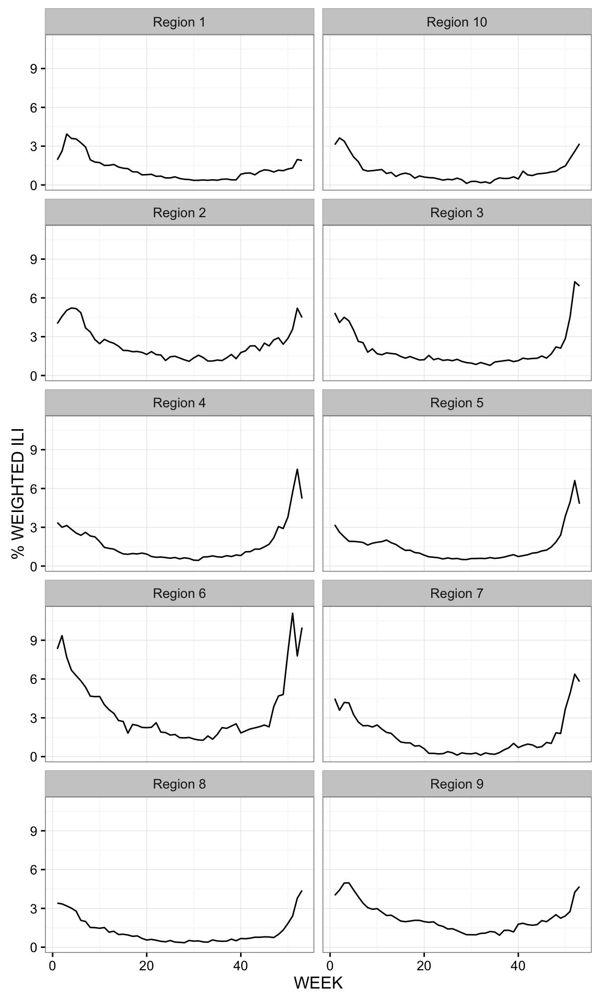
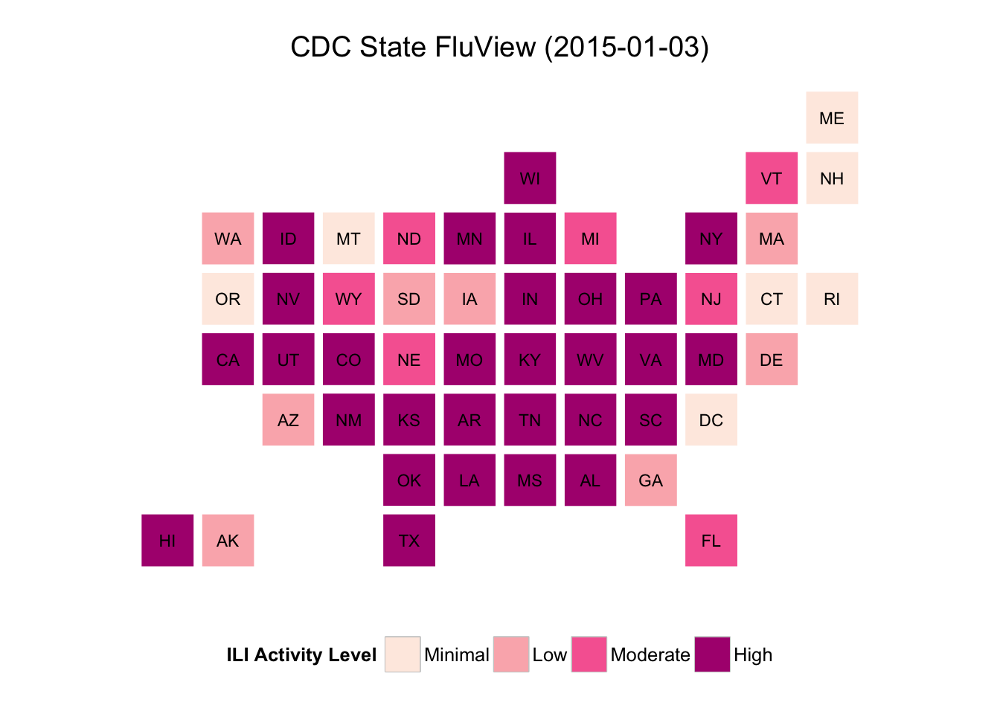

### cdcfluview - Retrieve U.S. Flu Season Data from the CDC FluView Portal

**NOTE** If there's a particular data set from <http://www.cdc.gov/flu/weekly/fluviewinteractive.htm> that you want and that isn't in the package, please file it as an issue and be as specific as you can (screen shot if possible).

------------------------------------------------------------------------

The U.S. Centers for Disease Control (CDC) maintains a [portal](http://gis.cdc.gov/grasp/fluview/fluportaldashboard.html) for accessing state, regional and national influenza statistics. The portal's Flash interface makes it difficult and time-consuming to select and retrieve influenza data. This package provides functions to access the data provided by portal's underlying API.

The following functions are implemented:

-   `get_flu_data`: Retrieves state, regional or national influenza statistics from the CDC
-   `get_state_data`: Retrieves state/territory-level influenza statistics from the CDC
-   `get_weekly_flu_report`: Retrieves weekly influenza surveillance report from the CDC

The following data sets are included:

-   `hhs_regions` HHS Region Table (a data frame with 59 rows and 4 variables)

### News

-   Version 0.4.0.999 released : another fix for the CDC API (for region parameter); added data file for region lookups; added weekly high-level flu report retrieval
-   Version 0.3 released : fix for the CDC API (it changed how year & region params are encoded in the request)
-   Version 0.2.1 released : bumped up `httr` version \# requirement in `DESCRIPTION` (via Issue [1](https://github.com/hrbrmstr/cdcfluview/issues/1))
-   Version 0.2 released : added state-level data retrieval
-   Version 0.1 released

### Installation

``` r
devtools::install_github("hrbrmstr/cdcfluview")
```

### Usage

``` r
suppressPackageStartupMessages(library(cdcfluview))
suppressPackageStartupMessages(library(ggplot2))
suppressPackageStartupMessages(library(dplyr))
suppressPackageStartupMessages(library(statebins))

# current verison
packageVersion("cdcfluview")
#> [1] '0.4.0.9000'

flu <- get_flu_data("hhs", sub_region=1:10, "ilinet", years=2014)
glimpse(flu)
#> Observations: 440
#> Variables:
#> $ REGION.TYPE       (chr) "HHS Regions", "HHS Regions", "HHS Regions", "HHS Regions", "HHS Regions", "HHS Regions",...
#> $ REGION            (chr) "Region 1", "Region 2", "Region 3", "Region 4", "Region 5", "Region 6", "Region 7", "Regi...
#> $ YEAR              (int) 2014, 2014, 2014, 2014, 2014, 2014, 2014, 2014, 2014, 2014, 2014, 2014, 2014, 2014, 2014,...
#> $ WEEK              (int) 40, 40, 40, 40, 40, 40, 40, 40, 40, 40, 41, 41, 41, 41, 41, 41, 41, 41, 41, 41, 42, 42, 4...
#> $ ILITOTAL          (int) 352, 2254, 1696, 1182, 1083, 1844, 220, 348, 1329, 61, 386, 2129, 1747, 1517, 1117, 2165,...
#> $ TOTAL.PATIENTS    (int) 51688, 137157, 129302, 130419, 107261, 103975, 50272, 37014, 88421, 11172, 51169, 132513,...
#> $ NUM..OF.PROVIDERS (int) 147, 285, 245, 305, 267, 241, 84, 117, 237, 55, 151, 274, 241, 310, 277, 250, 84, 114, 24...
#> $ X..WEIGHTED.ILI   (dbl) 0.8306102, 1.7759176, 1.1477759, 0.8167958, 0.7370374, 1.8252298, 0.6970221, 0.6731439, 1...
#> $ X.UNWEIGHTED.ILI  (dbl) 0.6810091, 1.6433722, 1.3116580, 0.9063097, 1.0096867, 1.7735032, 0.4376194, 0.9401848, 1...
#> $ AGE.0.4           (int) 101, 869, 395, 333, 358, 465, 50, 82, 310, 22, 109, 837, 404, 356, 339, 560, 57, 58, 335,...
#> $ AGE.5.24          (int) 185, 757, 629, 536, 400, 711, 98, 152, 577, 30, 199, 677, 670, 774, 443, 809, 124, 146, 5...
#> $ AGE.25.64         (lgl) NA, NA, NA, NA, NA, NA, NA, NA, NA, NA, NA, NA, NA, NA, NA, NA, NA, NA, NA, NA, NA, NA, N...
#> $ AGE.25.49         (int) 44, 363, 455, 187, 181, 469, 43, 87, 220, 7, 37, 349, 466, 249, 182, 509, 56, 87, 225, 20...
#> $ AGE.50.64         (int) 13, 157, 127, 80, 80, 121, 15, 19, 110, 1, 24, 151, 132, 74, 105, 187, 18, 23, 118, 10, 2...
#> $ AGE.65            (int) 9, 108, 90, 46, 64, 78, 14, 8, 112, 1, 17, 115, 75, 64, 48, 100, 14, 12, 103, 3, 9, 110, ...

state_flu <- get_state_data(years=2014)
glimpse(state_flu)
#> Observations: 2809
#> Variables:
#> $ STATENAME            (chr) "Alabama", "Alabama", "Alabama", "Alabama", "Alabama", "Alabama", "Alabama", "Alabama"...
#> $ URL                  (chr) "http://adph.org/influenza/", "http://adph.org/influenza/", "http://adph.org/influenza...
#> $ WEBSITE              (chr) "Influenza Surveillance", "Influenza Surveillance", "Influenza Surveillance", "Influen...
#> $ ACTIVITY.LEVEL       (chr) "Level 1", "Level 1", "Level 1", "Level 1", "Level 1", "Level 1", "Level 5", "Level 10...
#> $ ACTIVITY.LEVEL.LABEL (chr) "Minimal", "Minimal", "Minimal", "Minimal", "Minimal", "Minimal", "Low", "High", "High...
#> $ WEEKEND              (chr) "Oct-04-2014", "Oct-11-2014", "Oct-18-2014", "Oct-25-2014", "Nov-01-2014", "Nov-08-201...
#> $ WEEK                 (int) 40, 41, 42, 43, 44, 45, 46, 47, 48, 49, 50, 51, 52, 53, 1, 2, 3, 4, 5, 6, 7, 8, 9, 10,...
#> $ SEASON               (chr) "2014-15", "2014-15", "2014-15", "2014-15", "2014-15", "2014-15", "2014-15", "2014-15"...

gg <- ggplot(flu, aes(x=WEEK, y=X..WEIGHTED.ILI, group=REGION))
gg <- gg + geom_line()
gg <- gg + facet_wrap(~REGION, ncol=2)
gg <- gg + theme_bw()
```



``` r
dat <- get_flu_data(region="hhs", 
                    sub_region=1:10, 
                    data_source="ilinet", 
                    years=2000:2014)
 
dat %>% 
  mutate(REGION=factor(REGION,
                       levels=unique(REGION),
                       labels=c("Boston", "New York",
                                "Philadelphia", "Atlanta",
                                "Chicago", "Dallas",
                                "Kansas City", "Denver",
                                "San Francisco", "Seattle"),
                       ordered=TRUE)) %>%
  mutate(season_week=ifelse(WEEK>=40, WEEK-40, WEEK),
         season=ifelse(WEEK<40,
                       sprintf("%d-%d", YEAR-1, YEAR),
                       sprintf("%d-%d", YEAR, YEAR+1))) -> dat
 
prev_years <- dat %>% filter(season != "2014-2015")
curr_year <- dat %>% filter(season == "2014-2015")
 
curr_week <- tail(dat, 1)$season_week
 
gg <- ggplot()
gg <- gg + geom_point(data=prev_years,
                      aes(x=season_week, y=X..WEIGHTED.ILI, group=season),
                      color="#969696", size=1, alpa=0.25)
gg <- gg + geom_point(data=curr_year,
                      aes(x=season_week, y=X..WEIGHTED.ILI, group=season),
                      color="red", size=1.25, alpha=1)
gg <- gg + geom_line(data=curr_year, 
                     aes(x=season_week, y=X..WEIGHTED.ILI, group=season),
                     size=1.25, color="#d7301f")
gg <- gg + geom_vline(xintercept=curr_week, color="#d7301f", size=0.5, linetype="dashed", alpha=0.5)
gg <- gg + facet_wrap(~REGION, ncol=3)
gg <- gg + labs(x=NULL, y="Weighted ILI Index", 
                title="ILINet - 1999-2015 year weighted flu index history by CDC region\nWeek Ending Jan 3, 2015 (Red == 2014-2015 season)\n")
gg <- gg + theme_bw()
gg <- gg + theme(panel.grid=element_blank())
gg <- gg + theme(strip.background=element_blank())
gg <- gg + theme(axis.ticks.x=element_blank())
gg <- gg + theme(axis.text.x=element_blank())
```


``` r
gg_s <- state_flu %>%
  filter(WEEKEND=="Jan-03-2015") %>%
  select(state=STATENAME, value=ACTIVITY.LEVEL) %>%
  filter(!(state %in% c("Puerto Rico", "New York City"))) %>% # need to add PR to statebins
  mutate(value=as.numeric(gsub("Level ", "", value))) %>%
  statebins(brewer_pal="RdPu", breaks=4, 
            labels=c("Minimal", "Low", "Moderate", "High"),
            legend_position="bottom", legend_title="ILI Activity Level") +
  ggtitle("CDC State FluView (2015-01-03)")
```



### Test Results

``` r
suppressPackageStartupMessages(library(cdcfluview))
suppressPackageStartupMessages(library(testthat))

date()
#> [1] "Sun Aug  9 09:40:34 2015"

test_dir("tests/")
#> testthat results ========================================================================================================
#> OK: 0 SKIPPED: 0 FAILED: 0
#> 
#> DONE
```
