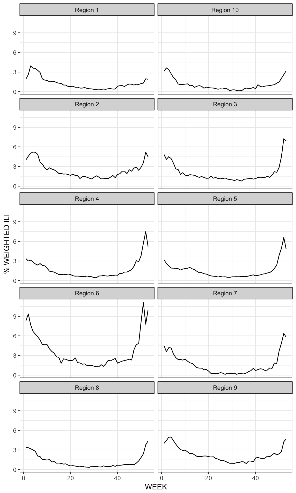

### :mask: cdcfluview - Retrieve U.S. Flu Season Data from the CDC FluView Portal

[](https://cran.r-project.org/package=cdcfluview)

**NOTE** If there's a particular data set from <http://www.cdc.gov/flu/weekly/fluviewinteractive.htm> that you want and that isn't in the package, please file it as an issue and be as specific as you can (screen shot if possible).

------------------------------------------------------------------------

The U.S. Centers for Disease Control (CDC) maintains a [portal](http://gis.cdc.gov/grasp/fluview/fluportaldashboard.html) for accessing state, regional and national influenza statistics. The portal's Flash interface makes it difficult and time-consuming to select and retrieve influenza data. This package provides functions to access the data provided by the portal's underlying API.

The following functions are implemented:

-   `get_flu_data`: Retrieves state, regional or national influenza statistics from the CDC
-   `get_state_data`: Retrieves state/territory-level influenza statistics from the CDC
-   `get_weekly_flu_report`: Retrieves (high-level) weekly influenza surveillance report from the CDC
-   `get_mortality_surveillance_data` : (fairly self explanatory but also pretty new to the pkg and uses data from: <http://www.cdc.gov/flu/weekly/nchs.htm>

The following data sets are included:

-   `hhs_regions` HHS Region Table (a data frame with 59 rows and 4 variables)
-   `census_regions` Census Region Table (a data frame with 51 rows and 2 variables)

### News

-   See NEWS
-   Version 0.4.0 - [CRAN release](http://cran.r-project.org/web/packages/cdcfluview)
-   Version 0.4.0.999 released : another fix for the CDC API (for region parameter); added data files for HHS/Census region lookups; added weekly high-level flu report retrieval
-   Version 0.3 released : fix for the CDC API (it changed how year & region params are encoded in the request)
-   Version 0.2.1 released : bumped up `httr` version \# requirement in `DESCRIPTION` (via Issue [1](https://github.com/hrbrmstr/cdcfluview/issues/1))
-   Version 0.2 released : added state-level data retrieval
-   Version 0.1 released

### Installation

``` r
install.packages("cdcfluview")
# **OR**
devtools::install_github("hrbrmstr/cdcfluview")
```

### Usage

``` r
library(cdcfluview)
library(ggplot2)
library(dplyr)
library(statebins)

# current verison
packageVersion("cdcfluview")
#> [1] '0.5.0'

flu <- get_flu_data("hhs", sub_region=1:10, "ilinet", years=2014)
glimpse(flu)
#> Observations: 530
#> Variables: 15
#> $ REGION TYPE       <chr> "HHS Regions", "HHS Regions", "HHS Regions", "HHS Regions", "HHS Regions", "HHS Regions",...
#> $ REGION            <chr> "Region 1", "Region 2", "Region 3", "Region 4", "Region 5", "Region 6", "Region 7", "Regi...
#> $ YEAR              <int> 2014, 2014, 2014, 2014, 2014, 2014, 2014, 2014, 2014, 2014, 2014, 2014, 2014, 2014, 2014,...
#> $ WEEK              <int> 40, 40, 40, 40, 40, 40, 40, 40, 40, 40, 41, 41, 41, 41, 41, 41, 41, 41, 41, 41, 42, 42, 4...
#> $ % WEIGHTED ILI    <dbl> 0.830610, 1.775920, 1.147780, 0.816796, 0.737037, 1.828510, 0.697022, 0.673507, 1.781290,...
#> $ %UNWEIGHTED ILI   <dbl> 0.681009, 1.643370, 1.311660, 0.906310, 1.009690, 1.775430, 0.437619, 0.930417, 1.497090,...
#> $ AGE 0-4           <int> 101, 869, 395, 333, 358, 465, 50, 82, 310, 22, 109, 884, 404, 355, 339, 560, 57, 58, 335,...
#> $ AGE 25-49         <int> 44, 363, 455, 187, 181, 469, 43, 87, 220, 7, 37, 385, 466, 247, 182, 504, 56, 87, 225, 20...
#> $ AGE 25-64         <chr> NA, NA, NA, NA, NA, NA, NA, NA, NA, NA, NA, NA, NA, NA, NA, NA, NA, NA, NA, NA, NA, NA, N...
#> $ AGE 5-24          <int> 185, 757, 629, 536, 400, 711, 98, 155, 577, 30, 199, 704, 670, 772, 443, 809, 124, 148, 5...
#> $ AGE 50-64         <int> 13, 157, 127, 80, 80, 123, 15, 19, 110, 1, 24, 176, 132, 74, 105, 186, 18, 23, 118, 10, 2...
#> $ AGE 65            <int> 9, 108, 90, 46, 64, 78, 14, 8, 112, 1, 17, 127, 75, 64, 48, 100, 14, 12, 103, 3, 9, 114, ...
#> $ ILITOTAL          <int> 352, 2254, 1696, 1182, 1083, 1846, 220, 351, 1329, 61, 386, 2276, 1747, 1512, 1117, 2159,...
#> $ NUM. OF PROVIDERS <int> 147, 285, 244, 305, 267, 241, 84, 120, 240, 55, 151, 275, 241, 311, 277, 250, 84, 116, 24...
#> $ TOTAL PATIENTS    <int> 51688, 137157, 129302, 130419, 107261, 103975, 50272, 37725, 88772, 11172, 51169, 134995,...

state_flu <- get_state_data(years=2014)
glimpse(state_flu)
#> Observations: 2,809
#> Variables: 8
#> $ STATENAME            <chr> "Alabama", "Alabama", "Alabama", "Alabama", "Alabama", "Alabama", "Alabama", "Alabama"...
#> $ URL                  <chr> "http://adph.org/influenza/", "http://adph.org/influenza/", "http://adph.org/influenza...
#> $ WEBSITE              <chr> "Influenza Surveillance", "Influenza Surveillance", "Influenza Surveillance", "Influen...
#> $ ACTIVITY.LEVEL       <chr> "Level 1", "Level 1", "Level 1", "Level 1", "Level 1", "Level 1", "Level 5", "Level 10...
#> $ ACTIVITY.LEVEL.LABEL <chr> "Minimal", "Minimal", "Minimal", "Minimal", "Minimal", "Minimal", "Low", "High", "High...
#> $ WEEKEND              <chr> "Oct-04-2014", "Oct-11-2014", "Oct-18-2014", "Oct-25-2014", "Nov-01-2014", "Nov-08-201...
#> $ WEEK                 <int> 40, 41, 42, 43, 44, 45, 46, 47, 48, 49, 50, 51, 52, 53, 1, 2, 3, 4, 5, 6, 7, 8, 9, 10,...
#> $ SEASON               <chr> "2014-15", "2014-15", "2014-15", "2014-15", "2014-15", "2014-15", "2014-15", "2014-15"...

gg <- ggplot(flu, aes(x=WEEK, y=`% WEIGHTED ILI`, group=REGION))
gg <- gg + geom_line()
gg <- gg + facet_wrap(~REGION, ncol=2)
gg <- gg + theme_bw()
gg
```



``` r
msd <- get_mortality_surveillance_data()

mutate(msd$by_state, ym=as.Date(sprintf("%04d-%02d-1", Year, Week), "%Y-%U-%u")) %>% 
  select(state, wk=ym, death_pct=`Percent of Deaths Due to Pneumonia and Influenza`) %>% 
  mutate(death_pct=death_pct/100) -> df

gg <- ggplot() + geom_smooth(data=df, aes(wk, death_pct, group=state), 
                             se=FALSE, color="#2b2b2b", size=0.25) 

gb <- ggplot_build(gg)

gb$data[[1]] %>% 
  arrange(desc(x)) %>% 
  group_by(group) %>% 
  slice(1) %>% 
  ungroup() %>% 
  arrange(desc(y)) %>% 
  head(1) -> top

top_state <- sort(unique(msd$by_state$state))[top$group]

gg <- gg + geom_text(data=top, aes(as.Date(x, origin="1970-01-01"), y, label=top_state),
                     hjust=1, family="Arial Narrow", size=3, nudge_x=-5, nudge_y=-0.001)
gg <- gg + scale_x_date(expand=c(0,0))
gg <- gg + scale_y_continuous(label=scales::percent)
gg <- gg + labs(x=NULL, y=NULL,
                title="Percent of In-State Deaths Due to Pneumonia and Pnfluenza (2010-Present)")
gg <- gg + theme_bw(base_family="Arial Narrow")
gg <- gg + theme(axis.text.x=element_text(margin=margin(0,0,0,0)))
gg <- gg + theme(axis.text.y=element_text(margin=margin(0,0,0,0)))
gg <- gg + theme(axis.ticks=element_blank())
gg <- gg + theme(plot.title=element_text(face="bold", size=16))
gg
```


``` r
gg_s <- state_flu %>%
  filter(WEEKEND=="Jan-03-2015") %>%
  select(state=STATENAME, value=ACTIVITY.LEVEL) %>%
  filter(!(state %in% c("Puerto Rico", "New York City"))) %>% # need to add PR to statebins
  mutate(value=as.numeric(gsub("Level ", "", value))) %>%
  statebins(brewer_pal="RdPu", breaks=4, 
            labels=c("Minimal", "Low", "Moderate", "High"),
            legend_position="bottom", legend_title="ILI Activity Level") +
  ggtitle("CDC State FluView (2015-01-03)")
gg_s
```


### Test Results

``` r
library(cdcfluview)
library(testthat)

date()
#> [1] "Mon Sep 26 11:16:43 2016"

test_dir("tests/")
#> testthat results ========================================================================================================
#> OK: 0 SKIPPED: 0 FAILED: 0
#> 
#> DONE ===================================================================================================================
```
