[](https://cran.r-project.org/package=cdcfluview)
[](https://travis-ci.org/hrbrmstr/cdcfluview)
[](https://codecov.io/github/hrbrmstr/cdcfluview?branch=master)

# I M P O R T A N T

The CDC migrated to a new non-Flash portal and back-end APIs changed.
This is a complete reimagining of the package and — as such — all your
code is going to break…eventually. Older functions have been deprecated
with warnings and will be removed at some point.

All folks providing feedback, code or suggestions will be added to the
DESCRIPTION file. Please include how you would prefer to be cited in any
issues you file.

If there’s a particular data set from
<https://www.cdc.gov/flu/weekly/fluviewinteractive.htm> that you want
and that isn’t in the package, please file it as an issue and be as
specific as you can (screen shot if possible).

# :mask: cdcfluview

Retrieve U.S. Flu Season Data from the CDC FluView Portal

## Description

The U.S. Centers for Disease Control (CDC) maintains a portal
<http://gis.cdc.gov/grasp/fluview/fluportaldashboard.html> for accessing
state, regional and national influenza statistics as well as Mortality
Surveillance Data. The Flash interface makes it difficult and
time-consuming to select and retrieve influenza data. This package
provides functions to access the data provided by the portal’s
underlying API.

## What’s Inside The Tin

The following functions are implemented:

  - `age_group_distribution`: Age Group Distribution of Influenza
    Positive Tests Reported by Public Health Laboratories
  - `cdc_basemap`: Retrieve CDC U.S. Basemaps
  - `geographic_spread`: State and Territorial Epidemiologists Reports
    of Geographic Spread of Influenza
  - `get_weekly_flu_report`: Retrieves (high-level) weekly (XML)
    influenza surveillance report from the CDC
  - `hospitalizations`: Laboratory-Confirmed Influenza Hospitalizations
  - `ilinet`: Retrieve ILINet Surveillance Data
  - `ili_weekly_activity_indicators`: Retrieve weekly state-level ILI
    indicators per-state for a given season
  - `pi_mortality`: Pneumonia and Influenza Mortality Surveillance
  - `state_data_providers`: Retrieve metadata about U.S. State CDC
    Provider Data
  - `surveillance_areas`: Retrieve a list of valid sub-regions for each
    surveillance area.
  - `who_nrevss`: Retrieve WHO/NREVSS Surveillance Data

MMWR ID Utilities:

  - `mmwrid_map`: MMWR ID to Calendar Mappings
  - `mmwr_week`: Convert a Date to an MMWR day+week+year
  - `mmwr_weekday`: Convert a Date to an MMWR weekday
  - `mmwr_week_to_date`: Convert an MMWR year+week or year+week+day to a
    Date object

Deprecated functions:

  - `get_flu_data`: Retrieves state, regional or national influenza
    statistics from the CDC (deprecated)
  - `get_hosp_data`: Retrieves influenza hospitalization statistics from
    the CDC (deprecated)
  - `get_mortality_surveillance_data`: Mortality Surveillance Data from
    the National Center for Health Statistics (deprecated)
  - `get_state_data`: Retrieves state/territory-level influenza
    statistics from the CDC (deprecated)

The following data sets are included:

  - `hhs_regions`: HHS Region Table (a data frame with 59 rows and 4
    variables)
  - `census_regions`: Census Region Table (a data frame with 51 rows and
    2 variables)
  - `mmwrid_map`: MMWR ID to Calendar Mappings (it is exported &
    available, no need to use `data()`)

## Installation

``` r
devtools::install_github("hrbrmstr/cdcfluview")
```

## Usage

``` r
library(cdcfluview)
library(hrbrthemes)
library(tidyverse)

# current verison
packageVersion("cdcfluview")
```

    ## [1] '0.7.0'

### Age Group Distribution of Influenza Positive Tests Reported by Public Health Laboratories

``` r
glimpse(age_group_distribution(years=2015))
```

    ## Observations: 1,872
    ## Variables: 16
    ## $ sea_label         <chr> "2015-16", "2015-16", "2015-16", "2015-16", "2015-16", "2015-16", "2015-16", "2015-16", "...
    ## $ age_label         <fctr> 0-4 yr, 0-4 yr, 0-4 yr, 0-4 yr, 0-4 yr, 0-4 yr, 0-4 yr, 0-4 yr, 0-4 yr, 0-4 yr, 0-4 yr, ...
    ## $ vir_label         <fctr> A (Subtyping not Performed), A (Subtyping not Performed), A (Subtyping not Performed), A...
    ## $ count             <int> 0, 1, 0, 1, 3, 0, 0, 0, 0, 0, 0, 0, 0, 0, 2, 2, 2, 3, 2, 2, 3, 3, 3, 0, 0, 2, 0, 1, 1, 0,...
    ## $ mmwrid            <int> 2806, 2807, 2808, 2809, 2810, 2811, 2812, 2813, 2814, 2815, 2816, 2817, 2818, 2819, 2820,...
    ## $ seasonid          <int> 55, 55, 55, 55, 55, 55, 55, 55, 55, 55, 55, 55, 55, 55, 55, 55, 55, 55, 55, 55, 55, 55, 5...
    ## $ publishyearweekid <int> 2914, 2914, 2914, 2914, 2914, 2914, 2914, 2914, 2914, 2914, 2914, 2914, 2914, 2914, 2914,...
    ## $ sea_description   <chr> "Season 2015-16", "Season 2015-16", "Season 2015-16", "Season 2015-16", "Season 2015-16",...
    ## $ sea_startweek     <int> 2806, 2806, 2806, 2806, 2806, 2806, 2806, 2806, 2806, 2806, 2806, 2806, 2806, 2806, 2806,...
    ## $ sea_endweek       <int> 2857, 2857, 2857, 2857, 2857, 2857, 2857, 2857, 2857, 2857, 2857, 2857, 2857, 2857, 2857,...
    ## $ vir_description   <chr> "A-Unk", "A-Unk", "A-Unk", "A-Unk", "A-Unk", "A-Unk", "A-Unk", "A-Unk", "A-Unk", "A-Unk",...
    ## $ vir_startmmwrid   <int> 1397, 1397, 1397, 1397, 1397, 1397, 1397, 1397, 1397, 1397, 1397, 1397, 1397, 1397, 1397,...
    ## $ vir_endmmwrid     <int> 3131, 3131, 3131, 3131, 3131, 3131, 3131, 3131, 3131, 3131, 3131, 3131, 3131, 3131, 3131,...
    ## $ wk_start          <date> 2015-10-04, 2015-10-11, 2015-10-18, 2015-10-25, 2015-11-01, 2015-11-08, 2015-11-15, 2015...
    ## $ wk_end            <date> 2015-10-10, 2015-10-17, 2015-10-24, 2015-10-31, 2015-11-07, 2015-11-14, 2015-11-21, 2015...
    ## $ year_wk_num       <int> 40, 41, 42, 43, 44, 45, 46, 47, 48, 49, 50, 51, 52, 1, 2, 3, 4, 5, 6, 7, 8, 9, 10, 11, 12...

### Retrieve CDC U.S. Coverage Map

``` r
plot(cdc_basemap("national"))
```

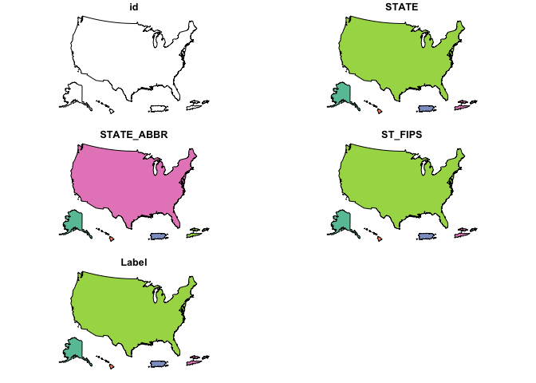<!-- -->

``` r
plot(cdc_basemap("hhs"))
```

<!-- -->

``` r
plot(cdc_basemap("census"))
```

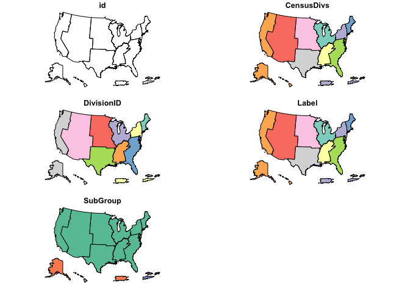<!-- -->

``` r
plot(cdc_basemap("states"))
```

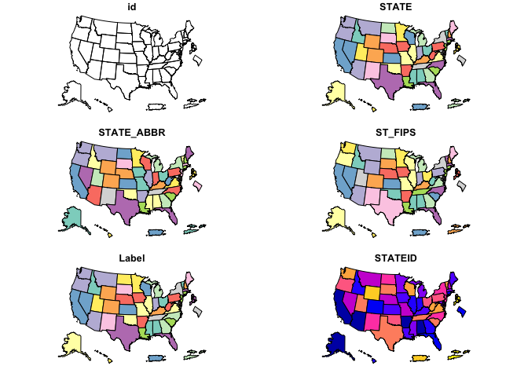<!-- -->

``` r
plot(cdc_basemap("spread"))
```

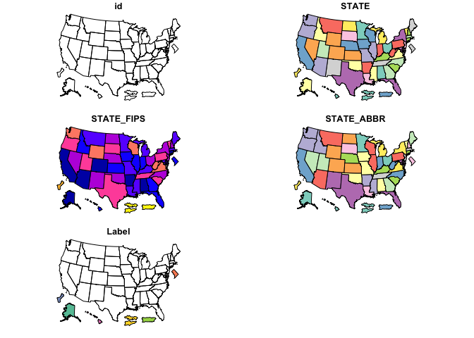<!-- -->

``` r
plot(cdc_basemap("surv"))
```

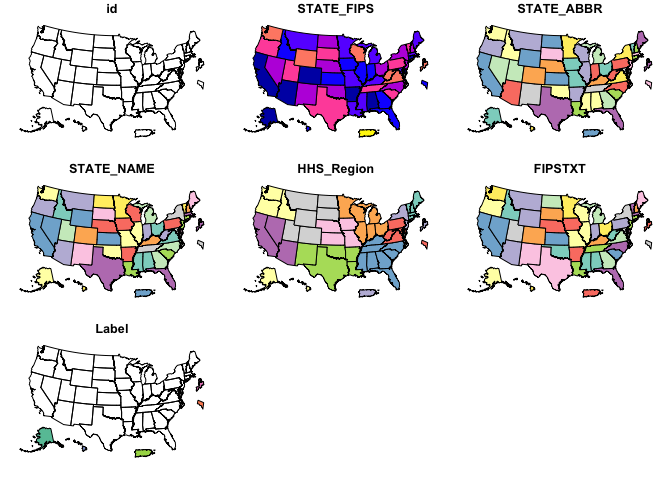<!-- -->

### State and Territorial Epidemiologists Reports of Geographic Spread of Influenza

``` r
glimpse(geographic_spread())
```

    ## Observations: 25,848
    ## Variables: 7
    ## $ statename         <chr> "Alabama", "Alabama", "Alabama", "Alabama", "Alabama", "Alabama", "Alabama", "Alabama", "...
    ## $ url               <chr> "http://adph.org/influenza/", "http://adph.org/influenza/", "http://adph.org/influenza/",...
    ## $ website           <chr> "Influenza Surveillance", "Influenza Surveillance", "Influenza Surveillance", "Influenza ...
    ## $ activity_estimate <chr> "No Activity", "No Activity", "No Activity", "Local Activity", "Sporadic", "Sporadic", "S...
    ## $ weekend           <date> 2003-10-04, 2003-10-11, 2003-10-18, 2003-10-25, 2003-11-01, 2003-11-08, 2003-11-15, 2003...
    ## $ season            <chr> "2003-04", "2003-04", "2003-04", "2003-04", "2003-04", "2003-04", "2003-04", "2003-04", "...
    ## $ weeknumber        <chr> "40", "41", "42", "43", "44", "45", "46", "47", "48", "49", "50", "51", "52", "53", "1", ...

### Laboratory-Confirmed Influenza Hospitalizations

``` r
surveillance_areas()
```

    ##    surveillance_area               region
    ## 1            flusurv       Entire Network
    ## 2                eip           California
    ## 3                eip             Colorado
    ## 4                eip          Connecticut
    ## 5                eip       Entire Network
    ## 6                eip              Georgia
    ## 7                eip             Maryland
    ## 8                eip            Minnesota
    ## 9                eip           New Mexico
    ## 10               eip    New York - Albany
    ## 11               eip New York - Rochester
    ## 12               eip               Oregon
    ## 13               eip            Tennessee
    ## 14              ihsp       Entire Network
    ## 15              ihsp                Idaho
    ## 16              ihsp                 Iowa
    ## 17              ihsp             Michigan
    ## 18              ihsp                 Ohio
    ## 19              ihsp             Oklahoma
    ## 20              ihsp         Rhode Island
    ## 21              ihsp         South Dakota
    ## 22              ihsp                 Utah

``` r
glimpse(fs_nat <- hospitalizations("flusurv"))
```

    ## Observations: 1,476
    ## Variables: 14
    ## $ surveillance_area <chr> "FluSurv-NET", "FluSurv-NET", "FluSurv-NET", "FluSurv-NET", "FluSurv-NET", "FluSurv-NET",...
    ## $ region            <chr> "Entire Network", "Entire Network", "Entire Network", "Entire Network", "Entire Network",...
    ## $ year              <int> 2009, 2009, 2009, 2009, 2009, 2009, 2009, 2009, 2009, 2009, 2009, 2009, 2009, 2009, 2009,...
    ## $ season            <int> 49, 49, 49, 49, 49, 49, 49, 49, 49, 49, 49, 49, 49, 49, 49, 49, 49, 49, 49, 49, 49, 49, 4...
    ## $ wk_start          <date> 2009-08-30, 2009-09-06, 2009-09-13, 2009-09-20, 2009-09-27, 2009-10-04, 2009-10-11, 2009...
    ## $ wk_end            <date> 2009-09-05, 2009-09-12, 2009-09-19, 2009-09-26, 2009-10-03, 2009-10-10, 2009-10-17, 2009...
    ## $ year_wk_num       <int> 35, 36, 37, 38, 39, 40, 41, 42, 43, 44, 45, 46, 47, 48, 49, 50, 51, 52, 1, 2, 3, 4, 5, 6,...
    ## $ rate              <dbl> 0.5, 2.5, 4.6, 6.7, 10.9, 18.1, 28.3, 39.1, 47.3, 53.3, 57.5, 60.1, 61.6, 62.9, 64.1, 65....
    ## $ weeklyrate        <dbl> 0.5, 2.0, 2.0, 2.1, 4.3, 7.2, 10.2, 10.8, 8.2, 6.0, 4.2, 2.6, 1.5, 1.3, 1.3, 1.0, 1.2, 1....
    ## $ age               <int> 1, 1, 1, 1, 1, 1, 1, 1, 1, 1, 1, 1, 1, 1, 1, 1, 1, 1, 1, 1, 1, 1, 1, 1, 1, 1, 1, 1, 1, 1,...
    ## $ age_label         <fctr> 0-4 yr, 0-4 yr, 0-4 yr, 0-4 yr, 0-4 yr, 0-4 yr, 0-4 yr, 0-4 yr, 0-4 yr, 0-4 yr, 0-4 yr, ...
    ## $ sea_label         <chr> "2009-10", "2009-10", "2009-10", "2009-10", "2009-10", "2009-10", "2009-10", "2009-10", "...
    ## $ sea_description   <chr> "Season 2009-10", "Season 2009-10", "Season 2009-10", "Season 2009-10", "Season 2009-10",...
    ## $ mmwrid            <int> 2488, 2489, 2490, 2491, 2492, 2493, 2494, 2495, 2496, 2497, 2498, 2499, 2500, 2501, 2502,...

``` r
ggplot(fs_nat, aes(wk_end, rate)) + 
  geom_line(aes(color=age_label, group=age_label)) +
  facet_wrap(~sea_description, scales="free_x") +
  scale_color_ipsum(name=NULL) +
  labs(x=NULL, y="Rates per 100,000 population",
       title="FluSurv-NET :: Entire Network :: All Seasons :: Cumulative Rate") +
  theme_ipsum_rc()
```

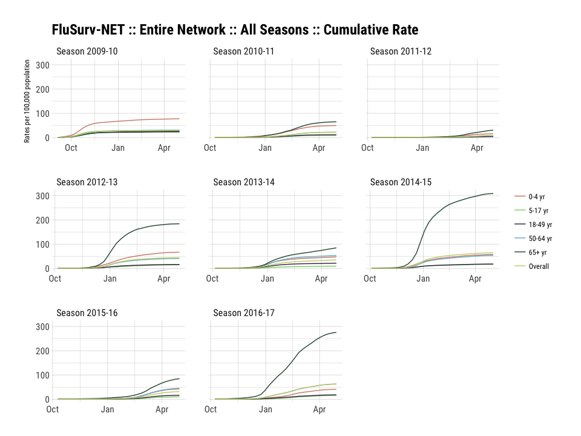<!-- -->

``` r
glimpse(hospitalizations("eip", years=2015))
```

    ## Observations: 180
    ## Variables: 14
    ## $ surveillance_area <chr> "EIP", "EIP", "EIP", "EIP", "EIP", "EIP", "EIP", "EIP", "EIP", "EIP", "EIP", "EIP", "EIP"...
    ## $ region            <chr> "Entire Network", "Entire Network", "Entire Network", "Entire Network", "Entire Network",...
    ## $ year              <int> 2015, 2015, 2015, 2015, 2015, 2015, 2015, 2015, 2015, 2015, 2015, 2015, 2015, 2016, 2016,...
    ## $ season            <int> 55, 55, 55, 55, 55, 55, 55, 55, 55, 55, 55, 55, 55, 55, 55, 55, 55, 55, 55, 55, 55, 55, 5...
    ## $ wk_start          <date> 2015-10-04, 2015-10-11, 2015-10-18, 2015-10-25, 2015-11-01, 2015-11-08, 2015-11-15, 2015...
    ## $ wk_end            <date> 2015-10-10, 2015-10-17, 2015-10-24, 2015-10-31, 2015-11-07, 2015-11-14, 2015-11-21, 2015...
    ## $ year_wk_num       <int> 40, 41, 42, 43, 44, 45, 46, 47, 48, 49, 50, 51, 52, 1, 2, 3, 4, 5, 6, 7, 8, 9, 10, 11, 12...
    ## $ rate              <dbl> 0.1, 0.3, 0.4, 0.5, 0.8, 0.8, 1.1, 1.4, 1.6, 1.7, 1.8, 2.1, 2.4, 2.9, 3.2, 3.5, 4.2, 5.3,...
    ## $ weeklyrate        <dbl> 0.1, 0.3, 0.1, 0.1, 0.3, 0.0, 0.3, 0.3, 0.2, 0.1, 0.1, 0.3, 0.3, 0.5, 0.3, 0.3, 0.6, 1.2,...
    ## $ age               <int> 1, 1, 1, 1, 1, 1, 1, 1, 1, 1, 1, 1, 1, 1, 1, 1, 1, 1, 1, 1, 1, 1, 1, 1, 1, 1, 1, 1, 1, 1,...
    ## $ age_label         <fctr> 0-4 yr, 0-4 yr, 0-4 yr, 0-4 yr, 0-4 yr, 0-4 yr, 0-4 yr, 0-4 yr, 0-4 yr, 0-4 yr, 0-4 yr, ...
    ## $ sea_label         <chr> "2015-16", "2015-16", "2015-16", "2015-16", "2015-16", "2015-16", "2015-16", "2015-16", "...
    ## $ sea_description   <chr> "Season 2015-16", "Season 2015-16", "Season 2015-16", "Season 2015-16", "Season 2015-16",...
    ## $ mmwrid            <int> 2806, 2807, 2808, 2809, 2810, 2811, 2812, 2813, 2814, 2815, 2816, 2817, 2818, 2819, 2820,...

``` r
glimpse(hospitalizations("eip", "Colorado", years=2015))
```

    ## Observations: 180
    ## Variables: 14
    ## $ surveillance_area <chr> "EIP", "EIP", "EIP", "EIP", "EIP", "EIP", "EIP", "EIP", "EIP", "EIP", "EIP", "EIP", "EIP"...
    ## $ region            <chr> "Colorado", "Colorado", "Colorado", "Colorado", "Colorado", "Colorado", "Colorado", "Colo...
    ## $ year              <int> 2015, 2015, 2015, 2015, 2015, 2015, 2015, 2015, 2015, 2015, 2015, 2015, 2015, 2016, 2016,...
    ## $ season            <int> 55, 55, 55, 55, 55, 55, 55, 55, 55, 55, 55, 55, 55, 55, 55, 55, 55, 55, 55, 55, 55, 55, 5...
    ## $ wk_start          <date> 2015-10-04, 2015-10-11, 2015-10-18, 2015-10-25, 2015-11-01, 2015-11-08, 2015-11-15, 2015...
    ## $ wk_end            <date> 2015-10-10, 2015-10-17, 2015-10-24, 2015-10-31, 2015-11-07, 2015-11-14, 2015-11-21, 2015...
    ## $ year_wk_num       <int> 40, 41, 42, 43, 44, 45, 46, 47, 48, 49, 50, 51, 52, 1, 2, 3, 4, 5, 6, 7, 8, 9, 10, 11, 12...
    ## $ rate              <dbl> 0.0, 0.0, 0.6, 0.6, 0.6, 0.6, 1.2, 1.7, 1.7, 1.7, 1.7, 1.7, 2.9, 3.5, 3.5, 3.5, 4.1, 6.4,...
    ## $ weeklyrate        <dbl> 0.0, 0.0, 0.6, 0.0, 0.0, 0.0, 0.6, 0.6, 0.0, 0.0, 0.0, 0.0, 1.2, 0.6, 0.0, 0.0, 0.6, 2.3,...
    ## $ age               <int> 1, 1, 1, 1, 1, 1, 1, 1, 1, 1, 1, 1, 1, 1, 1, 1, 1, 1, 1, 1, 1, 1, 1, 1, 1, 1, 1, 1, 1, 1,...
    ## $ age_label         <fctr> 0-4 yr, 0-4 yr, 0-4 yr, 0-4 yr, 0-4 yr, 0-4 yr, 0-4 yr, 0-4 yr, 0-4 yr, 0-4 yr, 0-4 yr, ...
    ## $ sea_label         <chr> "2015-16", "2015-16", "2015-16", "2015-16", "2015-16", "2015-16", "2015-16", "2015-16", "...
    ## $ sea_description   <chr> "Season 2015-16", "Season 2015-16", "Season 2015-16", "Season 2015-16", "Season 2015-16",...
    ## $ mmwrid            <int> 2806, 2807, 2808, 2809, 2810, 2811, 2812, 2813, 2814, 2815, 2816, 2817, 2818, 2819, 2820,...

``` r
glimpse(hospitalizations("ihsp", years=2015))
```

    ## Observations: 180
    ## Variables: 14
    ## $ surveillance_area <chr> "IHSP", "IHSP", "IHSP", "IHSP", "IHSP", "IHSP", "IHSP", "IHSP", "IHSP", "IHSP", "IHSP", "...
    ## $ region            <chr> "Entire Network", "Entire Network", "Entire Network", "Entire Network", "Entire Network",...
    ## $ year              <int> 2015, 2015, 2015, 2015, 2015, 2015, 2015, 2015, 2015, 2015, 2015, 2015, 2015, 2016, 2016,...
    ## $ season            <int> 55, 55, 55, 55, 55, 55, 55, 55, 55, 55, 55, 55, 55, 55, 55, 55, 55, 55, 55, 55, 55, 55, 5...
    ## $ wk_start          <date> 2015-10-04, 2015-10-11, 2015-10-18, 2015-10-25, 2015-11-01, 2015-11-08, 2015-11-15, 2015...
    ## $ wk_end            <date> 2015-10-10, 2015-10-17, 2015-10-24, 2015-10-31, 2015-11-07, 2015-11-14, 2015-11-21, 2015...
    ## $ year_wk_num       <int> 40, 41, 42, 43, 44, 45, 46, 47, 48, 49, 50, 51, 52, 1, 2, 3, 4, 5, 6, 7, 8, 9, 10, 11, 12...
    ## $ rate              <dbl> 0.0, 0.0, 0.4, 0.4, 0.4, 1.1, 1.1, 1.1, 1.1, 1.5, 1.8, 2.2, 2.2, 2.5, 2.5, 2.5, 2.9, 4.0,...
    ## $ weeklyrate        <dbl> 0.0, 0.0, 0.4, 0.0, 0.0, 0.7, 0.0, 0.0, 0.0, 0.4, 0.4, 0.4, 0.0, 0.4, 0.0, 0.0, 0.4, 1.1,...
    ## $ age               <int> 1, 1, 1, 1, 1, 1, 1, 1, 1, 1, 1, 1, 1, 1, 1, 1, 1, 1, 1, 1, 1, 1, 1, 1, 1, 1, 1, 1, 1, 1,...
    ## $ age_label         <fctr> 0-4 yr, 0-4 yr, 0-4 yr, 0-4 yr, 0-4 yr, 0-4 yr, 0-4 yr, 0-4 yr, 0-4 yr, 0-4 yr, 0-4 yr, ...
    ## $ sea_label         <chr> "2015-16", "2015-16", "2015-16", "2015-16", "2015-16", "2015-16", "2015-16", "2015-16", "...
    ## $ sea_description   <chr> "Season 2015-16", "Season 2015-16", "Season 2015-16", "Season 2015-16", "Season 2015-16",...
    ## $ mmwrid            <int> 2806, 2807, 2808, 2809, 2810, 2811, 2812, 2813, 2814, 2815, 2816, 2817, 2818, 2819, 2820,...

``` r
glimpse(hospitalizations("ihsp", "Oklahoma", years=2015))
```

    ## Observations: 180
    ## Variables: 14
    ## $ surveillance_area <chr> "IHSP", "IHSP", "IHSP", "IHSP", "IHSP", "IHSP", "IHSP", "IHSP", "IHSP", "IHSP", "IHSP", "...
    ## $ region            <chr> "Oklahoma", "Oklahoma", "Oklahoma", "Oklahoma", "Oklahoma", "Oklahoma", "Oklahoma", "Okla...
    ## $ year              <int> 2010, 2010, 2010, 2010, 2010, 2010, 2010, 2010, 2010, 2010, 2010, 2010, 2010, 2011, 2011,...
    ## $ season            <int> 50, 50, 50, 50, 50, 50, 50, 50, 50, 50, 50, 50, 50, 50, 50, 50, 50, 50, 50, 50, 50, 50, 5...
    ## $ wk_start          <date> 2010-10-03, 2010-10-10, 2010-10-17, 2010-10-24, 2010-10-31, 2010-11-07, 2010-11-14, 2010...
    ## $ wk_end            <date> 2010-10-09, 2010-10-16, 2010-10-23, 2010-10-30, 2010-11-06, 2010-11-13, 2010-11-20, 2010...
    ## $ year_wk_num       <int> 40, 41, 42, 43, 44, 45, 46, 47, 48, 49, 50, 51, 52, 1, 2, 3, 4, 5, 6, 7, 8, 9, 10, 11, 12...
    ## $ rate              <dbl> 0.0, 0.0, 1.3, 1.3, 1.3, 1.3, 1.3, 1.3, 1.3, 2.6, 2.6, 6.6, 15.9, 18.5, 35.7, 54.2, 83.3,...
    ## $ weeklyrate        <dbl> 0.0, 0.0, 1.3, 0.0, 0.0, 0.0, 0.0, 0.0, 0.0, 1.3, 0.0, 4.0, 9.3, 2.6, 17.2, 18.5, 29.1, 2...
    ## $ age               <int> 1, 1, 1, 1, 1, 1, 1, 1, 1, 1, 1, 1, 1, 1, 1, 1, 1, 1, 1, 1, 1, 1, 1, 1, 1, 1, 1, 1, 1, 1,...
    ## $ age_label         <fctr> 0-4 yr, 0-4 yr, 0-4 yr, 0-4 yr, 0-4 yr, 0-4 yr, 0-4 yr, 0-4 yr, 0-4 yr, 0-4 yr, 0-4 yr, ...
    ## $ sea_label         <chr> "2010-11", "2010-11", "2010-11", "2010-11", "2010-11", "2010-11", "2010-11", "2010-11", "...
    ## $ sea_description   <chr> "Season 2010-11", "Season 2010-11", "Season 2010-11", "Season 2010-11", "Season 2010-11",...
    ## $ mmwrid            <int> 2545, 2546, 2547, 2548, 2549, 2550, 2551, 2552, 2553, 2554, 2555, 2556, 2557, 2558, 2559,...

### Retrieve ILINet Surveillance Data

``` r
walk(c("national", "hhs", "census", "state"), ~{
  
  ili_df <- ilinet(region = .x)
  
  print(glimpse(ili_df))
  
  ggplot(ili_df, aes(week_start, unweighted_ili, group=region, color=region)) +
    geom_line() +
    viridis::scale_color_viridis(discrete=TRUE) +
    labs(x=NULL, y="Unweighted ILI", title=ili_df$region_type[1]) +
    theme_ipsum_rc(grid="XY") +
    theme(legend.position = "none") -> gg
  
  print(gg)
  
})
```

    ## Observations: 1,049
    ## Variables: 16
    ## $ region_type      <chr> "National", "National", "National", "National", "National", "National", "National", "Natio...
    ## $ region           <chr> "National", "National", "National", "National", "National", "National", "National", "Natio...
    ## $ year             <int> 1997, 1997, 1997, 1997, 1997, 1997, 1997, 1997, 1997, 1997, 1997, 1997, 1997, 1997, 1998, ...
    ## $ week             <int> 40, 41, 42, 43, 44, 45, 46, 47, 48, 49, 50, 51, 52, 53, 1, 2, 3, 4, 5, 6, 7, 8, 9, 10, 11,...
    ## $ weighted_ili     <dbl> 1.101480, 1.200070, 1.378760, 1.199200, 1.656180, 1.413260, 1.986800, 2.447490, 1.739010, ...
    ## $ unweighted_ili   <dbl> 1.216860, 1.280640, 1.239060, 1.144730, 1.261120, 1.282750, 1.445790, 1.647960, 1.675170, ...
    ## $ age_0_4          <dbl> 179, 199, 228, 188, 217, 178, 294, 288, 268, 299, 346, 348, 510, 579, 639, 690, 856, 824, ...
    ## $ age_25_49        <dbl> NA, NA, NA, NA, NA, NA, NA, NA, NA, NA, NA, NA, NA, NA, NA, NA, NA, NA, NA, NA, NA, NA, NA...
    ## $ age_25_64        <dbl> 157, 151, 153, 193, 162, 148, 240, 293, 206, 282, 268, 235, 404, 584, 759, 654, 679, 817, ...
    ## $ age_5_24         <dbl> 205, 242, 266, 236, 280, 281, 328, 456, 343, 415, 388, 362, 492, 576, 810, 1121, 1440, 160...
    ## $ age_50_64        <dbl> NA, NA, NA, NA, NA, NA, NA, NA, NA, NA, NA, NA, NA, NA, NA, NA, NA, NA, NA, NA, NA, NA, NA...
    ## $ age_65           <dbl> 29, 23, 34, 36, 41, 48, 70, 63, 69, 102, 81, 59, 113, 207, 207, 148, 151, 196, 233, 146, 1...
    ## $ ilitotal         <dbl> 570, 615, 681, 653, 700, 655, 932, 1100, 886, 1098, 1083, 1004, 1519, 1946, 2415, 2613, 31...
    ## $ num_of_providers <dbl> 192, 191, 219, 213, 213, 195, 248, 256, 252, 253, 242, 190, 251, 250, 254, 255, 245, 245, ...
    ## $ total_patients   <dbl> 46842, 48023, 54961, 57044, 55506, 51062, 64463, 66749, 52890, 67887, 61314, 47719, 48429,...
    ## $ week_start       <date> 1997-10-06, 1997-10-13, 1997-10-20, 1997-10-27, 1997-11-03, 1997-11-10, 1997-11-17, 1997-...
    ## # A tibble: 1,049 x 16
    ##    region_type   region  year  week weighted_ili unweighted_ili age_0_4 age_25_49 age_25_64 age_5_24 age_50_64 age_65
    ##          <chr>    <chr> <int> <int>        <dbl>          <dbl>   <dbl>     <dbl>     <dbl>    <dbl>     <dbl>  <dbl>
    ##  1    National National  1997    40      1.10148        1.21686     179        NA       157      205        NA     29
    ##  2    National National  1997    41      1.20007        1.28064     199        NA       151      242        NA     23
    ##  3    National National  1997    42      1.37876        1.23906     228        NA       153      266        NA     34
    ##  4    National National  1997    43      1.19920        1.14473     188        NA       193      236        NA     36
    ##  5    National National  1997    44      1.65618        1.26112     217        NA       162      280        NA     41
    ##  6    National National  1997    45      1.41326        1.28275     178        NA       148      281        NA     48
    ##  7    National National  1997    46      1.98680        1.44579     294        NA       240      328        NA     70
    ##  8    National National  1997    47      2.44749        1.64796     288        NA       293      456        NA     63
    ##  9    National National  1997    48      1.73901        1.67517     268        NA       206      343        NA     69
    ## 10    National National  1997    49      1.93919        1.61739     299        NA       282      415        NA    102
    ## # ... with 1,039 more rows, and 4 more variables: ilitotal <dbl>, num_of_providers <dbl>, total_patients <dbl>,
    ## #   week_start <date>

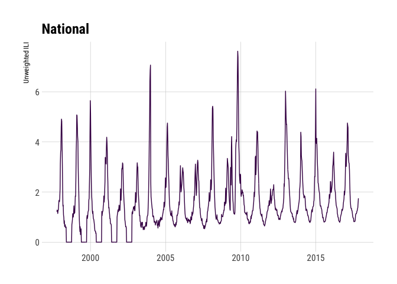<!-- -->

    ## Observations: 10,490
    ## Variables: 16
    ## $ region_type      <chr> "HHS Regions", "HHS Regions", "HHS Regions", "HHS Regions", "HHS Regions", "HHS Regions", ...
    ## $ region           <fctr> Region 1, Region 2, Region 3, Region 4, Region 5, Region 6, Region 7, Region 8, Region 9,...
    ## $ year             <int> 1997, 1997, 1997, 1997, 1997, 1997, 1997, 1997, 1997, 1997, 1997, 1997, 1997, 1997, 1997, ...
    ## $ week             <int> 40, 40, 40, 40, 40, 40, 40, 40, 40, 40, 41, 41, 41, 41, 41, 41, 41, 41, 41, 41, 42, 42, 42...
    ## $ weighted_ili     <dbl> 0.498535, 0.374963, 1.354280, 0.400338, 1.229260, 1.018980, 0.871791, 0.516017, 1.807610, ...
    ## $ unweighted_ili   <dbl> 0.623848, 0.384615, 1.341720, 0.450010, 0.901266, 0.747384, 1.152860, 0.422654, 2.258780, ...
    ## $ age_0_4          <dbl> 15, 0, 6, 12, 31, 2, 0, 2, 80, 31, 14, 0, 4, 21, 36, 2, 0, 0, 103, 19, 35, 0, 3, 19, 66, 2...
    ## $ age_25_49        <dbl> NA, NA, NA, NA, NA, NA, NA, NA, NA, NA, NA, NA, NA, NA, NA, NA, NA, NA, NA, NA, NA, NA, NA...
    ## $ age_25_64        <dbl> 7, 3, 7, 23, 24, 1, 4, 0, 76, 12, 14, 2, 19, 7, 23, 2, 0, 1, 76, 7, 15, 0, 17, 15, 29, 2, ...
    ## $ age_5_24         <dbl> 22, 0, 15, 11, 30, 2, 18, 3, 74, 30, 29, 0, 16, 14, 41, 2, 13, 8, 84, 35, 35, 0, 24, 18, 7...
    ## $ age_50_64        <dbl> NA, NA, NA, NA, NA, NA, NA, NA, NA, NA, NA, NA, NA, NA, NA, NA, NA, NA, NA, NA, NA, NA, NA...
    ## $ age_65           <dbl> 0, 0, 4, 0, 4, 0, 5, 0, 13, 3, 0, 0, 3, 2, 4, 0, 2, 0, 11, 1, 0, 1, 2, 2, 16, 0, 2, 0, 9, ...
    ## $ ilitotal         <dbl> 44, 3, 32, 46, 89, 5, 27, 5, 243, 76, 57, 2, 42, 44, 104, 6, 15, 9, 274, 62, 85, 1, 46, 54...
    ## $ num_of_providers <dbl> 32, 7, 16, 29, 49, 4, 14, 5, 23, 13, 29, 7, 17, 31, 48, 4, 14, 6, 23, 12, 40, 7, 15, 33, 6...
    ## $ total_patients   <dbl> 7053, 780, 2385, 10222, 9875, 669, 2342, 1183, 10758, 1575, 6987, 872, 2740, 11310, 9618, ...
    ## $ week_start       <date> 1997-10-06, 1997-10-06, 1997-10-06, 1997-10-06, 1997-10-06, 1997-10-06, 1997-10-06, 1997-...
    ## # A tibble: 10,490 x 16
    ##    region_type    region  year  week weighted_ili unweighted_ili age_0_4 age_25_49 age_25_64 age_5_24 age_50_64 age_65
    ##          <chr>    <fctr> <int> <int>        <dbl>          <dbl>   <dbl>     <dbl>     <dbl>    <dbl>     <dbl>  <dbl>
    ##  1 HHS Regions  Region 1  1997    40     0.498535       0.623848      15        NA         7       22        NA      0
    ##  2 HHS Regions  Region 2  1997    40     0.374963       0.384615       0        NA         3        0        NA      0
    ##  3 HHS Regions  Region 3  1997    40     1.354280       1.341720       6        NA         7       15        NA      4
    ##  4 HHS Regions  Region 4  1997    40     0.400338       0.450010      12        NA        23       11        NA      0
    ##  5 HHS Regions  Region 5  1997    40     1.229260       0.901266      31        NA        24       30        NA      4
    ##  6 HHS Regions  Region 6  1997    40     1.018980       0.747384       2        NA         1        2        NA      0
    ##  7 HHS Regions  Region 7  1997    40     0.871791       1.152860       0        NA         4       18        NA      5
    ##  8 HHS Regions  Region 8  1997    40     0.516017       0.422654       2        NA         0        3        NA      0
    ##  9 HHS Regions  Region 9  1997    40     1.807610       2.258780      80        NA        76       74        NA     13
    ## 10 HHS Regions Region 10  1997    40     4.743520       4.825400      31        NA        12       30        NA      3
    ## # ... with 10,480 more rows, and 4 more variables: ilitotal <dbl>, num_of_providers <dbl>, total_patients <dbl>,
    ## #   week_start <date>

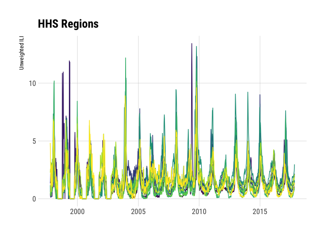<!-- -->

    ## Observations: 9,441
    ## Variables: 16
    ## $ region_type      <chr> "Census Regions", "Census Regions", "Census Regions", "Census Regions", "Census Regions", ...
    ## $ region           <chr> "New England", "Mid-Atlantic", "East North Central", "West North Central", "South Atlantic...
    ## $ year             <int> 1997, 1997, 1997, 1997, 1997, 1997, 1997, 1997, 1997, 1997, 1997, 1997, 1997, 1997, 1997, ...
    ## $ week             <int> 40, 40, 40, 40, 40, 40, 40, 40, 40, 41, 41, 41, 41, 41, 41, 41, 41, 41, 42, 42, 42, 42, 42...
    ## $ weighted_ili     <dbl> 0.4985350, 0.8441440, 0.7924860, 1.7640500, 0.5026620, 0.0542283, 1.0189800, 2.2587800, 2....
    ## $ unweighted_ili   <dbl> 0.6238480, 1.3213800, 0.8187380, 1.2793900, 0.7233800, 0.0688705, 0.7473840, 2.2763300, 3....
    ## $ age_0_4          <dbl> 15, 4, 28, 3, 14, 0, 2, 87, 26, 14, 4, 36, 0, 21, 0, 2, 93, 29, 35, 3, 65, 1, 19, 0, 2, 84...
    ## $ age_25_49        <dbl> NA, NA, NA, NA, NA, NA, NA, NA, NA, NA, NA, NA, NA, NA, NA, NA, NA, NA, NA, NA, NA, NA, NA...
    ## $ age_25_64        <dbl> 7, 8, 20, 8, 22, 3, 1, 71, 17, 14, 13, 23, 1, 14, 1, 2, 72, 11, 15, 11, 27, 5, 21, 0, 2, 5...
    ## $ age_5_24         <dbl> 22, 12, 28, 20, 14, 0, 2, 71, 36, 29, 8, 39, 18, 22, 0, 2, 80, 44, 35, 16, 74, 9, 24, 2, 2...
    ## $ age_50_64        <dbl> NA, NA, NA, NA, NA, NA, NA, NA, NA, NA, NA, NA, NA, NA, NA, NA, NA, NA, NA, NA, NA, NA, NA...
    ## $ age_65           <dbl> 0, 4, 3, 6, 0, 0, 0, 15, 1, 0, 2, 2, 4, 3, 0, 0, 10, 2, 0, 3, 12, 6, 2, 0, 0, 9, 2, 0, 1, ...
    ## $ ilitotal         <dbl> 44, 28, 79, 37, 50, 3, 5, 244, 80, 57, 27, 100, 23, 60, 1, 6, 255, 86, 85, 33, 178, 21, 66...
    ## $ num_of_providers <dbl> 32, 13, 47, 17, 30, 9, 4, 16, 24, 29, 13, 46, 17, 32, 10, 4, 17, 23, 40, 12, 62, 16, 33, 1...
    ## $ total_patients   <dbl> 7053, 2119, 9649, 2892, 6912, 4356, 669, 10719, 2473, 6987, 2384, 9427, 2823, 7591, 4947, ...
    ## $ week_start       <date> 1997-10-06, 1997-10-06, 1997-10-06, 1997-10-06, 1997-10-06, 1997-10-06, 1997-10-06, 1997-...
    ## # A tibble: 9,441 x 16
    ##       region_type             region  year  week weighted_ili unweighted_ili age_0_4 age_25_49 age_25_64 age_5_24
    ##             <chr>              <chr> <int> <int>        <dbl>          <dbl>   <dbl>     <dbl>     <dbl>    <dbl>
    ##  1 Census Regions        New England  1997    40    0.4985350      0.6238480      15        NA         7       22
    ##  2 Census Regions       Mid-Atlantic  1997    40    0.8441440      1.3213800       4        NA         8       12
    ##  3 Census Regions East North Central  1997    40    0.7924860      0.8187380      28        NA        20       28
    ##  4 Census Regions West North Central  1997    40    1.7640500      1.2793900       3        NA         8       20
    ##  5 Census Regions     South Atlantic  1997    40    0.5026620      0.7233800      14        NA        22       14
    ##  6 Census Regions East South Central  1997    40    0.0542283      0.0688705       0        NA         3        0
    ##  7 Census Regions West South Central  1997    40    1.0189800      0.7473840       2        NA         1        2
    ##  8 Census Regions           Mountain  1997    40    2.2587800      2.2763300      87        NA        71       71
    ##  9 Census Regions            Pacific  1997    40    2.0488300      3.2349400      26        NA        17       36
    ## 10 Census Regions        New England  1997    41    0.6426690      0.8158010      14        NA        14       29
    ## # ... with 9,431 more rows, and 6 more variables: age_50_64 <dbl>, age_65 <dbl>, ilitotal <dbl>,
    ## #   num_of_providers <dbl>, total_patients <dbl>, week_start <date>

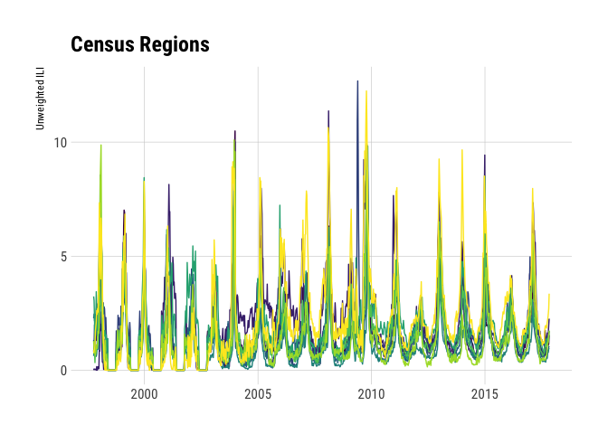<!-- -->

    ## Observations: 19,772
    ## Variables: 16
    ## $ region_type      <chr> "States", "States", "States", "States", "States", "States", "States", "States", "States", ...
    ## $ region           <chr> "Alabama", "Alaska", "Arizona", "Arkansas", "California", "Colorado", "Connecticut", "Dela...
    ## $ year             <int> 2010, 2010, 2010, 2010, 2010, 2010, 2010, 2010, 2010, 2010, 2010, 2010, 2010, 2010, 2010, ...
    ## $ week             <int> 40, 40, 40, 40, 40, 40, 40, 40, 40, 40, 40, 40, 40, 40, 40, 40, 40, 40, 40, 40, 40, 40, 40...
    ## $ weighted_ili     <dbl> NA, NA, NA, NA, NA, NA, NA, NA, NA, NA, NA, NA, NA, NA, NA, NA, NA, NA, NA, NA, NA, NA, NA...
    ## $ unweighted_ili   <dbl> 2.1347700, 0.8751460, 0.6747210, 0.6960560, 1.9541200, 0.6606840, 0.0783085, 0.1001250, 2....
    ## $ age_0_4          <dbl> NA, NA, NA, NA, NA, NA, NA, NA, NA, NA, NA, NA, NA, NA, NA, NA, NA, NA, NA, NA, NA, NA, NA...
    ## $ age_25_49        <dbl> NA, NA, NA, NA, NA, NA, NA, NA, NA, NA, NA, NA, NA, NA, NA, NA, NA, NA, NA, NA, NA, NA, NA...
    ## $ age_25_64        <dbl> NA, NA, NA, NA, NA, NA, NA, NA, NA, NA, NA, NA, NA, NA, NA, NA, NA, NA, NA, NA, NA, NA, NA...
    ## $ age_5_24         <dbl> NA, NA, NA, NA, NA, NA, NA, NA, NA, NA, NA, NA, NA, NA, NA, NA, NA, NA, NA, NA, NA, NA, NA...
    ## $ age_50_64        <dbl> NA, NA, NA, NA, NA, NA, NA, NA, NA, NA, NA, NA, NA, NA, NA, NA, NA, NA, NA, NA, NA, NA, NA...
    ## $ age_65           <dbl> NA, NA, NA, NA, NA, NA, NA, NA, NA, NA, NA, NA, NA, NA, NA, NA, NA, NA, NA, NA, NA, NA, NA...
    ## $ ilitotal         <dbl> 249, 15, 172, 18, 632, 134, 3, 4, 73, NA, 647, 20, 19, 505, 65, 10, 39, 19, NA, 22, 117, 1...
    ## $ num_of_providers <dbl> 35, 7, 49, 15, 112, 14, 12, 13, 4, NA, 62, 18, 12, 74, 44, 6, 40, 14, NA, 30, 17, 56, 47, ...
    ## $ total_patients   <dbl> 11664, 1714, 25492, 2586, 32342, 20282, 3831, 3995, 2599, NA, 40314, 1943, 4579, 39390, 12...
    ## $ week_start       <date> 2010-10-04, 2010-10-04, 2010-10-04, 2010-10-04, 2010-10-04, 2010-10-04, 2010-10-04, 2010-...
    ## # A tibble: 19,772 x 16
    ##    region_type               region  year  week weighted_ili unweighted_ili age_0_4 age_25_49 age_25_64 age_5_24
    ##          <chr>                <chr> <int> <int>        <dbl>          <dbl>   <dbl>     <dbl>     <dbl>    <dbl>
    ##  1      States              Alabama  2010    40           NA      2.1347700      NA        NA        NA       NA
    ##  2      States               Alaska  2010    40           NA      0.8751460      NA        NA        NA       NA
    ##  3      States              Arizona  2010    40           NA      0.6747210      NA        NA        NA       NA
    ##  4      States             Arkansas  2010    40           NA      0.6960560      NA        NA        NA       NA
    ##  5      States           California  2010    40           NA      1.9541200      NA        NA        NA       NA
    ##  6      States             Colorado  2010    40           NA      0.6606840      NA        NA        NA       NA
    ##  7      States          Connecticut  2010    40           NA      0.0783085      NA        NA        NA       NA
    ##  8      States             Delaware  2010    40           NA      0.1001250      NA        NA        NA       NA
    ##  9      States District of Columbia  2010    40           NA      2.8087700      NA        NA        NA       NA
    ## 10      States              Florida  2010    40           NA             NA      NA        NA        NA       NA
    ## # ... with 19,762 more rows, and 6 more variables: age_50_64 <dbl>, age_65 <dbl>, ilitotal <dbl>,
    ## #   num_of_providers <dbl>, total_patients <dbl>, week_start <date>

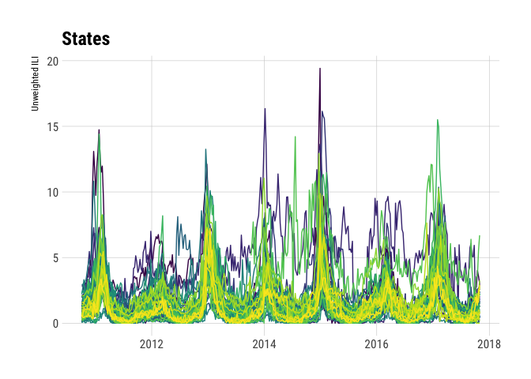<!-- -->

### Retrieve weekly state-level ILI indicators per-state for a given season

``` r
ili_weekly_activity_indicators(2017)
```

    ## # A tibble: 270 x 8
    ##         statename                                                                                 url
    ##  *          <chr>                                                                               <chr>
    ##  1 Virgin Islands                                                                  http://doh.vi.gov/
    ##  2 Virgin Islands                                                                  http://doh.vi.gov/
    ##  3 Virgin Islands                                                                  http://doh.vi.gov/
    ##  4    Puerto Rico http://www.salud.gov.pr/Estadisticas-Registros-y-Publicaciones/Pages/Influenza.aspx
    ##  5 Virgin Islands                                                                  http://doh.vi.gov/
    ##  6    Puerto Rico http://www.salud.gov.pr/Estadisticas-Registros-y-Publicaciones/Pages/Influenza.aspx
    ##  7 Virgin Islands                                                                  http://doh.vi.gov/
    ##  8        Indiana                                                    http://www.in.gov/isdh/22104.htm
    ##  9           Iowa                                         http://idph.iowa.gov/influenza/surveillance
    ## 10         Kansas                                          http://www.kdheks.gov/flu/surveillance.htm
    ## # ... with 260 more rows, and 6 more variables: website <chr>, activity_level <dbl>, activity_level_label <chr>,
    ## #   weekend <date>, season <chr>, weeknumber <dbl>

``` r
xdf <- map_df(2008:2017, ili_weekly_activity_indicators)

count(xdf, weekend, activity_level_label) %>% 
  complete(weekend, activity_level_label) %>% 
  ggplot(aes(weekend, activity_level_label, fill=n)) + 
  geom_tile(color="#c2c2c2", size=0.1) +
  scale_x_date(expand=c(0,0)) +
  viridis::scale_fill_viridis(name="# States", na.value="White") +
  labs(x=NULL, y=NULL, title="Weekly ILI Indicators (all states)") +
  coord_fixed(100/1) +
  theme_ipsum_rc(grid="") +
  theme(legend.position="bottom")
```

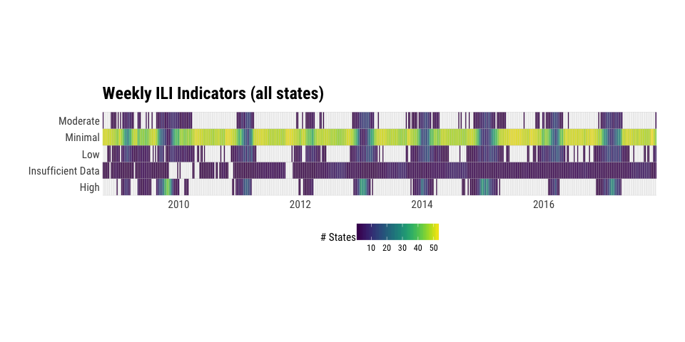<!-- -->

### Pneumonia and Influenza Mortality Surveillance

``` r
(nat_pi <- pi_mortality("national"))
```

    ## # A tibble: 420 x 19
    ##    seasonid baseline threshold percent_pni percent_complete number_influenza number_pneumonia all_deaths total_pni
    ##       <chr>    <dbl>     <dbl>       <dbl>            <dbl>            <dbl>            <dbl>      <dbl>     <dbl>
    ##  1       57    0.058     0.061       0.056            0.858               12             2276      40834      2288
    ##  2       57    0.058     0.062       0.056            0.764               14             2025      36328      2039
    ##  3       57    0.059     0.063       0.058            0.678               17             1844      32279      1861
    ##  4       56    0.059     0.063       0.059            1.000               18             3022      51404      3040
    ##  5       56    0.060     0.063       0.061            1.000               11             3193      52130      3204
    ##  6       56    0.061     0.064       0.062            1.000                7             3178      51443      3185
    ##  7       56    0.062     0.065       0.061            1.000               17             3129      51865      3146
    ##  8       56    0.063     0.066       0.060            1.000               16             3099      51753      3115
    ##  9       56    0.064     0.067       0.061            1.000               19             3208      52541      3227
    ## 10       56    0.065     0.068       0.060            1.000                7             3192      53460      3199
    ## # ... with 410 more rows, and 10 more variables: weeknumber <chr>, geo_description <chr>, age_label <chr>,
    ## #   wk_start <date>, wk_end <date>, year_wk_num <int>, mmwrid <chr>, coverage_area <chr>, region_name <chr>,
    ## #   callout <chr>

``` r
select(nat_pi, wk_end, percent_pni, baseline, threshold) %>% 
  gather(measure, value, -wk_end) %>% 
  ggplot(aes(wk_end, value)) + 
  geom_line(aes(group=measure, color=measure)) + 
  scale_y_percent() +
  scale_color_ipsum(name = NULL, labels=c("Baseline", "Percent P&I", "Threshold")) +
  labs(x=NULL, y="% of all deaths due to P&I",
       title="Percentage of all deaths due to pneumonia and influenza, National Summary") +
  theme_ipsum_rc(grid="XY") +
  theme(legend.position="bottom")
```

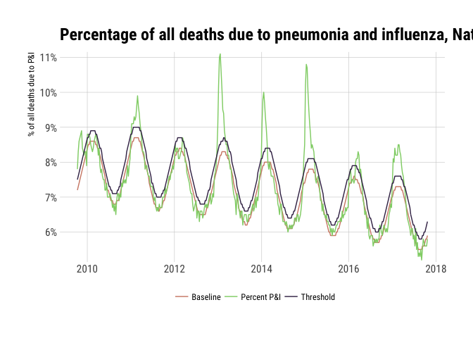<!-- -->

``` r
(st_pi <- pi_mortality("state", years=2015))
```

    ## # A tibble: 2,704 x 19
    ##    seasonid baseline threshold percent_pni percent_complete number_influenza number_pneumonia all_deaths total_pni
    ##       <chr>    <dbl>     <dbl>       <dbl>            <dbl>            <dbl>            <dbl>      <dbl>     <dbl>
    ##  1       55       NA        NA       0.047            1.000                0               46        979        46
    ##  2       55       NA        NA       0.038            0.963                0               34        889        34
    ##  3       55       NA        NA       0.053            1.000                0               52        977        52
    ##  4       55       NA        NA       0.070            1.000                0               68        968        68
    ##  5       55       NA        NA       0.053            0.981                0               48        906        48
    ##  6       55       NA        NA       0.058            1.000                0               56        968        56
    ##  7       55       NA        NA       0.051            1.000                0               53       1041        53
    ##  8       55       NA        NA       0.062            1.000                1               63       1031        64
    ##  9       55       NA        NA       0.056            1.000                0               55        976        55
    ## 10       55       NA        NA       0.054            1.000                0               56       1045        56
    ## # ... with 2,694 more rows, and 10 more variables: weeknumber <chr>, geo_description <chr>, age_label <chr>,
    ## #   wk_start <date>, wk_end <date>, year_wk_num <int>, mmwrid <chr>, coverage_area <chr>, region_name <chr>,
    ## #   callout <chr>

``` r
(reg_pi <- pi_mortality("region", years=2015))
```

    ## # A tibble: 520 x 19
    ##    seasonid baseline threshold percent_pni percent_complete number_influenza number_pneumonia all_deaths total_pni
    ##       <chr>    <dbl>     <dbl>       <dbl>            <dbl>            <dbl>            <dbl>      <dbl>     <dbl>
    ##  1       55    0.065     0.073       0.071                1                0              178       2520       178
    ##  2       55    0.066     0.073       0.063                1                0              159       2505       159
    ##  3       55    0.067     0.074       0.058                1                1              141       2452       142
    ##  4       55    0.068     0.075       0.071                1                0              171       2422       171
    ##  5       55    0.069     0.076       0.066                1                2              166       2554       168
    ##  6       55    0.070     0.077       0.067                1                1              160       2404       161
    ##  7       55    0.071     0.079       0.079                1                0              195       2478       195
    ##  8       55    0.073     0.080       0.072                1                1              176       2463       177
    ##  9       55    0.074     0.081       0.067                1                3              154       2347       157
    ## 10       55    0.075     0.082       0.062                1                0              151       2437       151
    ## # ... with 510 more rows, and 10 more variables: weeknumber <chr>, geo_description <chr>, age_label <chr>,
    ## #   wk_start <date>, wk_end <date>, year_wk_num <int>, mmwrid <chr>, coverage_area <chr>, region_name <chr>,
    ## #   callout <chr>

### Retrieve metadata about U.S. State CDC Provider Data

``` r
state_data_providers()
```

    ## # A tibble: 59 x 5
    ##               statename                                  statehealthdeptname
    ##  *                <chr>                                                <chr>
    ##  1              Alabama                  Alabama Department of Public Health
    ##  2               Alaska           State of Alaska Health and Social Services
    ##  3              Arizona                Arizona Department of Health Services
    ##  4             Arkansas                        Arkansas Department of Health
    ##  5           California               California Department of Public Health
    ##  6             Colorado Colorado Department of Public Health and Environment
    ##  7          Connecticut              Connecticut Department of Public Health
    ##  8             Delaware                  Delaware Health and Social Services
    ##  9 District of Columbia            District of Columbia Department of Health
    ## 10              Florida                         Florida Department of Health
    ## # ... with 49 more rows, and 3 more variables: url <chr>, statewebsitename <chr>, statefluphonenum <chr>

### Retrieve WHO/NREVSS Surveillance Data

``` r
glimpse(xdat <- who_nrevss("national"))
```

    ## List of 3
    ##  $ combined_prior_to_2015_16:Classes 'tbl_df', 'tbl' and 'data.frame':   940 obs. of  14 variables:
    ##   ..$ region_type              : chr [1:940] "National" "National" "National" "National" ...
    ##   ..$ region                   : chr [1:940] "National" "National" "National" "National" ...
    ##   ..$ year                     : int [1:940] 1997 1997 1997 1997 1997 1997 1997 1997 1997 1997 ...
    ##   ..$ week                     : int [1:940] 40 41 42 43 44 45 46 47 48 49 ...
    ##   ..$ total_specimens          : int [1:940] 1291 1513 1552 1669 1897 2106 2204 2533 2242 2607 ...
    ##   ..$ percent_positive         : num [1:940] 0 0.727 1.095 0.419 0.527 ...
    ##   ..$ a_2009_h1n1              : int [1:940] 0 0 0 0 0 0 0 0 0 0 ...
    ##   ..$ a_h1                     : int [1:940] 0 0 0 0 0 0 0 0 0 0 ...
    ##   ..$ a_h3                     : int [1:940] 0 0 3 0 9 0 3 5 14 11 ...
    ##   ..$ a_subtyping_not_performed: int [1:940] 0 11 13 7 1 6 4 17 22 28 ...
    ##   ..$ a_unable_to_subtype      : int [1:940] 0 0 0 0 0 0 0 0 0 0 ...
    ##   ..$ b                        : int [1:940] 0 0 1 0 0 0 1 1 1 1 ...
    ##   ..$ h3n2v                    : int [1:940] 0 0 0 0 0 0 0 0 0 0 ...
    ##   ..$ wk_date                  : Date[1:940], format: "1997-09-28" "1997-10-05" "1997-10-12" "1997-10-19" ...
    ##  $ public_health_labs       :Classes 'tbl_df', 'tbl' and 'data.frame':   109 obs. of  13 variables:
    ##   ..$ region_type              : chr [1:109] "National" "National" "National" "National" ...
    ##   ..$ region                   : chr [1:109] "National" "National" "National" "National" ...
    ##   ..$ year                     : int [1:109] 2015 2015 2015 2015 2015 2015 2015 2015 2015 2015 ...
    ##   ..$ week                     : int [1:109] 40 41 42 43 44 45 46 47 48 49 ...
    ##   ..$ total_specimens          : int [1:109] 1139 1152 1198 1244 1465 1393 1458 1157 1550 1518 ...
    ##   ..$ a_2009_h1n1              : int [1:109] 4 5 10 9 4 11 17 17 27 38 ...
    ##   ..$ a_h3                     : int [1:109] 65 41 50 31 23 34 42 24 36 37 ...
    ##   ..$ a_subtyping_not_performed: int [1:109] 2 2 1 4 4 1 1 0 3 3 ...
    ##   ..$ b                        : int [1:109] 10 7 8 9 9 10 4 4 9 11 ...
    ##   ..$ bvic                     : int [1:109] 0 3 3 1 1 4 0 3 3 2 ...
    ##   ..$ byam                     : int [1:109] 1 0 2 4 4 2 4 9 12 11 ...
    ##   ..$ h3n2v                    : int [1:109] 0 0 0 0 0 0 0 0 0 0 ...
    ##   ..$ wk_date                  : Date[1:109], format: "2015-10-04" "2015-10-11" "2015-10-18" "2015-10-25" ...
    ##  $ clinical_labs            :Classes 'tbl_df', 'tbl' and 'data.frame':   109 obs. of  11 variables:
    ##   ..$ region_type     : chr [1:109] "National" "National" "National" "National" ...
    ##   ..$ region          : chr [1:109] "National" "National" "National" "National" ...
    ##   ..$ year            : int [1:109] 2015 2015 2015 2015 2015 2015 2015 2015 2015 2015 ...
    ##   ..$ week            : int [1:109] 40 41 42 43 44 45 46 47 48 49 ...
    ##   ..$ total_specimens : int [1:109] 12029 13111 13441 13537 14687 15048 15250 15234 16201 16673 ...
    ##   ..$ total_a         : int [1:109] 84 116 97 98 97 122 84 119 145 140 ...
    ##   ..$ total_b         : int [1:109] 43 54 52 52 68 86 98 92 81 106 ...
    ##   ..$ percent_positive: num [1:109] 1.06 1.3 1.11 1.11 1.12 ...
    ##   ..$ percent_a       : num [1:109] 0.698 0.885 0.722 0.724 0.66 ...
    ##   ..$ percent_b       : num [1:109] 0.357 0.412 0.387 0.384 0.463 ...
    ##   ..$ wk_date         : Date[1:109], format: "2015-10-04" "2015-10-11" "2015-10-18" "2015-10-25" ...

``` r
mutate(xdat$combined_prior_to_2015_16, 
       percent_positive = percent_positive / 100) %>% 
  ggplot(aes(wk_date, percent_positive)) +
  geom_line() +
  scale_y_percent(name="% Positive") +
  labs(x=NULL, title="WHO/NREVSS Surveillance Data (National)") +
  theme_ipsum_rc(grid="XY")
```

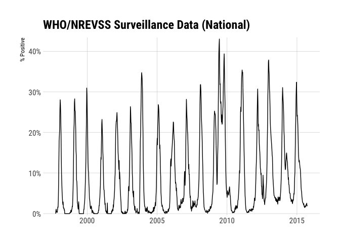<!-- -->

``` r
who_nrevss("hhs", years=2016)
```

    ## $public_health_labs
    ## # A tibble: 520 x 13
    ##    region_type    region  year  week total_specimens a_2009_h1n1  a_h3 a_subtyping_not_performed     b  bvic  byam
    ##          <chr>     <chr> <int> <chr>           <int>       <int> <int>                     <int> <int> <int> <int>
    ##  1 HHS Regions  Region 1  2016  <NA>              31           0     6                         0     0     0     0
    ##  2 HHS Regions  Region 2  2016  <NA>              31           0     6                         0     0     2     0
    ##  3 HHS Regions  Region 3  2016  <NA>             112           2     2                         0     0     0     0
    ##  4 HHS Regions  Region 4  2016  <NA>             112           1    11                         0     1     2     0
    ##  5 HHS Regions  Region 5  2016  <NA>             204           0     7                         0     0     0     1
    ##  6 HHS Regions  Region 6  2016  <NA>              39           1     1                         0     0     0     0
    ##  7 HHS Regions  Region 7  2016  <NA>              24           0     2                         0     0     1     0
    ##  8 HHS Regions  Region 8  2016  <NA>              46           2     8                         0     0     0     0
    ##  9 HHS Regions  Region 9  2016  <NA>             186           3    27                         0     0     0     3
    ## 10 HHS Regions Region 10  2016  <NA>             113           0    17                         0     0     0     0
    ## # ... with 510 more rows, and 2 more variables: h3n2v <int>, wk_date <date>
    ## 
    ## $clinical_labs
    ## # A tibble: 520 x 11
    ##    region_type    region  year  week total_specimens total_a total_b percent_positive percent_a percent_b    wk_date
    ##          <chr>     <chr> <int> <int>           <int>   <int>   <int>            <dbl>     <dbl>     <dbl>     <date>
    ##  1 HHS Regions  Region 1  2016    40             654       5       1         0.917431  0.764526 0.1529050 2016-10-02
    ##  2 HHS Regions  Region 2  2016    40            1307      10       3         0.994644  0.765111 0.2295330 2016-10-02
    ##  3 HHS Regions  Region 3  2016    40             941       1       4         0.531350  0.106270 0.4250800 2016-10-02
    ##  4 HHS Regions  Region 4  2016    40            2758      46      62         3.915880  1.667880 2.2480100 2016-10-02
    ##  5 HHS Regions  Region 5  2016    40            2386       8       5         0.544845  0.335289 0.2095560 2016-10-02
    ##  6 HHS Regions  Region 6  2016    40            1914      22      13         1.828630  1.149430 0.6792060 2016-10-02
    ##  7 HHS Regions  Region 7  2016    40             723       0       0         0.000000  0.000000 0.0000000 2016-10-02
    ##  8 HHS Regions  Region 8  2016    40             913       8       0         0.876232  0.876232 0.0000000 2016-10-02
    ##  9 HHS Regions  Region 9  2016    40            1123       7       1         0.712378  0.623330 0.0890472 2016-10-02
    ## 10 HHS Regions Region 10  2016    40             590      14       0         2.372880  2.372880 0.0000000 2016-10-02
    ## # ... with 510 more rows

``` r
who_nrevss("census", years=2016)
```

    ## $public_health_labs
    ## # A tibble: 468 x 13
    ##       region_type             region  year  week total_specimens a_2009_h1n1  a_h3 a_subtyping_not_performed     b
    ##             <chr>              <chr> <int> <chr>           <int>       <int> <int>                     <int> <int>
    ##  1 Census Regions        New England  2016  <NA>              31           0     6                         0     0
    ##  2 Census Regions       Mid-Atlantic  2016  <NA>              50           0     8                         0     0
    ##  3 Census Regions East North Central  2016  <NA>             139           0     4                         0     0
    ##  4 Census Regions West North Central  2016  <NA>             103           0     6                         0     0
    ##  5 Census Regions     South Atlantic  2016  <NA>             181           3    11                         0     1
    ##  6 Census Regions East South Central  2016  <NA>              24           0     0                         0     0
    ##  7 Census Regions West South Central  2016  <NA>              27           0     1                         0     0
    ##  8 Census Regions           Mountain  2016  <NA>              54           3    10                         0     0
    ##  9 Census Regions            Pacific  2016  <NA>             289           3    41                         0     0
    ## 10 Census Regions        New England  2016  <NA>              14           0     2                         0     0
    ## # ... with 458 more rows, and 4 more variables: bvic <int>, byam <int>, h3n2v <int>, wk_date <date>
    ## 
    ## $clinical_labs
    ## # A tibble: 468 x 11
    ##       region_type             region  year  week total_specimens total_a total_b percent_positive percent_a percent_b
    ##             <chr>              <chr> <int> <int>           <int>   <int>   <int>            <dbl>     <dbl>     <dbl>
    ##  1 Census Regions        New England  2016    40             654       5       1         0.917431  0.764526 0.1529050
    ##  2 Census Regions       Mid-Atlantic  2016    40            1579      10       4         0.886637  0.633312 0.2533250
    ##  3 Census Regions East North Central  2016    40            2176       6       5         0.505515  0.275735 0.2297790
    ##  4 Census Regions West North Central  2016    40            1104       3       0         0.271739  0.271739 0.0000000
    ##  5 Census Regions     South Atlantic  2016    40            2610      43      62         4.022990  1.647510 2.3754800
    ##  6 Census Regions East South Central  2016    40             817       4       3         0.856793  0.489596 0.3671970
    ##  7 Census Regions West South Central  2016    40            1738      21      13         1.956270  1.208290 0.7479860
    ##  8 Census Regions           Mountain  2016    40            1067       8       0         0.749766  0.749766 0.0000000
    ##  9 Census Regions            Pacific  2016    40            1564      21       1         1.406650  1.342710 0.0639386
    ## 10 Census Regions        New England  2016    41             810       5       1         0.740741  0.617284 0.1234570
    ## # ... with 458 more rows, and 1 more variables: wk_date <date>

``` r
who_nrevss("state", years=2016)
```

    ## $public_health_labs
    ## # A tibble: 54 x 12
    ##    region_type               region season_description total_specimens a_2009_h1n1  a_h3 a_subtyping_not_performed
    ##          <chr>                <chr>              <chr>           <chr>       <chr> <chr>                     <chr>
    ##  1      States              Alabama     Season 2016-17             549           3   222                         0
    ##  2      States               Alaska     Season 2016-17            5226          14   905                         3
    ##  3      States              Arizona     Season 2016-17            2974          63  1630                         0
    ##  4      States             Arkansas     Season 2016-17             121           0    51                         0
    ##  5      States           California     Season 2016-17           14033         184  4694                       120
    ##  6      States             Colorado     Season 2016-17             715           3   267                         2
    ##  7      States          Connecticut     Season 2016-17            1347          19   968                         0
    ##  8      States             Delaware     Season 2016-17            3090           5   659                         4
    ##  9      States District of Columbia     Season 2016-17              69           1    32                         0
    ## 10      States              Florida     Season 2016-17            <NA>        <NA>  <NA>                      <NA>
    ## # ... with 44 more rows, and 5 more variables: b <chr>, bvic <chr>, byam <chr>, h3n2v <chr>, wk_date <date>
    ## 
    ## $clinical_labs
    ## # A tibble: 2,808 x 11
    ##    region_type               region  year  week total_specimens total_a total_b percent_positive percent_a percent_b
    ##          <chr>                <chr> <int> <int>           <chr>   <chr>   <chr>            <chr>     <chr>     <chr>
    ##  1      States              Alabama  2016    40             379       4       0             1.06      1.06         0
    ##  2      States               Alaska  2016    40            <NA>    <NA>    <NA>             <NA>      <NA>      <NA>
    ##  3      States              Arizona  2016    40             133       0       0                0         0         0
    ##  4      States             Arkansas  2016    40              47       0       0                0         0         0
    ##  5      States           California  2016    40             799       3       0             0.38      0.38         0
    ##  6      States             Colorado  2016    40             260       0       0                0         0         0
    ##  7      States          Connecticut  2016    40             199       3       0             1.51      1.51         0
    ##  8      States             Delaware  2016    40              40       0       0                0         0         0
    ##  9      States District of Columbia  2016    40            <NA>    <NA>    <NA>             <NA>      <NA>      <NA>
    ## 10      States              Florida  2016    40            <NA>    <NA>    <NA>             <NA>      <NA>      <NA>
    ## # ... with 2,798 more rows, and 1 more variables: wk_date <date>

## Code of Conduct

Please note that this project is released with a [Contributor Code of
Conduct](CONDUCT.md). By participating in this project you agree to
abide by its terms.
