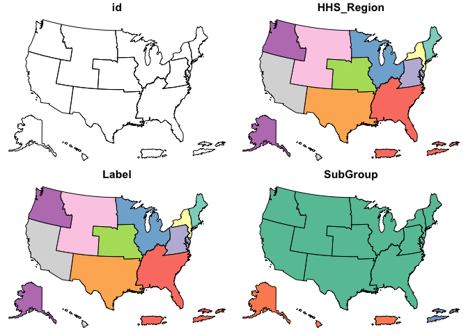
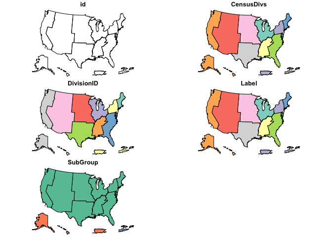
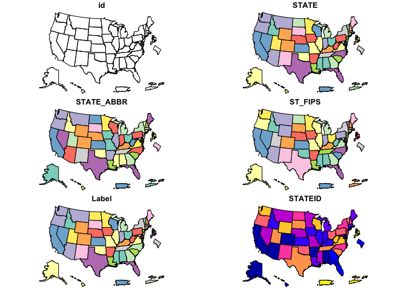
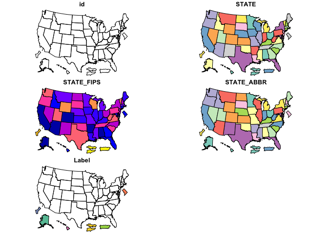
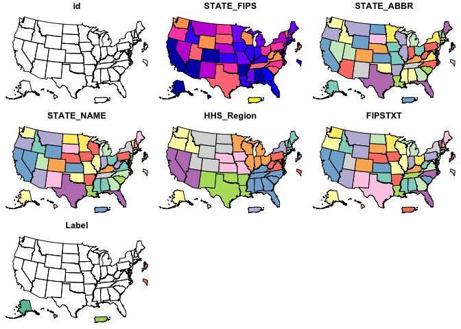
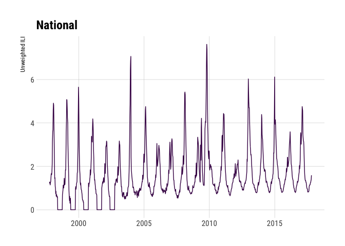
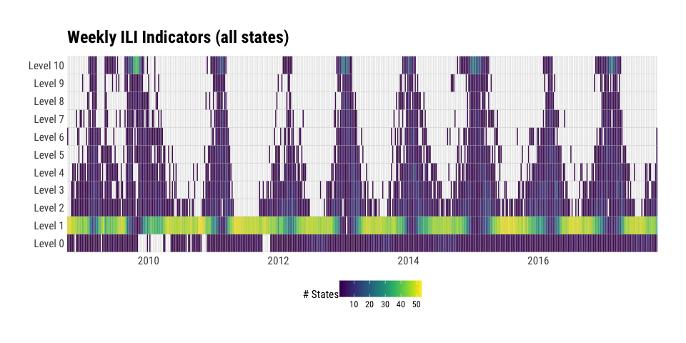
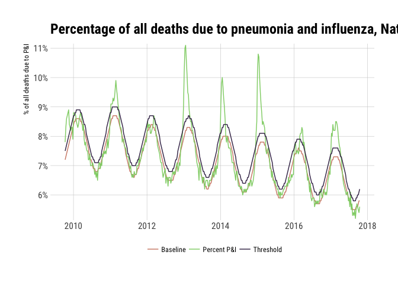

[](https://cran.r-project.org/package=cdcfluview)
[](https://travis-ci.org/hrbrmstr/cdcfluview)
[](https://codecov.io/github/hrbrmstr/cdcfluview?branch=master)

I M P O R T A N T
=================

The CDC migrated to a new non-Flash portal and back-end APIs changed.
This is a complete reimagining of the package and — as such — all your
code is going to break. Please use GitHub issues to identify previous
API functionality you would like ported over. There’s a [release
candidate for
0.5.2](https://github.com/hrbrmstr/cdcfluview/releases/tag/v0.5.2) which
uses the old API but it likely to break in the near future given the
changes to the hidden API. You can do what with
`devtools::install_github("hrbrmstr/cdcfluview", ref="58c172b")`.

All folks providing feedback, code or suggestions will be added to the
DESCRIPTION file. Please include how you would prefer to be cited in any
issues you file.

If there’s a particular data set from
<https://www.cdc.gov/flu/weekly/fluviewinteractive.htm> that you want
and that isn’t in the package, please file it as an issue and be as
specific as you can (screen shot if possible).

:mask: cdcfluview
=================

Retrieve U.S. Flu Season Data from the CDC FluView Portal

Description
-----------

The U.S. Centers for Disease Control (CDC) maintains a portal
<http://gis.cdc.gov/grasp/fluview/fluportaldashboard.html> for accessing
state, regional and national influenza statistics as well as Mortality
Surveillance Data. The Flash interface makes it difficult and
time-consuming to select and retrieve influenza data. This package
provides functions to access the data provided by the portal’s
underlying API.

What’s Inside The Tin
---------------------

The following functions are implemented:

-   `age_group_distribution`: Age Group Distribution of Influenza
    Positive Tests Reported by Public Health Laboratories
-   `cdc_basemap`: Retrieve CDC U.S. Basemaps
-   `geographic_spread`: State and Territorial Epidemiologists Reports
    of Geographic Spread of Influenza
-   `hospitalizations`: Laboratory-Confirmed Influenza Hospitalizations
-   `ilinet`: Retrieve ILINet Surveillance Data
-   `ili_weekly_activity_indicators`: Retrieve weekly state-level ILI
    indicators per-state for a given season
-   `pi_mortality`: Pneumonia and Influenza Mortality Surveillance
-   `state_data_providers`: Retrieve metadata about U.S. State CDC
    Provider Data
-   `surveillance_areas`: Retrieve a list of valid sub-regions for each
    surveillance area.
-   `who_nrevss`: Retrieve WHO/NREVSS Surveillance Data
-   `mmwr_week`: Convert a Date to an MMWR day+week+year
-   `mmwr_weekday`: Convert a Date to an MMWR weekday
-   `mmwr_week_to_date`: Convert an MMWR year+week or year+week+day to a
    Date object

The following data sets are included:

-   `hhs_regions`: HHS Region Table (a data frame with 59 rows and 4
    variables)
-   `census_regions`: Census Region Table (a data frame with 51 rows and
    2 variables)
-   `mmwrid_map`: MMWR ID to Calendar Mappings (it is exported &
    available, no need to use `data()`)

Installation
------------

``` r
devtools::install_github("hrbrmstr/cdcfluview")
```

Usage
-----

``` r
library(cdcfluview)
library(hrbrthemes)
library(tidyverse)

# current verison
packageVersion("cdcfluview")
```

    ## [1] '0.7.0'

### Age Group Distribution of Influenza Positive Tests Reported by Public Health Laboratories

``` r
glimpse(age_group_distribution())
```

    ## Observations: 36,144
    ## Variables: 16
    ## $ sea_label         <chr> "1997-98", "1997-98", "1997-98", "1997-98", "1997-98", "1997-98", "1997-98", "1997-98", "...
    ## $ age_label         <fctr> 0-4 yr, 0-4 yr, 0-4 yr, 0-4 yr, 0-4 yr, 0-4 yr, 0-4 yr, 0-4 yr, 0-4 yr, 0-4 yr, 0-4 yr, ...
    ## $ vir_label         <fctr> A (Subtyping not Performed), A (Subtyping not Performed), A (Subtyping not Performed), A...
    ## $ count             <int> 0, 1, 0, 0, 0, 0, 0, 3, 0, 6, 0, 1, 1, 2, 11, 8, 18, 26, 22, 19, 2, 5, 2, 1, 4, 0, 0, 0, ...
    ## $ mmwrid            <int> 1866, 1867, 1868, 1869, 1870, 1871, 1872, 1873, 1874, 1875, 1876, 1877, 1878, 1879, 1880,...
    ## $ seasonid          <int> 37, 37, 37, 37, 37, 37, 37, 37, 37, 37, 37, 37, 37, 37, 37, 37, 37, 37, 37, 37, 37, 37, 3...
    ## $ publishyearweekid <int> 2913, 2913, 2913, 2913, 2913, 2913, 2913, 2913, 2913, 2913, 2913, 2913, 2913, 2913, 2913,...
    ## $ sea_description   <chr> "Season 1997-98", "Season 1997-98", "Season 1997-98", "Season 1997-98", "Season 1997-98",...
    ## $ sea_startweek     <int> 1866, 1866, 1866, 1866, 1866, 1866, 1866, 1866, 1866, 1866, 1866, 1866, 1866, 1866, 1866,...
    ## $ sea_endweek       <int> 1918, 1918, 1918, 1918, 1918, 1918, 1918, 1918, 1918, 1918, 1918, 1918, 1918, 1918, 1918,...
    ## $ vir_description   <chr> "A-Unk", "A-Unk", "A-Unk", "A-Unk", "A-Unk", "A-Unk", "A-Unk", "A-Unk", "A-Unk", "A-Unk",...
    ## $ vir_startmmwrid   <int> 1397, 1397, 1397, 1397, 1397, 1397, 1397, 1397, 1397, 1397, 1397, 1397, 1397, 1397, 1397,...
    ## $ vir_endmmwrid     <int> 3131, 3131, 3131, 3131, 3131, 3131, 3131, 3131, 3131, 3131, 3131, 3131, 3131, 3131, 3131,...
    ## $ wk_start          <date> 1997-09-28, 1997-10-05, 1997-10-12, 1997-10-19, 1997-10-26, 1997-11-02, 1997-11-09, 1997...
    ## $ wk_end            <date> 1997-10-04, 1997-10-11, 1997-10-18, 1997-10-25, 1997-11-01, 1997-11-08, 1997-11-15, 1997...
    ## $ year_wk_num       <int> 40, 41, 42, 43, 44, 45, 46, 47, 48, 49, 50, 51, 52, 53, 1, 2, 3, 4, 5, 6, 7, 8, 9, 10, 11...

### Retrieve CDC U.S. Coverage Map

``` r
plot(cdc_basemap("national"))
```


``` r
plot(cdc_basemap("hhs"))
```



``` r
plot(cdc_basemap("census"))
```



``` r
plot(cdc_basemap("states"))
```



``` r
plot(cdc_basemap("spread"))
```



``` r
plot(cdc_basemap("surv"))
```



### State and Territorial Epidemiologists Reports of Geographic Spread of Influenza

``` r
glimpse(geographic_spread())
```

    ## Observations: 25,795
    ## Variables: 7
    ## $ statename         <chr> "Alabama", "Alabama", "Alabama", "Alabama", "Alabama", "Alabama", "Alabama", "Alabama", "...
    ## $ url               <chr> "http://adph.org/influenza/", "http://adph.org/influenza/", "http://adph.org/influenza/",...
    ## $ website           <chr> "Influenza Surveillance", "Influenza Surveillance", "Influenza Surveillance", "Influenza ...
    ## $ activity_estimate <chr> "No Activity", "No Activity", "No Activity", "Local Activity", "Sporadic", "Sporadic", "S...
    ## $ weekend           <date> 2003-10-04, 2003-10-11, 2003-10-18, 2003-10-25, 2003-11-01, 2003-11-08, 2003-11-15, 2003...
    ## $ season            <chr> "2003-04", "2003-04", "2003-04", "2003-04", "2003-04", "2003-04", "2003-04", "2003-04", "...
    ## $ weeknumber        <chr> "40", "41", "42", "43", "44", "45", "46", "47", "48", "49", "50", "51", "52", "53", "1", ...

### Laboratory-Confirmed Influenza Hospitalizations

``` r
surveillance_areas()
```

    ##    surveillance_area               region
    ## 1            flusurv       Entire Network
    ## 2                eip           California
    ## 3                eip             Colorado
    ## 4                eip          Connecticut
    ## 5                eip       Entire Network
    ## 6                eip              Georgia
    ## 7                eip             Maryland
    ## 8                eip            Minnesota
    ## 9                eip           New Mexico
    ## 10               eip    New York - Albany
    ## 11               eip New York - Rochester
    ## 12               eip               Oregon
    ## 13               eip            Tennessee
    ## 14              ihsp       Entire Network
    ## 15              ihsp                Idaho
    ## 16              ihsp                 Iowa
    ## 17              ihsp             Michigan
    ## 18              ihsp                 Ohio
    ## 19              ihsp             Oklahoma
    ## 20              ihsp         Rhode Island
    ## 21              ihsp         South Dakota
    ## 22              ihsp                 Utah

``` r
glimpse(fs_nat <- hospitalizations("flusurv"))
```

    ## Observations: 1,476
    ## Variables: 14
    ## $ surveillance_area <chr> "FluSurv-NET", "FluSurv-NET", "FluSurv-NET", "FluSurv-NET", "FluSurv-NET", "FluSurv-NET",...
    ## $ region            <chr> "Entire Network", "Entire Network", "Entire Network", "Entire Network", "Entire Network",...
    ## $ year              <int> 2009, 2009, 2009, 2009, 2009, 2009, 2009, 2009, 2009, 2009, 2009, 2009, 2009, 2009, 2009,...
    ## $ season            <int> 49, 49, 49, 49, 49, 49, 49, 49, 49, 49, 49, 49, 49, 49, 49, 49, 49, 49, 49, 49, 49, 49, 4...
    ## $ wk_start          <date> 2009-08-30, 2009-09-06, 2009-09-13, 2009-09-20, 2009-09-27, 2009-10-04, 2009-10-11, 2009...
    ## $ wk_end            <date> 2009-09-05, 2009-09-12, 2009-09-19, 2009-09-26, 2009-10-03, 2009-10-10, 2009-10-17, 2009...
    ## $ year_wk_num       <int> 35, 36, 37, 38, 39, 40, 41, 42, 43, 44, 45, 46, 47, 48, 49, 50, 51, 52, 1, 2, 3, 4, 5, 6,...
    ## $ rate              <dbl> 0.5, 2.5, 4.6, 6.7, 10.9, 18.1, 28.3, 39.1, 47.3, 53.3, 57.5, 60.1, 61.6, 62.9, 64.1, 65....
    ## $ weeklyrate        <dbl> 0.5, 2.0, 2.0, 2.1, 4.3, 7.2, 10.2, 10.8, 8.2, 6.0, 4.2, 2.6, 1.5, 1.3, 1.3, 1.0, 1.2, 1....
    ## $ age               <int> 1, 1, 1, 1, 1, 1, 1, 1, 1, 1, 1, 1, 1, 1, 1, 1, 1, 1, 1, 1, 1, 1, 1, 1, 1, 1, 1, 1, 1, 1,...
    ## $ age_label         <fctr> 0-4 yr, 0-4 yr, 0-4 yr, 0-4 yr, 0-4 yr, 0-4 yr, 0-4 yr, 0-4 yr, 0-4 yr, 0-4 yr, 0-4 yr, ...
    ## $ sea_label         <chr> "2009-10", "2009-10", "2009-10", "2009-10", "2009-10", "2009-10", "2009-10", "2009-10", "...
    ## $ sea_description   <chr> "Season 2009-10", "Season 2009-10", "Season 2009-10", "Season 2009-10", "Season 2009-10",...
    ## $ mmwrid            <int> 2488, 2489, 2490, 2491, 2492, 2493, 2494, 2495, 2496, 2497, 2498, 2499, 2500, 2501, 2502,...

``` r
ggplot(fs_nat, aes(wk_end, rate)) + 
  geom_line(aes(color=age_label, group=age_label)) +
  facet_wrap(~sea_description, scales="free_x") +
  scale_color_ipsum(name=NULL) +
  labs(x=NULL, y="Rates per 100,000 population",
       title="FluSurv-NET :: Entire Network :: All Seasons :: Cumulative Rate") +
  theme_ipsum_rc()
```


``` r
glimpse(hospitalizations("eip"))
```

    ## Observations: 2,385
    ## Variables: 14
    ## $ surveillance_area <chr> "EIP", "EIP", "EIP", "EIP", "EIP", "EIP", "EIP", "EIP", "EIP", "EIP", "EIP", "EIP", "EIP"...
    ## $ region            <chr> "Entire Network", "Entire Network", "Entire Network", "Entire Network", "Entire Network",...
    ## $ year              <int> 2003, 2003, 2003, 2003, 2003, 2003, 2003, 2003, 2003, 2003, 2003, 2003, 2003, 2003, 2004,...
    ## $ season            <int> 43, 43, 43, 43, 43, 43, 43, 43, 43, 43, 43, 43, 43, 43, 43, 43, 43, 43, 43, 43, 43, 43, 4...
    ## $ wk_start          <date> 2003-09-28, 2003-10-05, 2003-10-12, 2003-10-19, 2003-10-26, 2003-11-02, 2003-11-09, 2003...
    ## $ wk_end            <date> 2003-10-04, 2003-10-11, 2003-10-18, 2003-10-25, 2003-11-01, 2003-11-08, 2003-11-15, 2003...
    ## $ year_wk_num       <int> 40, 41, 42, 43, 44, 45, 46, 47, 48, 49, 50, 51, 52, 53, 1, 2, 3, 4, 5, 6, 7, 8, 9, 10, 11...
    ## $ rate              <dbl> 0.0, 0.0, 0.0, 0.0, 0.1, 0.7, 3.3, 9.1, 16.9, 28.1, 40.0, 55.6, 69.0, 78.7, 83.1, 86.6, 8...
    ## $ weeklyrate        <dbl> 0.0, 0.0, 0.0, 0.0, 0.1, 0.6, 2.7, 5.8, 7.8, 11.2, 11.9, 15.6, 13.4, 9.7, 4.4, 3.4, 1.3, ...
    ## $ age               <int> 1, 1, 1, 1, 1, 1, 1, 1, 1, 1, 1, 1, 1, 1, 1, 1, 1, 1, 1, 1, 1, 1, 1, 1, 1, 1, 1, 1, 1, 1,...
    ## $ age_label         <fctr> 0-4 yr, 0-4 yr, 0-4 yr, 0-4 yr, 0-4 yr, 0-4 yr, 0-4 yr, 0-4 yr, 0-4 yr, 0-4 yr, 0-4 yr, ...
    ## $ sea_label         <chr> NA, NA, NA, NA, NA, NA, NA, NA, NA, NA, NA, NA, NA, NA, NA, NA, NA, NA, NA, NA, NA, NA, N...
    ## $ sea_description   <chr> NA, NA, NA, NA, NA, NA, NA, NA, NA, NA, NA, NA, NA, NA, NA, NA, NA, NA, NA, NA, NA, NA, N...
    ## $ mmwrid            <int> 2179, 2180, 2181, 2182, 2183, 2184, 2185, 2186, 2187, 2188, 2189, 2190, 2191, 2192, 2193,...

``` r
glimpse(hospitalizations("eip", "Colorado"))
```

    ## Observations: 2,385
    ## Variables: 14
    ## $ surveillance_area <chr> "EIP", "EIP", "EIP", "EIP", "EIP", "EIP", "EIP", "EIP", "EIP", "EIP", "EIP", "EIP", "EIP"...
    ## $ region            <chr> "Colorado", "Colorado", "Colorado", "Colorado", "Colorado", "Colorado", "Colorado", "Colo...
    ## $ year              <int> 2003, 2003, 2003, 2003, 2003, 2003, 2003, 2003, 2003, 2003, 2003, 2003, 2003, 2003, 2004,...
    ## $ season            <int> 43, 43, 43, 43, 43, 43, 43, 43, 43, 43, 43, 43, 43, 43, 43, 43, 43, 43, 43, 43, 43, 43, 4...
    ## $ wk_start          <date> 2003-09-28, 2003-10-05, 2003-10-12, 2003-10-19, 2003-10-26, 2003-11-02, 2003-11-09, 2003...
    ## $ wk_end            <date> 2003-10-04, 2003-10-11, 2003-10-18, 2003-10-25, 2003-11-01, 2003-11-08, 2003-11-15, 2003...
    ## $ year_wk_num       <int> 40, 41, 42, 43, 44, 45, 46, 47, 48, 49, 50, 51, 52, 53, 1, 2, 3, 4, 5, 6, 7, 8, 9, 10, 11...
    ## $ rate              <dbl> 0.0, 0.0, 0.0, 0.0, 0.6, 3.6, 21.2, 57.5, 94.3, 130.6, 146.4, 150.6, 153.0, 157.2, 158.5,...
    ## $ weeklyrate        <dbl> 0.0, 0.0, 0.0, 0.0, 0.6, 3.0, 17.5, 36.3, 36.9, 36.3, 15.7, 4.2, 2.4, 4.2, 1.2, 1.2, 1.8,...
    ## $ age               <int> 1, 1, 1, 1, 1, 1, 1, 1, 1, 1, 1, 1, 1, 1, 1, 1, 1, 1, 1, 1, 1, 1, 1, 1, 1, 1, 1, 1, 1, 1,...
    ## $ age_label         <fctr> 0-4 yr, 0-4 yr, 0-4 yr, 0-4 yr, 0-4 yr, 0-4 yr, 0-4 yr, 0-4 yr, 0-4 yr, 0-4 yr, 0-4 yr, ...
    ## $ sea_label         <chr> NA, NA, NA, NA, NA, NA, NA, NA, NA, NA, NA, NA, NA, NA, NA, NA, NA, NA, NA, NA, NA, NA, N...
    ## $ sea_description   <chr> NA, NA, NA, NA, NA, NA, NA, NA, NA, NA, NA, NA, NA, NA, NA, NA, NA, NA, NA, NA, NA, NA, N...
    ## $ mmwrid            <int> 2179, 2180, 2181, 2182, 2183, 2184, 2185, 2186, 2187, 2188, 2189, 2190, 2191, 2192, 2193,...

``` r
glimpse(hospitalizations("ihsp"))
```

    ## Observations: 1,476
    ## Variables: 14
    ## $ surveillance_area <chr> "IHSP", "IHSP", "IHSP", "IHSP", "IHSP", "IHSP", "IHSP", "IHSP", "IHSP", "IHSP", "IHSP", "...
    ## $ region            <chr> "Entire Network", "Entire Network", "Entire Network", "Entire Network", "Entire Network",...
    ## $ year              <int> 2009, 2009, 2009, 2009, 2009, 2009, 2009, 2009, 2009, 2009, 2009, 2009, 2009, 2009, 2009,...
    ## $ season            <int> 49, 49, 49, 49, 49, 49, 49, 49, 49, 49, 49, 49, 49, 49, 49, 49, 49, 49, 49, 49, 49, 49, 4...
    ## $ wk_start          <date> 2009-08-30, 2009-09-06, 2009-09-13, 2009-09-20, 2009-09-27, 2009-10-04, 2009-10-11, 2009...
    ## $ wk_end            <date> 2009-09-05, 2009-09-12, 2009-09-19, 2009-09-26, 2009-10-03, 2009-10-10, 2009-10-17, 2009...
    ## $ year_wk_num       <int> 35, 36, 37, 38, 39, 40, 41, 42, 43, 44, 45, 46, 47, 48, 49, 50, 51, 52, 1, 2, 3, 4, 5, 6,...
    ## $ rate              <dbl> 0.0, 0.4, 3.6, 7.6, 14.0, 25.5, 47.1, 71.8, 87.4, 92.5, 94.9, 96.9, 98.1, 98.9, 100.9, 10...
    ## $ weeklyrate        <dbl> 0.0, 0.4, 3.2, 4.0, 6.4, 11.6, 21.5, 24.7, 15.6, 5.2, 2.4, 2.0, 1.2, 0.8, 2.0, 1.2, 1.6, ...
    ## $ age               <int> 1, 1, 1, 1, 1, 1, 1, 1, 1, 1, 1, 1, 1, 1, 1, 1, 1, 1, 1, 1, 1, 1, 1, 1, 1, 1, 1, 1, 1, 1,...
    ## $ age_label         <fctr> 0-4 yr, 0-4 yr, 0-4 yr, 0-4 yr, 0-4 yr, 0-4 yr, 0-4 yr, 0-4 yr, 0-4 yr, 0-4 yr, 0-4 yr, ...
    ## $ sea_label         <chr> "2009-10", "2009-10", "2009-10", "2009-10", "2009-10", "2009-10", "2009-10", "2009-10", "...
    ## $ sea_description   <chr> "Season 2009-10", "Season 2009-10", "Season 2009-10", "Season 2009-10", "Season 2009-10",...
    ## $ mmwrid            <int> 2488, 2489, 2490, 2491, 2492, 2493, 2494, 2495, 2496, 2497, 2498, 2499, 2500, 2501, 2502,...

``` r
glimpse(hospitalizations("ihsp", "Oklahoma"))
```

    ## Observations: 390
    ## Variables: 14
    ## $ surveillance_area <chr> "IHSP", "IHSP", "IHSP", "IHSP", "IHSP", "IHSP", "IHSP", "IHSP", "IHSP", "IHSP", "IHSP", "...
    ## $ region            <chr> "Oklahoma", "Oklahoma", "Oklahoma", "Oklahoma", "Oklahoma", "Oklahoma", "Oklahoma", "Okla...
    ## $ year              <int> 2009, 2009, 2009, 2009, 2009, 2009, 2009, 2009, 2009, 2009, 2009, 2009, 2009, 2009, 2009,...
    ## $ season            <int> 49, 49, 49, 49, 49, 49, 49, 49, 49, 49, 49, 49, 49, 49, 49, 49, 49, 49, 49, 49, 49, 49, 4...
    ## $ wk_start          <date> 2009-08-30, 2009-09-06, 2009-09-13, 2009-09-20, 2009-09-27, 2009-10-04, 2009-10-11, 2009...
    ## $ wk_end            <date> 2009-09-05, 2009-09-12, 2009-09-19, 2009-09-26, 2009-10-03, 2009-10-10, 2009-10-17, 2009...
    ## $ year_wk_num       <int> 35, 36, 37, 38, 39, 40, 41, 42, 43, 44, 45, 46, 47, 48, 49, 50, 51, 52, 1, 2, 3, 4, 5, 6,...
    ## $ rate              <dbl> 0.0, 1.3, 10.8, 21.5, 40.4, 63.3, 88.9, 106.4, 115.8, 121.2, 125.2, 125.2, 126.6, 127.9, ...
    ## $ weeklyrate        <dbl> 0.0, 1.3, 9.4, 10.8, 18.9, 22.9, 25.6, 17.5, 9.4, 5.4, 4.0, 0.0, 1.3, 1.3, 2.7, 1.3, 5.4,...
    ## $ age               <int> 1, 1, 1, 1, 1, 1, 1, 1, 1, 1, 1, 1, 1, 1, 1, 1, 1, 1, 1, 1, 1, 1, 1, 1, 1, 1, 1, 1, 1, 1,...
    ## $ age_label         <fctr> 0-4 yr, 0-4 yr, 0-4 yr, 0-4 yr, 0-4 yr, 0-4 yr, 0-4 yr, 0-4 yr, 0-4 yr, 0-4 yr, 0-4 yr, ...
    ## $ sea_label         <chr> "2009-10", "2009-10", "2009-10", "2009-10", "2009-10", "2009-10", "2009-10", "2009-10", "...
    ## $ sea_description   <chr> "Season 2009-10", "Season 2009-10", "Season 2009-10", "Season 2009-10", "Season 2009-10",...
    ## $ mmwrid            <int> 2488, 2489, 2490, 2491, 2492, 2493, 2494, 2495, 2496, 2497, 2498, 2499, 2500, 2501, 2502,...

### Retrieve ILINet Surveillance Data

``` r
walk(c("national", "hhs", "census", "state"), ~{
  
  ili_df <- ilinet(region = .x)
  
  print(glimpse(ili_df))
  
  ggplot(ili_df, aes(week_start, unweighted_ili, group=region, color=region)) +
    geom_line() +
    viridis::scale_color_viridis(discrete=TRUE) +
    labs(x=NULL, y="Unweighted ILI", title=ili_df$region_type[1]) +
    theme_ipsum_rc(grid="XY") +
    theme(legend.position = "none") -> gg
  
  print(gg)
  
})
```

    ## Observations: 1,048
    ## Variables: 16
    ## $ region_type      <chr> "National", "National", "National", "National", "National", "National", "National", "Natio...
    ## $ region           <chr> "National", "National", "National", "National", "National", "National", "National", "Natio...
    ## $ year             <int> 1997, 1997, 1997, 1997, 1997, 1997, 1997, 1997, 1997, 1997, 1997, 1997, 1997, 1997, 1998, ...
    ## $ week             <int> 40, 41, 42, 43, 44, 45, 46, 47, 48, 49, 50, 51, 52, 53, 1, 2, 3, 4, 5, 6, 7, 8, 9, 10, 11,...
    ## $ weighted_ili     <dbl> 1.101480, 1.200070, 1.378760, 1.199200, 1.656180, 1.413260, 1.986800, 2.447490, 1.739010, ...
    ## $ unweighted_ili   <dbl> 1.216860, 1.280640, 1.239060, 1.144730, 1.261120, 1.282750, 1.445790, 1.647960, 1.675170, ...
    ## $ age_0_4          <dbl> 179, 199, 228, 188, 217, 178, 294, 288, 268, 299, 346, 348, 510, 579, 639, 690, 856, 824, ...
    ## $ age_25_49        <dbl> NA, NA, NA, NA, NA, NA, NA, NA, NA, NA, NA, NA, NA, NA, NA, NA, NA, NA, NA, NA, NA, NA, NA...
    ## $ age_25_64        <dbl> 157, 151, 153, 193, 162, 148, 240, 293, 206, 282, 268, 235, 404, 584, 759, 654, 679, 817, ...
    ## $ age_5_24         <dbl> 205, 242, 266, 236, 280, 281, 328, 456, 343, 415, 388, 362, 492, 576, 810, 1121, 1440, 160...
    ## $ age_50_64        <dbl> NA, NA, NA, NA, NA, NA, NA, NA, NA, NA, NA, NA, NA, NA, NA, NA, NA, NA, NA, NA, NA, NA, NA...
    ## $ age_65           <dbl> 29, 23, 34, 36, 41, 48, 70, 63, 69, 102, 81, 59, 113, 207, 207, 148, 151, 196, 233, 146, 1...
    ## $ ilitotal         <dbl> 570, 615, 681, 653, 700, 655, 932, 1100, 886, 1098, 1083, 1004, 1519, 1946, 2415, 2613, 31...
    ## $ num_of_providers <dbl> 192, 191, 219, 213, 213, 195, 248, 256, 252, 253, 242, 190, 251, 250, 254, 255, 245, 245, ...
    ## $ total_patients   <dbl> 46842, 48023, 54961, 57044, 55506, 51062, 64463, 66749, 52890, 67887, 61314, 47719, 48429,...
    ## $ week_start       <date> 1997-10-06, 1997-10-13, 1997-10-20, 1997-10-27, 1997-11-03, 1997-11-10, 1997-11-17, 1997-...
    ## # A tibble: 1,048 x 16
    ##    region_type   region  year  week weighted_ili unweighted_ili age_0_4 age_25_49 age_25_64 age_5_24 age_50_64 age_65
    ##          <chr>    <chr> <int> <int>        <dbl>          <dbl>   <dbl>     <dbl>     <dbl>    <dbl>     <dbl>  <dbl>
    ##  1    National National  1997    40      1.10148        1.21686     179        NA       157      205        NA     29
    ##  2    National National  1997    41      1.20007        1.28064     199        NA       151      242        NA     23
    ##  3    National National  1997    42      1.37876        1.23906     228        NA       153      266        NA     34
    ##  4    National National  1997    43      1.19920        1.14473     188        NA       193      236        NA     36
    ##  5    National National  1997    44      1.65618        1.26112     217        NA       162      280        NA     41
    ##  6    National National  1997    45      1.41326        1.28275     178        NA       148      281        NA     48
    ##  7    National National  1997    46      1.98680        1.44579     294        NA       240      328        NA     70
    ##  8    National National  1997    47      2.44749        1.64796     288        NA       293      456        NA     63
    ##  9    National National  1997    48      1.73901        1.67517     268        NA       206      343        NA     69
    ## 10    National National  1997    49      1.93919        1.61739     299        NA       282      415        NA    102
    ## # ... with 1,038 more rows, and 4 more variables: ilitotal <dbl>, num_of_providers <dbl>, total_patients <dbl>,
    ## #   week_start <date>



    ## Observations: 10,480
    ## Variables: 16
    ## $ region_type      <chr> "HHS Regions", "HHS Regions", "HHS Regions", "HHS Regions", "HHS Regions", "HHS Regions", ...
    ## $ region           <fctr> Region 1, Region 2, Region 3, Region 4, Region 5, Region 6, Region 7, Region 8, Region 9,...
    ## $ year             <int> 1997, 1997, 1997, 1997, 1997, 1997, 1997, 1997, 1997, 1997, 1997, 1997, 1997, 1997, 1997, ...
    ## $ week             <int> 40, 40, 40, 40, 40, 40, 40, 40, 40, 40, 41, 41, 41, 41, 41, 41, 41, 41, 41, 41, 42, 42, 42...
    ## $ weighted_ili     <dbl> 0.498535, 0.374963, 1.354280, 0.400338, 1.229260, 1.018980, 0.871791, 0.516017, 1.807610, ...
    ## $ unweighted_ili   <dbl> 0.623848, 0.384615, 1.341720, 0.450010, 0.901266, 0.747384, 1.152860, 0.422654, 2.258780, ...
    ## $ age_0_4          <dbl> 15, 0, 6, 12, 31, 2, 0, 2, 80, 31, 14, 0, 4, 21, 36, 2, 0, 0, 103, 19, 35, 0, 3, 19, 66, 2...
    ## $ age_25_49        <dbl> NA, NA, NA, NA, NA, NA, NA, NA, NA, NA, NA, NA, NA, NA, NA, NA, NA, NA, NA, NA, NA, NA, NA...
    ## $ age_25_64        <dbl> 7, 3, 7, 23, 24, 1, 4, 0, 76, 12, 14, 2, 19, 7, 23, 2, 0, 1, 76, 7, 15, 0, 17, 15, 29, 2, ...
    ## $ age_5_24         <dbl> 22, 0, 15, 11, 30, 2, 18, 3, 74, 30, 29, 0, 16, 14, 41, 2, 13, 8, 84, 35, 35, 0, 24, 18, 7...
    ## $ age_50_64        <dbl> NA, NA, NA, NA, NA, NA, NA, NA, NA, NA, NA, NA, NA, NA, NA, NA, NA, NA, NA, NA, NA, NA, NA...
    ## $ age_65           <dbl> 0, 0, 4, 0, 4, 0, 5, 0, 13, 3, 0, 0, 3, 2, 4, 0, 2, 0, 11, 1, 0, 1, 2, 2, 16, 0, 2, 0, 9, ...
    ## $ ilitotal         <dbl> 44, 3, 32, 46, 89, 5, 27, 5, 243, 76, 57, 2, 42, 44, 104, 6, 15, 9, 274, 62, 85, 1, 46, 54...
    ## $ num_of_providers <dbl> 32, 7, 16, 29, 49, 4, 14, 5, 23, 13, 29, 7, 17, 31, 48, 4, 14, 6, 23, 12, 40, 7, 15, 33, 6...
    ## $ total_patients   <dbl> 7053, 780, 2385, 10222, 9875, 669, 2342, 1183, 10758, 1575, 6987, 872, 2740, 11310, 9618, ...
    ## $ week_start       <date> 1997-10-06, 1997-10-06, 1997-10-06, 1997-10-06, 1997-10-06, 1997-10-06, 1997-10-06, 1997-...
    ## # A tibble: 10,480 x 16
    ##    region_type    region  year  week weighted_ili unweighted_ili age_0_4 age_25_49 age_25_64 age_5_24 age_50_64 age_65
    ##          <chr>    <fctr> <int> <int>        <dbl>          <dbl>   <dbl>     <dbl>     <dbl>    <dbl>     <dbl>  <dbl>
    ##  1 HHS Regions  Region 1  1997    40     0.498535       0.623848      15        NA         7       22        NA      0
    ##  2 HHS Regions  Region 2  1997    40     0.374963       0.384615       0        NA         3        0        NA      0
    ##  3 HHS Regions  Region 3  1997    40     1.354280       1.341720       6        NA         7       15        NA      4
    ##  4 HHS Regions  Region 4  1997    40     0.400338       0.450010      12        NA        23       11        NA      0
    ##  5 HHS Regions  Region 5  1997    40     1.229260       0.901266      31        NA        24       30        NA      4
    ##  6 HHS Regions  Region 6  1997    40     1.018980       0.747384       2        NA         1        2        NA      0
    ##  7 HHS Regions  Region 7  1997    40     0.871791       1.152860       0        NA         4       18        NA      5
    ##  8 HHS Regions  Region 8  1997    40     0.516017       0.422654       2        NA         0        3        NA      0
    ##  9 HHS Regions  Region 9  1997    40     1.807610       2.258780      80        NA        76       74        NA     13
    ## 10 HHS Regions Region 10  1997    40     4.743520       4.825400      31        NA        12       30        NA      3
    ## # ... with 10,470 more rows, and 4 more variables: ilitotal <dbl>, num_of_providers <dbl>, total_patients <dbl>,
    ## #   week_start <date>


    ## Observations: 9,432
    ## Variables: 16
    ## $ region_type      <chr> "Census Regions", "Census Regions", "Census Regions", "Census Regions", "Census Regions", ...
    ## $ region           <chr> "New England", "Mid-Atlantic", "East North Central", "West North Central", "South Atlantic...
    ## $ year             <int> 1997, 1997, 1997, 1997, 1997, 1997, 1997, 1997, 1997, 1997, 1997, 1997, 1997, 1997, 1997, ...
    ## $ week             <int> 40, 40, 40, 40, 40, 40, 40, 40, 40, 41, 41, 41, 41, 41, 41, 41, 41, 41, 42, 42, 42, 42, 42...
    ## $ weighted_ili     <dbl> 0.4985350, 0.8441440, 0.7924860, 1.7640500, 0.5026620, 0.0542283, 1.0189800, 2.2587800, 2....
    ## $ unweighted_ili   <dbl> 0.6238480, 1.3213800, 0.8187380, 1.2793900, 0.7233800, 0.0688705, 0.7473840, 2.2763300, 3....
    ## $ age_0_4          <dbl> 15, 4, 28, 3, 14, 0, 2, 87, 26, 14, 4, 36, 0, 21, 0, 2, 93, 29, 35, 3, 65, 1, 19, 0, 2, 84...
    ## $ age_25_49        <dbl> NA, NA, NA, NA, NA, NA, NA, NA, NA, NA, NA, NA, NA, NA, NA, NA, NA, NA, NA, NA, NA, NA, NA...
    ## $ age_25_64        <dbl> 7, 8, 20, 8, 22, 3, 1, 71, 17, 14, 13, 23, 1, 14, 1, 2, 72, 11, 15, 11, 27, 5, 21, 0, 2, 5...
    ## $ age_5_24         <dbl> 22, 12, 28, 20, 14, 0, 2, 71, 36, 29, 8, 39, 18, 22, 0, 2, 80, 44, 35, 16, 74, 9, 24, 2, 2...
    ## $ age_50_64        <dbl> NA, NA, NA, NA, NA, NA, NA, NA, NA, NA, NA, NA, NA, NA, NA, NA, NA, NA, NA, NA, NA, NA, NA...
    ## $ age_65           <dbl> 0, 4, 3, 6, 0, 0, 0, 15, 1, 0, 2, 2, 4, 3, 0, 0, 10, 2, 0, 3, 12, 6, 2, 0, 0, 9, 2, 0, 1, ...
    ## $ ilitotal         <dbl> 44, 28, 79, 37, 50, 3, 5, 244, 80, 57, 27, 100, 23, 60, 1, 6, 255, 86, 85, 33, 178, 21, 66...
    ## $ num_of_providers <dbl> 32, 13, 47, 17, 30, 9, 4, 16, 24, 29, 13, 46, 17, 32, 10, 4, 17, 23, 40, 12, 62, 16, 33, 1...
    ## $ total_patients   <dbl> 7053, 2119, 9649, 2892, 6912, 4356, 669, 10719, 2473, 6987, 2384, 9427, 2823, 7591, 4947, ...
    ## $ week_start       <date> 1997-10-06, 1997-10-06, 1997-10-06, 1997-10-06, 1997-10-06, 1997-10-06, 1997-10-06, 1997-...
    ## # A tibble: 9,432 x 16
    ##       region_type             region  year  week weighted_ili unweighted_ili age_0_4 age_25_49 age_25_64 age_5_24
    ##             <chr>              <chr> <int> <int>        <dbl>          <dbl>   <dbl>     <dbl>     <dbl>    <dbl>
    ##  1 Census Regions        New England  1997    40    0.4985350      0.6238480      15        NA         7       22
    ##  2 Census Regions       Mid-Atlantic  1997    40    0.8441440      1.3213800       4        NA         8       12
    ##  3 Census Regions East North Central  1997    40    0.7924860      0.8187380      28        NA        20       28
    ##  4 Census Regions West North Central  1997    40    1.7640500      1.2793900       3        NA         8       20
    ##  5 Census Regions     South Atlantic  1997    40    0.5026620      0.7233800      14        NA        22       14
    ##  6 Census Regions East South Central  1997    40    0.0542283      0.0688705       0        NA         3        0
    ##  7 Census Regions West South Central  1997    40    1.0189800      0.7473840       2        NA         1        2
    ##  8 Census Regions           Mountain  1997    40    2.2587800      2.2763300      87        NA        71       71
    ##  9 Census Regions            Pacific  1997    40    2.0488300      3.2349400      26        NA        17       36
    ## 10 Census Regions        New England  1997    41    0.6426690      0.8158010      14        NA        14       29
    ## # ... with 9,422 more rows, and 6 more variables: age_50_64 <dbl>, age_65 <dbl>, ilitotal <dbl>,
    ## #   num_of_providers <dbl>, total_patients <dbl>, week_start <date>


    ## Observations: 19,718
    ## Variables: 16
    ## $ region_type      <chr> "States", "States", "States", "States", "States", "States", "States", "States", "States", ...
    ## $ region           <chr> "Alabama", "Alaska", "Arizona", "Arkansas", "California", "Colorado", "Connecticut", "Dela...
    ## $ year             <int> 2010, 2010, 2010, 2010, 2010, 2010, 2010, 2010, 2010, 2010, 2010, 2010, 2010, 2010, 2010, ...
    ## $ week             <int> 40, 40, 40, 40, 40, 40, 40, 40, 40, 40, 40, 40, 40, 40, 40, 40, 40, 40, 40, 40, 40, 40, 40...
    ## $ weighted_ili     <dbl> NA, NA, NA, NA, NA, NA, NA, NA, NA, NA, NA, NA, NA, NA, NA, NA, NA, NA, NA, NA, NA, NA, NA...
    ## $ unweighted_ili   <dbl> 2.1347700, 0.8751460, 0.6747210, 0.6960560, 1.9541200, 0.6606840, 0.0783085, 0.1001250, 2....
    ## $ age_0_4          <dbl> NA, NA, NA, NA, NA, NA, NA, NA, NA, NA, NA, NA, NA, NA, NA, NA, NA, NA, NA, NA, NA, NA, NA...
    ## $ age_25_49        <dbl> NA, NA, NA, NA, NA, NA, NA, NA, NA, NA, NA, NA, NA, NA, NA, NA, NA, NA, NA, NA, NA, NA, NA...
    ## $ age_25_64        <dbl> NA, NA, NA, NA, NA, NA, NA, NA, NA, NA, NA, NA, NA, NA, NA, NA, NA, NA, NA, NA, NA, NA, NA...
    ## $ age_5_24         <dbl> NA, NA, NA, NA, NA, NA, NA, NA, NA, NA, NA, NA, NA, NA, NA, NA, NA, NA, NA, NA, NA, NA, NA...
    ## $ age_50_64        <dbl> NA, NA, NA, NA, NA, NA, NA, NA, NA, NA, NA, NA, NA, NA, NA, NA, NA, NA, NA, NA, NA, NA, NA...
    ## $ age_65           <dbl> NA, NA, NA, NA, NA, NA, NA, NA, NA, NA, NA, NA, NA, NA, NA, NA, NA, NA, NA, NA, NA, NA, NA...
    ## $ ilitotal         <dbl> 249, 15, 172, 18, 632, 134, 3, 4, 73, NA, 647, 20, 19, 505, 65, 10, 39, 19, NA, 22, 117, 1...
    ## $ num_of_providers <dbl> 35, 7, 49, 15, 112, 14, 12, 13, 4, NA, 62, 18, 12, 74, 44, 6, 40, 14, NA, 30, 17, 56, 47, ...
    ## $ total_patients   <dbl> 11664, 1714, 25492, 2586, 32342, 20282, 3831, 3995, 2599, NA, 40314, 1943, 4579, 39390, 12...
    ## $ week_start       <date> 2010-10-04, 2010-10-04, 2010-10-04, 2010-10-04, 2010-10-04, 2010-10-04, 2010-10-04, 2010-...
    ## # A tibble: 19,718 x 16
    ##    region_type               region  year  week weighted_ili unweighted_ili age_0_4 age_25_49 age_25_64 age_5_24
    ##          <chr>                <chr> <int> <int>        <dbl>          <dbl>   <dbl>     <dbl>     <dbl>    <dbl>
    ##  1      States              Alabama  2010    40           NA      2.1347700      NA        NA        NA       NA
    ##  2      States               Alaska  2010    40           NA      0.8751460      NA        NA        NA       NA
    ##  3      States              Arizona  2010    40           NA      0.6747210      NA        NA        NA       NA
    ##  4      States             Arkansas  2010    40           NA      0.6960560      NA        NA        NA       NA
    ##  5      States           California  2010    40           NA      1.9541200      NA        NA        NA       NA
    ##  6      States             Colorado  2010    40           NA      0.6606840      NA        NA        NA       NA
    ##  7      States          Connecticut  2010    40           NA      0.0783085      NA        NA        NA       NA
    ##  8      States             Delaware  2010    40           NA      0.1001250      NA        NA        NA       NA
    ##  9      States District of Columbia  2010    40           NA      2.8087700      NA        NA        NA       NA
    ## 10      States              Florida  2010    40           NA             NA      NA        NA        NA       NA
    ## # ... with 19,708 more rows, and 6 more variables: age_50_64 <dbl>, age_65 <dbl>, ilitotal <dbl>,
    ## #   num_of_providers <dbl>, total_patients <dbl>, week_start <date>


### Retrieve weekly state-level ILI indicators per-state for a given season

``` r
ili_weekly_activity_indicators(2017)
```

    ## # A tibble: 216 x 9
    ##    statename ili_activity_label ili_activity_group statefips stateabbr    weekend weeknumber  year seasonid
    ##        <chr>             <fctr>              <chr>     <chr>     <chr>     <date>      <int> <int>    <int>
    ##  1   Alabama            Level 2            Minimal        01        AL 2017-10-07         40  2017       57
    ##  2   Alabama            Level 2            Minimal        01        AL 2017-10-14         41  2017       57
    ##  3   Alabama            Level 2            Minimal        01        AL 2017-10-21         42  2017       57
    ##  4   Alabama            Level 3            Minimal        01        AL 2017-10-28         43  2017       57
    ##  5    Alaska            Level 1            Minimal        02        AK 2017-10-07         40  2017       57
    ##  6    Alaska            Level 2            Minimal        02        AK 2017-10-14         41  2017       57
    ##  7    Alaska            Level 4                Low        02        AK 2017-10-21         42  2017       57
    ##  8    Alaska            Level 3            Minimal        02        AK 2017-10-28         43  2017       57
    ##  9   Arizona            Level 2            Minimal        04        AZ 2017-10-07         40  2017       57
    ## 10   Arizona            Level 3            Minimal        04        AZ 2017-10-14         41  2017       57
    ## # ... with 206 more rows

``` r
xdf <- map_df(2008:2017, ili_weekly_activity_indicators)

count(xdf, weekend, ili_activity_label) %>% 
  complete(weekend, ili_activity_label) %>% 
  ggplot(aes(weekend, ili_activity_label, fill=n)) + 
  geom_tile(color="#c2c2c2", size=0.1) +
  scale_x_date(expand=c(0,0)) +
  viridis::scale_fill_viridis(name="# States", na.value="White") +
  labs(x=NULL, y=NULL, title="Weekly ILI Indicators (all states)") +
  coord_fixed(100/1) +
  theme_ipsum_rc(grid="") +
  theme(legend.position="bottom")
```



### Pneumonia and Influenza Mortality Surveillance

``` r
(nat_pi <- pi_mortality("national"))
```

    ## # A tibble: 419 x 19
    ##    seasonid baseline threshold percent_pni percent_complete number_influenza number_pneumonia all_deaths total_pni
    ##       <chr>    <dbl>     <dbl>       <dbl>            <dbl>            <dbl>            <dbl>      <dbl>     <dbl>
    ##  1       57    0.058     0.061       0.054            0.763               10             1962      36283      1972
    ##  2       57    0.058     0.062       0.056            0.675               10             1795      32107      1805
    ##  3       56    0.059     0.063       0.059            1.000               18             3022      51404      3040
    ##  4       56    0.060     0.063       0.061            1.000               11             3193      52130      3204
    ##  5       56    0.061     0.064       0.062            1.000                7             3178      51443      3185
    ##  6       56    0.062     0.065       0.061            1.000               17             3129      51865      3146
    ##  7       56    0.063     0.066       0.060            1.000               16             3099      51753      3115
    ##  8       56    0.064     0.067       0.061            1.000               19             3208      52541      3227
    ##  9       56    0.065     0.068       0.060            1.000                7             3192      53460      3199
    ## 10       56    0.066     0.069       0.062            1.000               22             3257      53163      3279
    ## # ... with 409 more rows, and 10 more variables: weeknumber <chr>, geo_description <chr>, age_label <chr>,
    ## #   wk_start <date>, wk_end <date>, year_wk_num <int>, mmwrid <chr>, coverage_area <chr>, region_name <chr>,
    ## #   callout <chr>

``` r
select(nat_pi, wk_end, percent_pni, baseline, threshold) %>% 
  gather(measure, value, -wk_end) %>% 
  ggplot(aes(wk_end, value)) + 
  geom_line(aes(group=measure, color=measure)) + 
  scale_y_percent() +
  scale_color_ipsum(name = NULL, labels=c("Baseline", "Percent P&I", "Threshold")) +
  labs(x=NULL, y="% of all deaths due to P&I",
       title="Percentage of all deaths due to pneumonia and influenza, National Summary") +
  theme_ipsum_rc(grid="XY") +
  theme(legend.position="bottom")
```



``` r
(st_pi <- pi_mortality("state"))
```

    ## # A tibble: 21,788 x 19
    ##    seasonid baseline threshold percent_pni percent_complete number_influenza number_pneumonia all_deaths total_pni
    ##       <chr>    <dbl>     <dbl>       <dbl>            <dbl>            <dbl>            <dbl>      <dbl>     <dbl>
    ##  1       57       NA        NA       0.065            0.836                0               50        772        50
    ##  2       57       NA        NA       0.064            0.767                0               45        708        45
    ##  3       57       NA        NA       0.063            0.666                1                2         48         3
    ##  4       57       NA        NA       0.105            0.527                0                4         38         4
    ##  5       57       NA        NA       0.053            0.412                0               20        374        20
    ##  6       57       NA        NA       0.059            0.393                0               21        356        21
    ##  7       57       NA        NA       0.060            0.751                0               25        420        25
    ##  8       57       NA        NA       0.050            0.604                0               17        338        17
    ##  9       57       NA        NA       0.065            0.774                1              228       3510       229
    ## 10       57       NA        NA       0.059            0.758                2              201       3438       203
    ## # ... with 21,778 more rows, and 10 more variables: weeknumber <chr>, geo_description <chr>, age_label <chr>,
    ## #   wk_start <date>, wk_end <date>, year_wk_num <int>, mmwrid <chr>, coverage_area <chr>, region_name <chr>,
    ## #   callout <chr>

``` r
(reg_pi <- pi_mortality("region"))
```

    ## # A tibble: 4,190 x 19
    ##    seasonid baseline threshold percent_pni percent_complete number_influenza number_pneumonia all_deaths total_pni
    ##       <chr>    <dbl>     <dbl>       <dbl>            <dbl>            <dbl>            <dbl>      <dbl>     <dbl>
    ##  1       57    0.060     0.067       0.051            0.735                0               85       1683        85
    ##  2       57    0.061     0.068       0.060            0.701                0               96       1605        96
    ##  3       57    0.060     0.065       0.061            0.608                1              154       2524       155
    ##  4       57    0.060     0.066       0.063            0.602                1              157       2497       158
    ##  5       57    0.053     0.058       0.045            0.511                1              115       2575       116
    ##  6       57    0.054     0.059       0.045            0.440                1               98       2215        99
    ##  7       57    0.056     0.060       0.051            0.744                3              394       7753       397
    ##  8       57    0.057     0.061       0.052            0.651                1              354       6778       355
    ##  9       57    0.055     0.059       0.052            0.914                1              403       7701       404
    ## 10       57    0.056     0.060       0.054            0.799                4              358       6733       362
    ## # ... with 4,180 more rows, and 10 more variables: weeknumber <chr>, geo_description <chr>, age_label <chr>,
    ## #   wk_start <date>, wk_end <date>, year_wk_num <int>, mmwrid <chr>, coverage_area <chr>, region_name <chr>,
    ## #   callout <chr>

### Retrieve metadata about U.S. State CDC Provider Data

``` r
state_data_providers()
```

    ## # A tibble: 59 x 5
    ##               statename                                  statehealthdeptname
    ##  *                <chr>                                                <chr>
    ##  1              Alabama                  Alabama Department of Public Health
    ##  2               Alaska           State of Alaska Health and Social Services
    ##  3              Arizona                Arizona Department of Health Services
    ##  4             Arkansas                        Arkansas Department of Health
    ##  5           California               California Department of Public Health
    ##  6             Colorado Colorado Department of Public Health and Environment
    ##  7          Connecticut              Connecticut Department of Public Health
    ##  8             Delaware                  Delaware Health and Social Services
    ##  9 District of Columbia            District of Columbia Department of Health
    ## 10              Florida                         Florida Department of Health
    ## # ... with 49 more rows, and 3 more variables: url <chr>, statewebsitename <chr>, statefluphonenum <chr>

### Retrieve WHO/NREVSS Surveillance Data

``` r
glimpse(xdat <- who_nrevss("national"))
```

    ## List of 3
    ##  $ combined_prior_to_2015_16:Classes 'tbl_df', 'tbl' and 'data.frame':   940 obs. of  14 variables:
    ##   ..$ region_type              : chr [1:940] "National" "National" "National" "National" ...
    ##   ..$ region                   : chr [1:940] "National" "National" "National" "National" ...
    ##   ..$ year                     : int [1:940] 1997 1997 1997 1997 1997 1997 1997 1997 1997 1997 ...
    ##   ..$ week                     : int [1:940] 40 41 42 43 44 45 46 47 48 49 ...
    ##   ..$ total_specimens          : int [1:940] 1291 1513 1552 1669 1897 2106 2204 2533 2242 2607 ...
    ##   ..$ percent_positive         : num [1:940] 0 0.727 1.095 0.419 0.527 ...
    ##   ..$ a_2009_h1n1              : int [1:940] 0 0 0 0 0 0 0 0 0 0 ...
    ##   ..$ a_h1                     : int [1:940] 0 0 0 0 0 0 0 0 0 0 ...
    ##   ..$ a_h3                     : int [1:940] 0 0 3 0 9 0 3 5 14 11 ...
    ##   ..$ a_subtyping_not_performed: int [1:940] 0 11 13 7 1 6 4 17 22 28 ...
    ##   ..$ a_unable_to_subtype      : int [1:940] 0 0 0 0 0 0 0 0 0 0 ...
    ##   ..$ b                        : int [1:940] 0 0 1 0 0 0 1 1 1 1 ...
    ##   ..$ h3n2v                    : int [1:940] 0 0 0 0 0 0 0 0 0 0 ...
    ##   ..$ wk_date                  : Date[1:940], format: "1997-09-28" "1997-10-05" "1997-10-12" "1997-10-19" ...
    ##  $ public_health_labs       :Classes 'tbl_df', 'tbl' and 'data.frame':   108 obs. of  13 variables:
    ##   ..$ region_type              : chr [1:108] "National" "National" "National" "National" ...
    ##   ..$ region                   : chr [1:108] "National" "National" "National" "National" ...
    ##   ..$ year                     : int [1:108] 2015 2015 2015 2015 2015 2015 2015 2015 2015 2015 ...
    ##   ..$ week                     : int [1:108] 40 41 42 43 44 45 46 47 48 49 ...
    ##   ..$ total_specimens          : int [1:108] 1139 1152 1198 1244 1465 1393 1458 1157 1550 1518 ...
    ##   ..$ a_2009_h1n1              : int [1:108] 4 5 10 9 4 11 17 17 27 38 ...
    ##   ..$ a_h3                     : int [1:108] 65 41 50 31 23 34 42 24 36 37 ...
    ##   ..$ a_subtyping_not_performed: int [1:108] 2 2 1 4 4 1 1 0 3 3 ...
    ##   ..$ b                        : int [1:108] 10 7 8 9 9 10 4 4 9 11 ...
    ##   ..$ bvic                     : int [1:108] 0 3 3 1 1 4 0 3 3 2 ...
    ##   ..$ byam                     : int [1:108] 1 0 2 4 4 2 4 9 12 11 ...
    ##   ..$ h3n2v                    : int [1:108] 0 0 0 0 0 0 0 0 0 0 ...
    ##   ..$ wk_date                  : Date[1:108], format: "2015-10-04" "2015-10-11" "2015-10-18" "2015-10-25" ...
    ##  $ clinical_labs            :Classes 'tbl_df', 'tbl' and 'data.frame':   108 obs. of  11 variables:
    ##   ..$ region_type     : chr [1:108] "National" "National" "National" "National" ...
    ##   ..$ region          : chr [1:108] "National" "National" "National" "National" ...
    ##   ..$ year            : int [1:108] 2015 2015 2015 2015 2015 2015 2015 2015 2015 2015 ...
    ##   ..$ week            : int [1:108] 40 41 42 43 44 45 46 47 48 49 ...
    ##   ..$ total_specimens : int [1:108] 12029 13111 13441 13537 14687 15048 15250 15234 16201 16673 ...
    ##   ..$ total_a         : int [1:108] 84 116 97 98 97 122 84 119 145 140 ...
    ##   ..$ total_b         : int [1:108] 43 54 52 52 68 86 98 92 81 106 ...
    ##   ..$ percent_positive: num [1:108] 1.06 1.3 1.11 1.11 1.12 ...
    ##   ..$ percent_a       : num [1:108] 0.698 0.885 0.722 0.724 0.66 ...
    ##   ..$ percent_b       : num [1:108] 0.357 0.412 0.387 0.384 0.463 ...
    ##   ..$ wk_date         : Date[1:108], format: "2015-10-04" "2015-10-11" "2015-10-18" "2015-10-25" ...

``` r
mutate(xdat$combined_prior_to_2015_16, 
       percent_positive = percent_positive / 100) %>% 
  ggplot(aes(wk_date, percent_positive)) +
  geom_line() +
  scale_y_percent(name="% Positive") +
  labs(x=NULL, title="WHO/NREVSS Surveillance Data (National)") +
  theme_ipsum_rc(grid="XY")
```


``` r
who_nrevss("hhs")
```

    ## $combined_prior_to_2015_16
    ## # A tibble: 9,400 x 14
    ##    region_type    region  year  week total_specimens percent_positive a_2009_h1n1  a_h1  a_h3 a_subtyping_not_performed
    ##          <chr>     <chr> <int> <int>           <int>            <dbl>       <int> <int> <int>                     <int>
    ##  1 HHS Regions  Region 1  1997    40              51                0           0     0     0                         0
    ##  2 HHS Regions  Region 2  1997    40             152                0           0     0     0                         0
    ##  3 HHS Regions  Region 3  1997    40             143                0           0     0     0                         0
    ##  4 HHS Regions  Region 4  1997    40              98                0           0     0     0                         0
    ##  5 HHS Regions  Region 5  1997    40             147                0           0     0     0                         0
    ##  6 HHS Regions  Region 6  1997    40             343                0           0     0     0                         0
    ##  7 HHS Regions  Region 7  1997    40             133                0           0     0     0                         0
    ##  8 HHS Regions  Region 8  1997    40              78                0           0     0     0                         0
    ##  9 HHS Regions  Region 9  1997    40              98                0           0     0     0                         0
    ## 10 HHS Regions Region 10  1997    40              48                0           0     0     0                         0
    ## # ... with 9,390 more rows, and 4 more variables: a_unable_to_subtype <int>, b <int>, h3n2v <int>, wk_date <date>
    ## 
    ## $public_health_labs
    ## # A tibble: 1,080 x 13
    ##    region_type    region  year  week total_specimens a_2009_h1n1  a_h3 a_subtyping_not_performed     b  bvic  byam
    ##          <chr>     <chr> <int> <chr>           <int>       <int> <int>                     <int> <int> <int> <int>
    ##  1 HHS Regions  Region 1  2015  <NA>              39           0     5                         0     0     0     0
    ##  2 HHS Regions  Region 2  2015  <NA>              56           1     4                         0     1     0     0
    ##  3 HHS Regions  Region 3  2015  <NA>             132           1     3                         0     0     0     0
    ##  4 HHS Regions  Region 4  2015  <NA>              83           0     5                         0     1     0     0
    ##  5 HHS Regions  Region 5  2015  <NA>             218           2     7                         0     0     0     1
    ##  6 HHS Regions  Region 6  2015  <NA>              97           0     2                         0     0     0     0
    ##  7 HHS Regions  Region 7  2015  <NA>              36           0     2                         0     0     0     0
    ##  8 HHS Regions  Region 8  2015  <NA>              71           0     2                         0     0     0     0
    ##  9 HHS Regions  Region 9  2015  <NA>             273           0    22                         2     8     0     0
    ## 10 HHS Regions Region 10  2015  <NA>             134           0    13                         0     0     0     0
    ## # ... with 1,070 more rows, and 2 more variables: h3n2v <int>, wk_date <date>
    ## 
    ## $clinical_labs
    ## # A tibble: 1,080 x 11
    ##    region_type    region  year  week total_specimens total_a total_b percent_positive percent_a percent_b    wk_date
    ##          <chr>     <chr> <int> <int>           <int>   <int>   <int>            <dbl>     <dbl>     <dbl>     <date>
    ##  1 HHS Regions  Region 1  2015    40             693       2       3         0.721501  0.288600  0.432900 2015-10-04
    ##  2 HHS Regions  Region 2  2015    40            1220       5       0         0.409836  0.409836  0.000000 2015-10-04
    ##  3 HHS Regions  Region 3  2015    40             896       0       1         0.111607  0.000000  0.111607 2015-10-04
    ##  4 HHS Regions  Region 4  2015    40            2486      24      16         1.609010  0.965406  0.643604 2015-10-04
    ##  5 HHS Regions  Region 5  2015    40            2138      14       3         0.795136  0.654818  0.140318 2015-10-04
    ##  6 HHS Regions  Region 6  2015    40            1774       8      16         1.352870  0.450958  0.901917 2015-10-04
    ##  7 HHS Regions  Region 7  2015    40             621       2       1         0.483092  0.322061  0.161031 2015-10-04
    ##  8 HHS Regions  Region 8  2015    40             824       1       1         0.242718  0.121359  0.121359 2015-10-04
    ##  9 HHS Regions  Region 9  2015    40             980      25       2         2.755100  2.551020  0.204082 2015-10-04
    ## 10 HHS Regions Region 10  2015    40             397       3       0         0.755668  0.755668  0.000000 2015-10-04
    ## # ... with 1,070 more rows

``` r
who_nrevss("census")
```

    ## $combined_prior_to_2015_16
    ## # A tibble: 8,460 x 14
    ##       region_type             region  year  week total_specimens percent_positive a_2009_h1n1  a_h1  a_h3
    ##             <chr>              <chr> <int> <int>           <int>            <dbl>       <int> <int> <int>
    ##  1 Census Regions        New England  1997    40              51                0           0     0     0
    ##  2 Census Regions       Mid-Atlantic  1997    40             155                0           0     0     0
    ##  3 Census Regions East North Central  1997    40             127                0           0     0     0
    ##  4 Census Regions West North Central  1997    40             183                0           0     0     0
    ##  5 Census Regions     South Atlantic  1997    40             204                0           0     0     0
    ##  6 Census Regions East South Central  1997    40              34                0           0     0     0
    ##  7 Census Regions West South Central  1997    40             339                0           0     0     0
    ##  8 Census Regions           Mountain  1997    40              85                0           0     0     0
    ##  9 Census Regions            Pacific  1997    40             113                0           0     0     0
    ## 10 Census Regions        New England  1997    41              54                0           0     0     0
    ## # ... with 8,450 more rows, and 5 more variables: a_subtyping_not_performed <int>, a_unable_to_subtype <int>, b <int>,
    ## #   h3n2v <int>, wk_date <date>
    ## 
    ## $public_health_labs
    ## # A tibble: 972 x 13
    ##       region_type             region  year  week total_specimens a_2009_h1n1  a_h3 a_subtyping_not_performed     b
    ##             <chr>              <chr> <int> <chr>           <int>       <int> <int>                     <int> <int>
    ##  1 Census Regions        New England  2015  <NA>              39           0     5                         0     0
    ##  2 Census Regions       Mid-Atlantic  2015  <NA>              63           1     5                         0     1
    ##  3 Census Regions East North Central  2015  <NA>              91           2     5                         0     0
    ##  4 Census Regions West North Central  2015  <NA>             169           0     4                         0     0
    ##  5 Census Regions     South Atlantic  2015  <NA>             187           1     7                         0     0
    ##  6 Census Regions East South Central  2015  <NA>              21           0     0                         0     1
    ##  7 Census Regions West South Central  2015  <NA>              72           0     2                         0     0
    ##  8 Census Regions           Mountain  2015  <NA>             111           0     6                         0     0
    ##  9 Census Regions            Pacific  2015  <NA>             386           0    31                         2     8
    ## 10 Census Regions        New England  2015  <NA>              39           2     3                         0     0
    ## # ... with 962 more rows, and 4 more variables: bvic <int>, byam <int>, h3n2v <int>, wk_date <date>
    ## 
    ## $clinical_labs
    ## # A tibble: 972 x 11
    ##       region_type             region  year  week total_specimens total_a total_b percent_positive percent_a percent_b
    ##             <chr>              <chr> <int> <int>           <int>   <int>   <int>            <dbl>     <dbl>     <dbl>
    ##  1 Census Regions        New England  2015    40             693       2       3         0.721501  0.288600 0.4329000
    ##  2 Census Regions       Mid-Atlantic  2015    40            1584       5       1         0.378788  0.315657 0.0631313
    ##  3 Census Regions East North Central  2015    40            1918      13       3         0.834202  0.677789 0.1564130
    ##  4 Census Regions West North Central  2015    40             978       3       1         0.408998  0.306748 0.1022490
    ##  5 Census Regions     South Atlantic  2015    40            2403      20      12         1.331670  0.832293 0.4993760
    ##  6 Census Regions East South Central  2015    40             615       4       4         1.300810  0.650407 0.6504070
    ##  7 Census Regions West South Central  2015    40            1592       8      16         1.507540  0.502513 1.0050300
    ##  8 Census Regions           Mountain  2015    40             943       1       1         0.212089  0.106045 0.1060450
    ##  9 Census Regions            Pacific  2015    40            1303      28       2         2.302380  2.148890 0.1534920
    ## 10 Census Regions        New England  2015    41             752      11       4         1.994680  1.462770 0.5319150
    ## # ... with 962 more rows, and 1 more variables: wk_date <date>

``` r
who_nrevss("state")
```

    ## $combined_prior_to_2015_16
    ## # A tibble: 14,094 x 14
    ##    region_type               region  year  week total_specimens percent_positive a_2009_h1n1  a_h1  a_h3
    ##          <chr>                <chr> <int> <int>           <chr>            <chr>       <chr> <chr> <chr>
    ##  1      States              Alabama  2010    40              54                0           0     0     0
    ##  2      States               Alaska  2010    40              40                0           0     0     0
    ##  3      States              Arizona  2010    40              40              2.5           0     0     1
    ##  4      States             Arkansas  2010    40              15                0           0     0     0
    ##  5      States           California  2010    40             183             3.28           2     0     3
    ##  6      States             Colorado  2010    40             126             0.79           0     0     1
    ##  7      States          Connecticut  2010    40              54                0           0     0     0
    ##  8      States             Delaware  2010    40              75                4           0     0     3
    ##  9      States District of Columbia  2010    40              14                0           0     0     0
    ## 10      States              Florida  2010    40            <NA>             <NA>        <NA>  <NA>  <NA>
    ## # ... with 14,084 more rows, and 5 more variables: a_subtyping_not_performed <chr>, a_unable_to_subtype <chr>, b <chr>,
    ## #   h3n2v <chr>, wk_date <date>
    ## 
    ## $public_health_labs
    ## # A tibble: 162 x 12
    ##    region_type               region season_description total_specimens a_2009_h1n1  a_h3 a_subtyping_not_performed
    ##          <chr>                <chr>              <chr>           <chr>       <chr> <chr>                     <chr>
    ##  1      States              Alabama     Season 2015-16             256          59    16                         1
    ##  2      States               Alaska     Season 2015-16            4691         607    98                         0
    ##  3      States              Arizona     Season 2015-16            2110         762   580                         0
    ##  4      States             Arkansas     Season 2015-16             128          20     8                         0
    ##  5      States           California     Season 2015-16           12241        1394   825                        28
    ##  6      States             Colorado     Season 2015-16            1625         912   243                         3
    ##  7      States          Connecticut     Season 2015-16            1581         662    52                         0
    ##  8      States             Delaware     Season 2015-16            2754         414    20                        12
    ##  9      States District of Columbia     Season 2015-16             172          68     3                         0
    ## 10      States              Florida     Season 2015-16            <NA>        <NA>  <NA>                      <NA>
    ## # ... with 152 more rows, and 5 more variables: b <chr>, bvic <chr>, byam <chr>, h3n2v <chr>, wk_date <date>
    ## 
    ## $clinical_labs
    ## # A tibble: 5,832 x 11
    ##    region_type               region  year  week total_specimens total_a total_b percent_positive percent_a percent_b
    ##          <chr>                <chr> <int> <int>           <chr>   <chr>   <chr>            <chr>     <chr>     <chr>
    ##  1      States              Alabama  2015    40             167       2       3             2.99       1.2       1.8
    ##  2      States               Alaska  2015    40            <NA>    <NA>    <NA>             <NA>      <NA>      <NA>
    ##  3      States              Arizona  2015    40              55       0       0                0         0         0
    ##  4      States             Arkansas  2015    40              26       0       1             3.85         0      3.85
    ##  5      States           California  2015    40             679       2       0             0.29      0.29         0
    ##  6      States             Colorado  2015    40             255       0       1             0.39         0      0.39
    ##  7      States          Connecticut  2015    40             304       1       0             0.33      0.33         0
    ##  8      States             Delaware  2015    40              22       0       0                0         0         0
    ##  9      States District of Columbia  2015    40            <NA>    <NA>    <NA>             <NA>      <NA>      <NA>
    ## 10      States              Florida  2015    40            <NA>    <NA>    <NA>             <NA>      <NA>      <NA>
    ## # ... with 5,822 more rows, and 1 more variables: wk_date <date>

Code of Conduct
---------------

Please note that this project is released with a [Contributor Code of
Conduct](CONDUCT.md). By participating in this project you agree to
abide by its terms.
