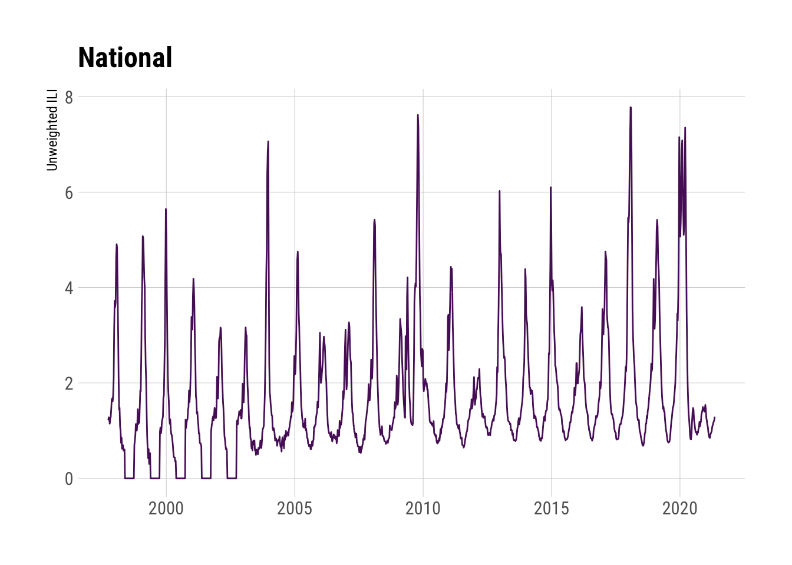

[](https://www.repostatus.org/#active)
[](https://keybase.io/hrbrmstr)

[](https://travis-ci.org/hrbrmstr/cdcfluview)
[](https://codecov.io/gh/hrbrmstr/cdcfluview)
[](https://cranchecks.info/pkgs/cdcfluview)
[](https://www.r-pkg.org/pkg/cdcfluview)


# I M P O R T A N T

The CDC migrated to a new non-Flash portal and back-end APIs changed.
This is a complete reimagining of the package and — as such — all your
code is going to break…eventually. Older functions have been deprecated
with warnings and will be removed at some point.

All folks providing feedback, code or suggestions will be added to the
DESCRIPTION file. Please include how you would prefer to be cited in any
issues you file.

If there’s a particular data set from
<https://www.cdc.gov/flu/weekly/fluviewinteractive.htm> that you want
and that isn’t in the package, please file it as an issue and be as
specific as you can (screen shot if possible).

# :mask: cdcfluview

Retrieve Flu Season Data from the United States Centers for Disease
Control and Prevention (‘CDC’) ‘FluView’ Portal

## Description

The U.S. Centers for Disease Control (CDC) maintains a portal
<https://gis.cdc.gov/grasp/fluview/fluportaldashboard.html> for accessing
state, regional and national influenza statistics as well as Mortality
Surveillance Data. The Flash interface makes it difficult and
time-consuming to select and retrieve influenza data. This package
provides functions to access the data provided by the portal’s
underlying API.

## What’s Inside The Tin

The following functions are implemented:

  - `age_group_distribution`: Age Group Distribution of Influenza
    Positive Tests Reported by Public Health Laboratories
  - `cdc_basemap`: Retrieve CDC U.S. Basemaps
  - `geographic_spread`: State and Territorial Epidemiologists Reports
    of Geographic Spread of Influenza
  - `get_weekly_flu_report`: Retrieves (high-level) weekly (XML)
    influenza surveillance report from the CDC
  - `hospitalizations`: Laboratory-Confirmed Influenza Hospitalizations
  - `ilinet`: Retrieve ILINet Surveillance Data
  - `ili_weekly_activity_indicators`: Retrieve weekly state-level ILI
    indicators per-state for a given season
  - `pi_mortality`: Pneumonia and Influenza Mortality Surveillance
  - `state_data_providers`: Retrieve metadata about U.S. State CDC
    Provider Data
  - `surveillance_areas`: Retrieve a list of valid sub-regions for each
    surveillance area.
  - `who_nrevss`: Retrieve WHO/NREVSS Surveillance Data

MMWR ID Utilities:

  - `mmwrid_map`: MMWR ID to Calendar Mappings
  - `mmwr_week`: Convert a Date to an MMWR day+week+year
  - `mmwr_weekday`: Convert a Date to an MMWR weekday
  - `mmwr_week_to_date`: Convert an MMWR year+week or year+week+day to a
    Date object

Deprecated functions:

  - `get_flu_data`: Retrieves state, regional or national influenza
    statistics from the CDC (deprecated)
  - `get_hosp_data`: Retrieves influenza hospitalization statistics from
    the CDC (deprecated)
  - `get_state_data`: Retrieves state/territory-level influenza
    statistics from the CDC (deprecated)

The following data sets are included:

  - `hhs_regions`: HHS Region Table (a data frame with 59 rows and 4
    variables)
  - `census_regions`: Census Region Table (a data frame with 51 rows and
    2 variables)
  - `mmwrid_map`: MMWR ID to Calendar Mappings (it is exported &
    available, no need to use `data()`)

## NOTE

All development happens in branches now with only critical fixes being
back-ported to the master branch when necessary.

## Installation

``` r
# CRAN
install.packages("cdcfluview")

# main branch
remotes::install_git("https://git.rud.is/hrbrmstr/cdcfluview.git")
remotes::install_git("https://sr.ht/~hrbrmstr/cdcfluview")
remotes::install_git("https://gitlab.com/hrbrmstr/cdcfluview")
remotes::install_github("hrbrmstr/cdcfluview")
```

## Usage

``` r
library(cdcfluview)
library(hrbrthemes)
library(tidyverse)

# current versoon
packageVersion("cdcfluview")
## [1] '0.9.2'
```

### Age Group Distribution of Influenza Positive Tests Reported by Public Health Laboratories

``` r
glimpse(age_group_distribution(years=2015))
## Rows: 1,872
## Columns: 16
## $ sea_label         <chr> "2015-16", "2015-16", "2015-16", "2015-16", "2015-16", "2015-16", "2015-16", "2015-16", "20…
## $ age_label         <fct> 0-4 yr, 0-4 yr, 0-4 yr, 0-4 yr, 0-4 yr, 0-4 yr, 0-4 yr, 0-4 yr, 0-4 yr, 0-4 yr, 0-4 yr, 0-4…
## $ vir_label         <fct> A (Subtyping not Performed), A (Subtyping not Performed), A (Subtyping not Performed), A (S…
## $ count             <int> 0, 1, 0, 1, 3, 0, 0, 0, 0, 0, 0, 0, 0, 0, 2, 2, 2, 3, 2, 2, 3, 3, 3, 0, 0, 2, 0, 1, 1, 0, 0…
## $ mmwrid            <int> 2806, 2807, 2808, 2809, 2810, 2811, 2812, 2813, 2814, 2815, 2816, 2817, 2818, 2819, 2820, 2…
## $ seasonid          <int> 55, 55, 55, 55, 55, 55, 55, 55, 55, 55, 55, 55, 55, 55, 55, 55, 55, 55, 55, 55, 55, 55, 55,…
## $ sea_description   <chr> "Season 2015-16", "Season 2015-16", "Season 2015-16", "Season 2015-16", "Season 2015-16", "…
## $ sea_startweek     <int> 2806, 2806, 2806, 2806, 2806, 2806, 2806, 2806, 2806, 2806, 2806, 2806, 2806, 2806, 2806, 2…
## $ sea_endweek       <int> 2857, 2857, 2857, 2857, 2857, 2857, 2857, 2857, 2857, 2857, 2857, 2857, 2857, 2857, 2857, 2…
## $ vir_description   <chr> "A-Unk", "A-Unk", "A-Unk", "A-Unk", "A-Unk", "A-Unk", "A-Unk", "A-Unk", "A-Unk", "A-Unk", "…
## $ vir_startmmwrid   <int> 1397, 1397, 1397, 1397, 1397, 1397, 1397, 1397, 1397, 1397, 1397, 1397, 1397, 1397, 1397, 1…
## $ vir_endmmwrid     <int> 3131, 3131, 3131, 3131, 3131, 3131, 3131, 3131, 3131, 3131, 3131, 3131, 3131, 3131, 3131, 3…
## $ wk_start          <date> 2015-10-04, 2015-10-11, 2015-10-18, 2015-10-25, 2015-11-01, 2015-11-08, 2015-11-15, 2015-1…
## $ wk_end            <date> 2015-10-10, 2015-10-17, 2015-10-24, 2015-10-31, 2015-11-07, 2015-11-14, 2015-11-21, 2015-1…
## $ year_wk_num       <int> 40, 41, 42, 43, 44, 45, 46, 47, 48, 49, 50, 51, 52, 1, 2, 3, 4, 5, 6, 7, 8, 9, 10, 11, 12, …
```

### Retrieve CDC U.S. Coverage Map

``` r
plot(cdc_basemap("national"))
```


``` r
plot(cdc_basemap("hhs"))
```


``` r
plot(cdc_basemap("census"))
```


``` r
plot(cdc_basemap("states"))
```


``` r
plot(cdc_basemap("spread"))
```


``` r
plot(cdc_basemap("surv"))
```


### State and Territorial Epidemiologists Reports of Geographic Spread of Influenza

``` r
glimpse(geographic_spread())
## Rows: 30,427
## Columns: 7
## $ statename         <chr> "Alabama", "Alabama", "Alabama", "Alabama", "Alabama", "Alabama", "Alabama", "Alabama", "Al…
## $ url               <chr> "http://adph.org/influenza/", "http://adph.org/influenza/", "http://adph.org/influenza/", "…
## $ website           <chr> "Influenza Surveillance", "Influenza Surveillance", "Influenza Surveillance", "Influenza Su…
## $ activity_estimate <chr> "No Activity", "No Activity", "No Activity", "Local Activity", "Sporadic", "Sporadic", "Spo…
## $ weekend           <date> 2003-10-04, 2003-10-11, 2003-10-18, 2003-10-25, 2003-11-01, 2003-11-08, 2003-11-15, 2003-1…
## $ season            <chr> "2003-04", "2003-04", "2003-04", "2003-04", "2003-04", "2003-04", "2003-04", "2003-04", "20…
## $ weeknumber        <chr> "40", "41", "42", "43", "44", "45", "46", "47", "48", "49", "50", "51", "52", "53", "1", "2…
```

### Laboratory-Confirmed Influenza Hospitalizations

``` r
surveillance_areas()
##    surveillance_area               region
## 1            flusurv       Entire Network
## 2                eip           California
## 3                eip             Colorado
## 4                eip          Connecticut
## 5                eip       Entire Network
## 6                eip              Georgia
## 7                eip             Maryland
## 8                eip            Minnesota
## 9                eip           New Mexico
## 10               eip    New York - Albany
## 11               eip New York - Rochester
## 12               eip               Oregon
## 13               eip            Tennessee
## 14              ihsp       Entire Network
## 15              ihsp                Idaho
## 16              ihsp                 Iowa
## 17              ihsp             Michigan
## 18              ihsp                 Ohio
## 19              ihsp             Oklahoma
## 20              ihsp         Rhode Island
## 21              ihsp         South Dakota
## 22              ihsp                 Utah

glimpse(fs_nat <- hospitalizations("flusurv"))
## Rows: 2,979
## Columns: 14
## $ surveillance_area <chr> "FluSurv-NET", "FluSurv-NET", "FluSurv-NET", "FluSurv-NET", "FluSurv-NET", "FluSurv-NET", "…
## $ region            <chr> "Entire Network", "Entire Network", "Entire Network", "Entire Network", "Entire Network", "…
## $ year              <int> 2017, 2017, 2017, 2017, 2017, 2017, 2017, 2017, 2017, 2017, 2017, 2017, 2017, 2018, 2018, 2…
## $ season            <int> 57, 57, 57, 57, 57, 57, 57, 57, 57, 57, 57, 57, 57, 57, 57, 57, 57, 57, 57, 57, 57, 57, 57,…
## $ wk_start          <date> 2017-10-01, 2017-10-08, 2017-10-15, 2017-10-22, 2017-10-29, 2017-11-05, 2017-11-12, 2017-1…
## $ wk_end            <date> 2017-10-07, 2017-10-14, 2017-10-21, 2017-10-28, 2017-11-04, 2017-11-11, 2017-11-18, 2017-1…
## $ year_wk_num       <int> 40, 41, 42, 43, 44, 45, 46, 47, 48, 49, 50, 51, 52, 1, 2, 3, 4, 5, 6, 7, 8, 9, 10, 11, 12, …
## $ rate              <dbl> 0.0, 0.1, 0.1, 0.1, 0.3, 0.4, 0.6, 0.8, 1.0, 1.3, 1.8, 2.5, 3.4, 4.2, 5.6, 6.8, 8.2, 10.3, …
## $ weeklyrate        <dbl> 0.0, 0.0, 0.0, 0.0, 0.1, 0.1, 0.2, 0.2, 0.2, 0.3, 0.6, 0.6, 0.9, 0.8, 1.3, 1.3, 1.4, 2.1, 1…
## $ age               <int> 2, 2, 2, 2, 2, 2, 2, 2, 2, 2, 2, 2, 2, 2, 2, 2, 2, 2, 2, 2, 2, 2, 2, 2, 2, 2, 2, 2, 2, 2, 3…
## $ age_label         <fct> 5-17 yr, 5-17 yr, 5-17 yr, 5-17 yr, 5-17 yr, 5-17 yr, 5-17 yr, 5-17 yr, 5-17 yr, 5-17 yr, 5…
## $ sea_label         <chr> "2017-18", "2017-18", "2017-18", "2017-18", "2017-18", "2017-18", "2017-18", "2017-18", "20…
## $ sea_description   <chr> "Season 2017-18", "Season 2017-18", "Season 2017-18", "Season 2017-18", "Season 2017-18", "…
## $ mmwrid            <int> 2910, 2911, 2912, 2913, 2914, 2915, 2916, 2917, 2918, 2919, 2920, 2921, 2922, 2923, 2924, 2…

ggplot(fs_nat, aes(wk_end, rate)) + 
  geom_line(aes(color=age_label, group=age_label)) +
  facet_wrap(~sea_description, scales="free_x") +
  scale_color_ipsum(name=NULL) +
  labs(x=NULL, y="Rates per 100,000 population",
       title="FluSurv-NET :: Entire Network :: All Seasons :: Cumulative Rate") +
  theme_ipsum_rc()
```


``` r

glimpse(hospitalizations("eip", years=2015))
## Rows: 270
## Columns: 14
## $ surveillance_area <chr> "EIP", "EIP", "EIP", "EIP", "EIP", "EIP", "EIP", "EIP", "EIP", "EIP", "EIP", "EIP", "EIP", …
## $ region            <chr> "Entire Network", "Entire Network", "Entire Network", "Entire Network", "Entire Network", "…
## $ year              <int> 2015, 2015, 2015, 2015, 2015, 2015, 2015, 2015, 2015, 2015, 2015, 2015, 2015, 2016, 2016, 2…
## $ season            <int> 55, 55, 55, 55, 55, 55, 55, 55, 55, 55, 55, 55, 55, 55, 55, 55, 55, 55, 55, 55, 55, 55, 55,…
## $ wk_start          <date> 2015-10-04, 2015-10-11, 2015-10-18, 2015-10-25, 2015-11-01, 2015-11-08, 2015-11-15, 2015-1…
## $ wk_end            <date> 2015-10-10, 2015-10-17, 2015-10-24, 2015-10-31, 2015-11-07, 2015-11-14, 2015-11-21, 2015-1…
## $ year_wk_num       <int> 40, 41, 42, 43, 44, 45, 46, 47, 48, 49, 50, 51, 52, 1, 2, 3, 4, 5, 6, 7, 8, 9, 10, 11, 12, …
## $ rate              <dbl> 0.4, 0.7, 1.0, 1.1, 1.4, 1.6, 1.9, 2.2, 2.4, 2.8, 3.4, 4.4, 5.0, 6.5, 7.6, 8.7, 10.4, 12.5,…
## $ weeklyrate        <dbl> 0.4, 0.3, 0.3, 0.2, 0.3, 0.3, 0.3, 0.3, 0.2, 0.4, 0.6, 0.9, 0.6, 1.5, 1.1, 1.1, 1.6, 2.1, 3…
## $ age               <int> 5, 5, 5, 5, 5, 5, 5, 5, 5, 5, 5, 5, 5, 5, 5, 5, 5, 5, 5, 5, 5, 5, 5, 5, 5, 5, 5, 5, 5, 5, 2…
## $ age_label         <fct> 65+ yr, 65+ yr, 65+ yr, 65+ yr, 65+ yr, 65+ yr, 65+ yr, 65+ yr, 65+ yr, 65+ yr, 65+ yr, 65+…
## $ sea_label         <chr> "2015-16", "2015-16", "2015-16", "2015-16", "2015-16", "2015-16", "2015-16", "2015-16", "20…
## $ sea_description   <chr> "Season 2015-16", "Season 2015-16", "Season 2015-16", "Season 2015-16", "Season 2015-16", "…
## $ mmwrid            <int> 2806, 2807, 2808, 2809, 2810, 2811, 2812, 2813, 2814, 2815, 2816, 2817, 2818, 2819, 2820, 2…

glimpse(hospitalizations("eip", "Colorado", years=2015))
## Rows: 270
## Columns: 14
## $ surveillance_area <chr> "EIP", "EIP", "EIP", "EIP", "EIP", "EIP", "EIP", "EIP", "EIP", "EIP", "EIP", "EIP", "EIP", …
## $ region            <chr> "Colorado", "Colorado", "Colorado", "Colorado", "Colorado", "Colorado", "Colorado", "Colora…
## $ year              <int> 2015, 2015, 2015, 2015, 2015, 2015, 2015, 2015, 2015, 2015, 2015, 2015, 2015, 2016, 2016, 2…
## $ season            <int> 55, 55, 55, 55, 55, 55, 55, 55, 55, 55, 55, 55, 55, 55, 55, 55, 55, 55, 55, 55, 55, 55, 55,…
## $ wk_start          <date> 2015-10-04, 2015-10-11, 2015-10-18, 2015-10-25, 2015-11-01, 2015-11-08, 2015-11-15, 2015-1…
## $ wk_end            <date> 2015-10-10, 2015-10-17, 2015-10-24, 2015-10-31, 2015-11-07, 2015-11-14, 2015-11-21, 2015-1…
## $ year_wk_num       <int> 40, 41, 42, 43, 44, 45, 46, 47, 48, 49, 50, 51, 52, 1, 2, 3, 4, 5, 6, 7, 8, 9, 10, 11, 12, …
## $ rate              <dbl> 0.0, 0.3, 0.6, 0.9, 0.9, 1.3, 1.3, 1.6, 1.6, 2.5, 2.8, 4.4, 6.3, 7.8, 9.7, 10.7, 12.5, 14.7…
## $ weeklyrate        <dbl> 0.0, 0.3, 0.3, 0.3, 0.0, 0.3, 0.0, 0.3, 0.0, 0.9, 0.3, 1.6, 1.9, 1.6, 1.9, 0.9, 1.9, 2.2, 2…
## $ age               <int> 5, 5, 5, 5, 5, 5, 5, 5, 5, 5, 5, 5, 5, 5, 5, 5, 5, 5, 5, 5, 5, 5, 5, 5, 5, 5, 5, 5, 5, 5, 2…
## $ age_label         <fct> 65+ yr, 65+ yr, 65+ yr, 65+ yr, 65+ yr, 65+ yr, 65+ yr, 65+ yr, 65+ yr, 65+ yr, 65+ yr, 65+…
## $ sea_label         <chr> "2015-16", "2015-16", "2015-16", "2015-16", "2015-16", "2015-16", "2015-16", "2015-16", "20…
## $ sea_description   <chr> "Season 2015-16", "Season 2015-16", "Season 2015-16", "Season 2015-16", "Season 2015-16", "…
## $ mmwrid            <int> 2806, 2807, 2808, 2809, 2810, 2811, 2812, 2813, 2814, 2815, 2816, 2817, 2818, 2819, 2820, 2…

glimpse(hospitalizations("ihsp", years=2015))
## Rows: 270
## Columns: 14
## $ surveillance_area <chr> "IHSP", "IHSP", "IHSP", "IHSP", "IHSP", "IHSP", "IHSP", "IHSP", "IHSP", "IHSP", "IHSP", "IH…
## $ region            <chr> "Entire Network", "Entire Network", "Entire Network", "Entire Network", "Entire Network", "…
## $ year              <int> 2015, 2015, 2015, 2015, 2015, 2015, 2015, 2015, 2015, 2015, 2015, 2015, 2015, 2016, 2016, 2…
## $ season            <int> 55, 55, 55, 55, 55, 55, 55, 55, 55, 55, 55, 55, 55, 55, 55, 55, 55, 55, 55, 55, 55, 55, 55,…
## $ wk_start          <date> 2015-10-04, 2015-10-11, 2015-10-18, 2015-10-25, 2015-11-01, 2015-11-08, 2015-11-15, 2015-1…
## $ wk_end            <date> 2015-10-10, 2015-10-17, 2015-10-24, 2015-10-31, 2015-11-07, 2015-11-14, 2015-11-21, 2015-1…
## $ year_wk_num       <int> 40, 41, 42, 43, 44, 45, 46, 47, 48, 49, 50, 51, 52, 1, 2, 3, 4, 5, 6, 7, 8, 9, 10, 11, 12, …
## $ rate              <dbl> 0.4, 0.8, 1.0, 1.2, 1.4, 1.4, 1.4, 1.6, 1.8, 2.0, 2.5, 3.1, 3.5, 4.1, 5.1, 6.5, 8.0, 10.0, …
## $ weeklyrate        <dbl> 0.4, 0.4, 0.2, 0.2, 0.2, 0.0, 0.0, 0.2, 0.2, 0.2, 0.4, 0.6, 0.4, 0.6, 1.0, 1.4, 1.4, 2.0, 4…
## $ age               <int> 5, 5, 5, 5, 5, 5, 5, 5, 5, 5, 5, 5, 5, 5, 5, 5, 5, 5, 5, 5, 5, 5, 5, 5, 5, 5, 5, 5, 5, 5, 2…
## $ age_label         <fct> 65+ yr, 65+ yr, 65+ yr, 65+ yr, 65+ yr, 65+ yr, 65+ yr, 65+ yr, 65+ yr, 65+ yr, 65+ yr, 65+…
## $ sea_label         <chr> "2015-16", "2015-16", "2015-16", "2015-16", "2015-16", "2015-16", "2015-16", "2015-16", "20…
## $ sea_description   <chr> "Season 2015-16", "Season 2015-16", "Season 2015-16", "Season 2015-16", "Season 2015-16", "…
## $ mmwrid            <int> 2806, 2807, 2808, 2809, 2810, 2811, 2812, 2813, 2814, 2815, 2816, 2817, 2818, 2819, 2820, 2…

glimpse(hospitalizations("ihsp", "Oklahoma", years=2015))
## Rows: 270
## Columns: 14
## $ surveillance_area <chr> "IHSP", "IHSP", "IHSP", "IHSP", "IHSP", "IHSP", "IHSP", "IHSP", "IHSP", "IHSP", "IHSP", "IH…
## $ region            <chr> "Oklahoma", "Oklahoma", "Oklahoma", "Oklahoma", "Oklahoma", "Oklahoma", "Oklahoma", "Oklaho…
## $ year              <int> 2010, 2010, 2010, 2010, 2010, 2010, 2010, 2010, 2010, 2010, 2010, 2010, 2010, 2011, 2011, 2…
## $ season            <int> 50, 50, 50, 50, 50, 50, 50, 50, 50, 50, 50, 50, 50, 50, 50, 50, 50, 50, 50, 50, 50, 50, 50,…
## $ wk_start          <date> 2010-10-03, 2010-10-10, 2010-10-17, 2010-10-24, 2010-10-31, 2010-11-07, 2010-11-14, 2010-1…
## $ wk_end            <date> 2010-10-09, 2010-10-16, 2010-10-23, 2010-10-30, 2010-11-06, 2010-11-13, 2010-11-20, 2010-1…
## $ year_wk_num       <int> 40, 41, 42, 43, 44, 45, 46, 47, 48, 49, 50, 51, 52, 1, 2, 3, 4, 5, 6, 7, 8, 9, 10, 11, 12, …
## $ rate              <dbl> 0.0, 0.0, 0.0, 0.0, 0.0, 0.0, 0.2, 0.2, 0.5, 0.7, 0.7, 1.4, 2.3, 2.5, 3.5, 4.6, 6.0, 7.8, 8…
## $ weeklyrate        <dbl> 0.0, 0.0, 0.0, 0.0, 0.0, 0.0, 0.2, 0.0, 0.2, 0.2, 0.0, 0.7, 0.9, 0.2, 0.9, 1.2, 1.4, 1.8, 0…
## $ age               <int> 3, 3, 3, 3, 3, 3, 3, 3, 3, 3, 3, 3, 3, 3, 3, 3, 3, 3, 3, 3, 3, 3, 3, 3, 3, 3, 3, 3, 3, 3, 8…
## $ age_label         <fct> 18-49 yr, 18-49 yr, 18-49 yr, 18-49 yr, 18-49 yr, 18-49 yr, 18-49 yr, 18-49 yr, 18-49 yr, 1…
## $ sea_label         <chr> "2010-11", "2010-11", "2010-11", "2010-11", "2010-11", "2010-11", "2010-11", "2010-11", "20…
## $ sea_description   <chr> "Season 2010-11", "Season 2010-11", "Season 2010-11", "Season 2010-11", "Season 2010-11", "…
## $ mmwrid            <int> 2545, 2546, 2547, 2548, 2549, 2550, 2551, 2552, 2553, 2554, 2555, 2556, 2557, 2558, 2559, 2…
```

### Retrieve ILINet Surveillance Data

``` r
walk(c("national", "hhs", "census", "state"), ~{
  
  ili_df <- ilinet(region = .x)
  
  print(glimpse(ili_df))
  
  ggplot(ili_df, aes(week_start, unweighted_ili, group=region, color=region)) +
    geom_line() +
    viridis::scale_color_viridis(discrete=TRUE) +
    labs(x=NULL, y="Unweighted ILI", title=ili_df$region_type[1]) +
    theme_ipsum_rc(grid="XY") +
    theme(legend.position = "none") -> gg
  
  print(gg)
  
})
## Rows: 1,173
## Columns: 16
## $ region_type      <chr> "National", "National", "National", "National", "National", "National", "National", "Nationa…
## $ region           <chr> "National", "National", "National", "National", "National", "National", "National", "Nationa…
## $ year             <int> 1997, 1997, 1997, 1997, 1997, 1997, 1997, 1997, 1997, 1997, 1997, 1997, 1997, 1997, 1998, 19…
## $ week             <int> 40, 41, 42, 43, 44, 45, 46, 47, 48, 49, 50, 51, 52, 53, 1, 2, 3, 4, 5, 6, 7, 8, 9, 10, 11, 1…
## $ weighted_ili     <dbl> 1.101480, 1.200070, 1.378760, 1.199200, 1.656180, 1.413260, 1.986800, 2.447490, 1.739010, 1.…
## $ unweighted_ili   <dbl> 1.216860, 1.280640, 1.239060, 1.144730, 1.261120, 1.282750, 1.445790, 1.647960, 1.675170, 1.…
## $ age_0_4          <dbl> 179, 199, 228, 188, 217, 178, 294, 288, 268, 299, 346, 348, 510, 579, 639, 690, 856, 824, 88…
## $ age_25_49        <dbl> NA, NA, NA, NA, NA, NA, NA, NA, NA, NA, NA, NA, NA, NA, NA, NA, NA, NA, NA, NA, NA, NA, NA, …
## $ age_25_64        <dbl> 157, 151, 153, 193, 162, 148, 240, 293, 206, 282, 268, 235, 404, 584, 759, 654, 679, 817, 76…
## $ age_5_24         <dbl> 205, 242, 266, 236, 280, 281, 328, 456, 343, 415, 388, 362, 492, 576, 810, 1121, 1440, 1600,…
## $ age_50_64        <dbl> NA, NA, NA, NA, NA, NA, NA, NA, NA, NA, NA, NA, NA, NA, NA, NA, NA, NA, NA, NA, NA, NA, NA, …
## $ age_65           <dbl> 29, 23, 34, 36, 41, 48, 70, 63, 69, 102, 81, 59, 113, 207, 207, 148, 151, 196, 233, 146, 119…
## $ ilitotal         <dbl> 570, 615, 681, 653, 700, 655, 932, 1100, 886, 1098, 1083, 1004, 1519, 1946, 2415, 2613, 3126…
## $ num_of_providers <dbl> 192, 191, 219, 213, 213, 195, 248, 256, 252, 253, 242, 190, 251, 250, 254, 255, 245, 245, 23…
## $ total_patients   <dbl> 46842, 48023, 54961, 57044, 55506, 51062, 64463, 66749, 52890, 67887, 61314, 47719, 48429, 5…
## $ week_start       <date> 1997-09-28, 1997-10-05, 1997-10-12, 1997-10-19, 1997-10-26, 1997-11-02, 1997-11-09, 1997-11…
## # A tibble: 1,173 x 16
##    region_type region  year  week weighted_ili unweighted_ili age_0_4 age_25_49 age_25_64 age_5_24 age_50_64 age_65
##    <chr>       <chr>  <int> <int>        <dbl>          <dbl>   <dbl>     <dbl>     <dbl>    <dbl>     <dbl>  <dbl>
##  1 National    Natio…  1997    40         1.10           1.22     179        NA       157      205        NA     29
##  2 National    Natio…  1997    41         1.20           1.28     199        NA       151      242        NA     23
##  3 National    Natio…  1997    42         1.38           1.24     228        NA       153      266        NA     34
##  4 National    Natio…  1997    43         1.20           1.14     188        NA       193      236        NA     36
##  5 National    Natio…  1997    44         1.66           1.26     217        NA       162      280        NA     41
##  6 National    Natio…  1997    45         1.41           1.28     178        NA       148      281        NA     48
##  7 National    Natio…  1997    46         1.99           1.45     294        NA       240      328        NA     70
##  8 National    Natio…  1997    47         2.45           1.65     288        NA       293      456        NA     63
##  9 National    Natio…  1997    48         1.74           1.68     268        NA       206      343        NA     69
## 10 National    Natio…  1997    49         1.94           1.62     299        NA       282      415        NA    102
## # … with 1,163 more rows, and 4 more variables: ilitotal <dbl>, num_of_providers <dbl>, total_patients <dbl>,
## #   week_start <date>
```



    ## Rows: 11,730
    ## Columns: 16
    ## $ region_type      <chr> "HHS Regions", "HHS Regions", "HHS Regions", "HHS Regions", "HHS Regions", "HHS Regions", "H…
    ## $ region           <fct> Region 1, Region 2, Region 3, Region 4, Region 5, Region 6, Region 7, Region 8, Region 9, Re…
    ## $ year             <int> 1997, 1997, 1997, 1997, 1997, 1997, 1997, 1997, 1997, 1997, 1997, 1997, 1997, 1997, 1997, 19…
    ## $ week             <int> 40, 40, 40, 40, 40, 40, 40, 40, 40, 40, 41, 41, 41, 41, 41, 41, 41, 41, 41, 41, 42, 42, 42, …
    ## $ weighted_ili     <dbl> 0.498535, 0.374963, 1.354280, 0.400338, 1.229260, 1.018980, 0.871791, 0.516017, 1.807610, 4.…
    ## $ unweighted_ili   <dbl> 0.623848, 0.384615, 1.341720, 0.450010, 0.901266, 0.747384, 1.152860, 0.422654, 2.258780, 4.…
    ## $ age_0_4          <dbl> 15, 0, 6, 12, 31, 2, 0, 2, 80, 31, 14, 0, 4, 21, 36, 2, 0, 0, 103, 19, 35, 0, 3, 19, 66, 2, …
    ## $ age_25_49        <dbl> NA, NA, NA, NA, NA, NA, NA, NA, NA, NA, NA, NA, NA, NA, NA, NA, NA, NA, NA, NA, NA, NA, NA, …
    ## $ age_25_64        <dbl> 7, 3, 7, 23, 24, 1, 4, 0, 76, 12, 14, 2, 19, 7, 23, 2, 0, 1, 76, 7, 15, 0, 17, 15, 29, 2, 3,…
    ## $ age_5_24         <dbl> 22, 0, 15, 11, 30, 2, 18, 3, 74, 30, 29, 0, 16, 14, 41, 2, 13, 8, 84, 35, 35, 0, 24, 18, 75,…
    ## $ age_50_64        <dbl> NA, NA, NA, NA, NA, NA, NA, NA, NA, NA, NA, NA, NA, NA, NA, NA, NA, NA, NA, NA, NA, NA, NA, …
    ## $ age_65           <dbl> 0, 0, 4, 0, 4, 0, 5, 0, 13, 3, 0, 0, 3, 2, 4, 0, 2, 0, 11, 1, 0, 1, 2, 2, 16, 0, 2, 0, 9, 2,…
    ## $ ilitotal         <dbl> 44, 3, 32, 46, 89, 5, 27, 5, 243, 76, 57, 2, 42, 44, 104, 6, 15, 9, 274, 62, 85, 1, 46, 54, …
    ## $ num_of_providers <dbl> 32, 7, 16, 29, 49, 4, 14, 5, 23, 13, 29, 7, 17, 31, 48, 4, 14, 6, 23, 12, 40, 7, 15, 33, 64,…
    ## $ total_patients   <dbl> 7053, 780, 2385, 10222, 9875, 669, 2342, 1183, 10758, 1575, 6987, 872, 2740, 11310, 9618, 68…
    ## $ week_start       <date> 1997-09-28, 1997-09-28, 1997-09-28, 1997-09-28, 1997-09-28, 1997-09-28, 1997-09-28, 1997-09…
    ## # A tibble: 11,730 x 16
    ##    region_type region  year  week weighted_ili unweighted_ili age_0_4 age_25_49 age_25_64 age_5_24 age_50_64 age_65
    ##    <chr>       <fct>  <int> <int>        <dbl>          <dbl>   <dbl>     <dbl>     <dbl>    <dbl>     <dbl>  <dbl>
    ##  1 HHS Regions Regio…  1997    40        0.499          0.624      15        NA         7       22        NA      0
    ##  2 HHS Regions Regio…  1997    40        0.375          0.385       0        NA         3        0        NA      0
    ##  3 HHS Regions Regio…  1997    40        1.35           1.34        6        NA         7       15        NA      4
    ##  4 HHS Regions Regio…  1997    40        0.400          0.450      12        NA        23       11        NA      0
    ##  5 HHS Regions Regio…  1997    40        1.23           0.901      31        NA        24       30        NA      4
    ##  6 HHS Regions Regio…  1997    40        1.02           0.747       2        NA         1        2        NA      0
    ##  7 HHS Regions Regio…  1997    40        0.872          1.15        0        NA         4       18        NA      5
    ##  8 HHS Regions Regio…  1997    40        0.516          0.423       2        NA         0        3        NA      0
    ##  9 HHS Regions Regio…  1997    40        1.81           2.26       80        NA        76       74        NA     13
    ## 10 HHS Regions Regio…  1997    40        4.74           4.83       31        NA        12       30        NA      3
    ## # … with 11,720 more rows, and 4 more variables: ilitotal <dbl>, num_of_providers <dbl>, total_patients <dbl>,
    ## #   week_start <date>


    ## Rows: 10,557
    ## Columns: 16
    ## $ region_type      <chr> "Census Regions", "Census Regions", "Census Regions", "Census Regions", "Census Regions", "C…
    ## $ region           <chr> "New England", "Mid-Atlantic", "East North Central", "West North Central", "South Atlantic",…
    ## $ year             <int> 1997, 1997, 1997, 1997, 1997, 1997, 1997, 1997, 1997, 1997, 1997, 1997, 1997, 1997, 1997, 19…
    ## $ week             <int> 40, 40, 40, 40, 40, 40, 40, 40, 40, 41, 41, 41, 41, 41, 41, 41, 41, 41, 42, 42, 42, 42, 42, …
    ## $ weighted_ili     <dbl> 0.4985350, 0.8441440, 0.7924860, 1.7640500, 0.5026620, 0.0542283, 1.0189800, 2.2587800, 2.04…
    ## $ unweighted_ili   <dbl> 0.6238480, 1.3213800, 0.8187380, 1.2793900, 0.7233800, 0.0688705, 0.7473840, 2.2763300, 3.23…
    ## $ age_0_4          <dbl> 15, 4, 28, 3, 14, 0, 2, 87, 26, 14, 4, 36, 0, 21, 0, 2, 93, 29, 35, 3, 65, 1, 19, 0, 2, 84, …
    ## $ age_25_49        <dbl> NA, NA, NA, NA, NA, NA, NA, NA, NA, NA, NA, NA, NA, NA, NA, NA, NA, NA, NA, NA, NA, NA, NA, …
    ## $ age_25_64        <dbl> 7, 8, 20, 8, 22, 3, 1, 71, 17, 14, 13, 23, 1, 14, 1, 2, 72, 11, 15, 11, 27, 5, 21, 0, 2, 55,…
    ## $ age_5_24         <dbl> 22, 12, 28, 20, 14, 0, 2, 71, 36, 29, 8, 39, 18, 22, 0, 2, 80, 44, 35, 16, 74, 9, 24, 2, 2, …
    ## $ age_50_64        <dbl> NA, NA, NA, NA, NA, NA, NA, NA, NA, NA, NA, NA, NA, NA, NA, NA, NA, NA, NA, NA, NA, NA, NA, …
    ## $ age_65           <dbl> 0, 4, 3, 6, 0, 0, 0, 15, 1, 0, 2, 2, 4, 3, 0, 0, 10, 2, 0, 3, 12, 6, 2, 0, 0, 9, 2, 0, 1, 14…
    ## $ ilitotal         <dbl> 44, 28, 79, 37, 50, 3, 5, 244, 80, 57, 27, 100, 23, 60, 1, 6, 255, 86, 85, 33, 178, 21, 66, …
    ## $ num_of_providers <dbl> 32, 13, 47, 17, 30, 9, 4, 16, 24, 29, 13, 46, 17, 32, 10, 4, 17, 23, 40, 12, 62, 16, 33, 10,…
    ## $ total_patients   <dbl> 7053, 2119, 9649, 2892, 6912, 4356, 669, 10719, 2473, 6987, 2384, 9427, 2823, 7591, 4947, 68…
    ## $ week_start       <date> 1997-09-28, 1997-09-28, 1997-09-28, 1997-09-28, 1997-09-28, 1997-09-28, 1997-09-28, 1997-09…
    ## # A tibble: 10,557 x 16
    ##    region_type region  year  week weighted_ili unweighted_ili age_0_4 age_25_49 age_25_64 age_5_24 age_50_64 age_65
    ##    <chr>       <chr>  <int> <int>        <dbl>          <dbl>   <dbl>     <dbl>     <dbl>    <dbl>     <dbl>  <dbl>
    ##  1 Census Reg… New E…  1997    40       0.499          0.624       15        NA         7       22        NA      0
    ##  2 Census Reg… Mid-A…  1997    40       0.844          1.32         4        NA         8       12        NA      4
    ##  3 Census Reg… East …  1997    40       0.792          0.819       28        NA        20       28        NA      3
    ##  4 Census Reg… West …  1997    40       1.76           1.28         3        NA         8       20        NA      6
    ##  5 Census Reg… South…  1997    40       0.503          0.723       14        NA        22       14        NA      0
    ##  6 Census Reg… East …  1997    40       0.0542         0.0689       0        NA         3        0        NA      0
    ##  7 Census Reg… West …  1997    40       1.02           0.747        2        NA         1        2        NA      0
    ##  8 Census Reg… Mount…  1997    40       2.26           2.28        87        NA        71       71        NA     15
    ##  9 Census Reg… Pacif…  1997    40       2.05           3.23        26        NA        17       36        NA      1
    ## 10 Census Reg… New E…  1997    41       0.643          0.816       14        NA        14       29        NA      0
    ## # … with 10,547 more rows, and 4 more variables: ilitotal <dbl>, num_of_providers <dbl>, total_patients <dbl>,
    ## #   week_start <date>


    ## Rows: 26,493
    ## Columns: 16
    ## $ region_type      <chr> "States", "States", "States", "States", "States", "States", "States", "States", "States", "S…
    ## $ region           <chr> "Alabama", "Alaska", "Arizona", "Arkansas", "California", "Colorado", "Connecticut", "Delawa…
    ## $ year             <int> 2010, 2010, 2010, 2010, 2010, 2010, 2010, 2010, 2010, 2010, 2010, 2010, 2010, 2010, 2010, 20…
    ## $ week             <int> 40, 40, 40, 40, 40, 40, 40, 40, 40, 40, 40, 40, 40, 40, 40, 40, 40, 40, 40, 40, 40, 40, 40, …
    ## $ weighted_ili     <dbl> NA, NA, NA, NA, NA, NA, NA, NA, NA, NA, NA, NA, NA, NA, NA, NA, NA, NA, NA, NA, NA, NA, NA, …
    ## $ unweighted_ili   <dbl> 2.1347700, 0.8751460, 0.6747210, 0.6960560, 1.9541200, 0.6606840, 0.0783085, 0.1001250, 2.80…
    ## $ age_0_4          <dbl> NA, NA, NA, NA, NA, NA, NA, NA, NA, NA, NA, NA, NA, NA, NA, NA, NA, NA, NA, NA, NA, NA, NA, …
    ## $ age_25_49        <dbl> NA, NA, NA, NA, NA, NA, NA, NA, NA, NA, NA, NA, NA, NA, NA, NA, NA, NA, NA, NA, NA, NA, NA, …
    ## $ age_25_64        <dbl> NA, NA, NA, NA, NA, NA, NA, NA, NA, NA, NA, NA, NA, NA, NA, NA, NA, NA, NA, NA, NA, NA, NA, …
    ## $ age_5_24         <dbl> NA, NA, NA, NA, NA, NA, NA, NA, NA, NA, NA, NA, NA, NA, NA, NA, NA, NA, NA, NA, NA, NA, NA, …
    ## $ age_50_64        <dbl> NA, NA, NA, NA, NA, NA, NA, NA, NA, NA, NA, NA, NA, NA, NA, NA, NA, NA, NA, NA, NA, NA, NA, …
    ## $ age_65           <dbl> NA, NA, NA, NA, NA, NA, NA, NA, NA, NA, NA, NA, NA, NA, NA, NA, NA, NA, NA, NA, NA, NA, NA, …
    ## $ ilitotal         <dbl> 249, 15, 172, 18, 632, 134, 3, 4, 73, NA, 647, 20, 19, 505, 65, 10, 39, 19, 391, 22, 117, 16…
    ## $ num_of_providers <dbl> 35, 7, 49, 15, 112, 14, 12, 13, 4, NA, 62, 18, 12, 74, 44, 6, 40, 14, 41, 30, 17, 56, 47, 17…
    ## $ total_patients   <dbl> 11664, 1714, 25492, 2586, 32342, 20282, 3831, 3995, 2599, NA, 40314, 1943, 4579, 39390, 1252…
    ## $ week_start       <date> 2010-10-03, 2010-10-03, 2010-10-03, 2010-10-03, 2010-10-03, 2010-10-03, 2010-10-03, 2010-10…
    ## # A tibble: 26,493 x 16
    ##    region_type region  year  week weighted_ili unweighted_ili age_0_4 age_25_49 age_25_64 age_5_24 age_50_64 age_65
    ##    <chr>       <chr>  <int> <int>        <dbl>          <dbl>   <dbl>     <dbl>     <dbl>    <dbl>     <dbl>  <dbl>
    ##  1 States      Alaba…  2010    40           NA         2.13        NA        NA        NA       NA        NA     NA
    ##  2 States      Alaska  2010    40           NA         0.875       NA        NA        NA       NA        NA     NA
    ##  3 States      Arizo…  2010    40           NA         0.675       NA        NA        NA       NA        NA     NA
    ##  4 States      Arkan…  2010    40           NA         0.696       NA        NA        NA       NA        NA     NA
    ##  5 States      Calif…  2010    40           NA         1.95        NA        NA        NA       NA        NA     NA
    ##  6 States      Color…  2010    40           NA         0.661       NA        NA        NA       NA        NA     NA
    ##  7 States      Conne…  2010    40           NA         0.0783      NA        NA        NA       NA        NA     NA
    ##  8 States      Delaw…  2010    40           NA         0.100       NA        NA        NA       NA        NA     NA
    ##  9 States      Distr…  2010    40           NA         2.81        NA        NA        NA       NA        NA     NA
    ## 10 States      Flori…  2010    40           NA        NA           NA        NA        NA       NA        NA     NA
    ## # … with 26,483 more rows, and 4 more variables: ilitotal <dbl>, num_of_providers <dbl>, total_patients <dbl>,
    ## #   week_start <date>


### Retrieve weekly state-level ILI indicators per-state for a given season

``` r
ili_weekly_activity_indicators(2017)
## # A tibble: 2,805 x 8
##    statename      url                website   activity_level activity_level_label weekend    season  weeknumber
##  * <chr>          <chr>              <chr>              <dbl> <chr>                <date>     <chr>        <dbl>
##  1 Virgin Islands http://doh.vi.gov/ Influenza              0 Insufficient Data    2017-10-07 2017-18         40
##  2 Virgin Islands http://doh.vi.gov/ Influenza              0 Insufficient Data    2017-10-14 2017-18         41
##  3 Virgin Islands http://doh.vi.gov/ Influenza              0 Insufficient Data    2017-10-21 2017-18         42
##  4 Virgin Islands http://doh.vi.gov/ Influenza              0 Insufficient Data    2017-10-28 2017-18         43
##  5 Virgin Islands http://doh.vi.gov/ Influenza              0 Insufficient Data    2017-11-04 2017-18         44
##  6 Virgin Islands http://doh.vi.gov/ Influenza              0 Insufficient Data    2017-11-11 2017-18         45
##  7 Virgin Islands http://doh.vi.gov/ Influenza              0 Insufficient Data    2017-12-02 2017-18         48
##  8 Virgin Islands http://doh.vi.gov/ Influenza              0 Insufficient Data    2017-12-09 2017-18         49
##  9 Virgin Islands http://doh.vi.gov/ Influenza              0 Insufficient Data    2017-12-23 2017-18         51
## 10 Virgin Islands http://doh.vi.gov/ Influenza              0 Insufficient Data    2017-12-30 2017-18         52
## # … with 2,795 more rows

xdf <- map_df(2008:2017, ili_weekly_activity_indicators)

count(xdf, weekend, activity_level_label) %>% 
  complete(weekend, activity_level_label) %>% 
  ggplot(aes(weekend, activity_level_label, fill=n)) + 
  geom_tile(color="#c2c2c2", size=0.1) +
  scale_x_date(expand=c(0,0)) +
  viridis::scale_fill_viridis(name="# States", na.value="White") +
  labs(x=NULL, y=NULL, title="Weekly ILI Indicators (all states)") +
  coord_fixed(100/1) +
  theme_ipsum_rc(grid="") +
  theme(legend.position="bottom")
```


### Pneumonia and Influenza Mortality Surveillance

``` r
(nat_pi <- pi_mortality("national"))
## # A tibble: 337 x 19
##    seasonid baseline threshold percent_pni percent_complete number_influenza number_pneumonia all_deaths total_pni
##    <chr>       <dbl>     <dbl>       <dbl>            <dbl>            <dbl>            <dbl>      <dbl>     <dbl>
##  1 59         0.053     0.057       0.052                 1               16             2702      52444      2718
##  2 59         0.054     0.057       0.053                 1               16             2769      52858      2785
##  3 59         0.055     0.0580      0.055                 1               18             2976      54120      2994
##  4 59         0.0560    0.059       0.0560                1               30             2984      53906      3014
##  5 59         0.057     0.06        0.054                 1               31             2906      53971      2937
##  6 59         0.0580    0.062       0.0560                1               31             3061      55460      3092
##  7 59         0.059     0.063       0.0560                1               39             3092      55679      3131
##  8 59         0.06      0.064       0.054                 1               50             2992      55976      3042
##  9 59         0.062     0.065       0.055                 1               65             2971      55225      3036
## 10 59         0.063     0.066       0.06                  1               99             3305      56974      3404
## # … with 327 more rows, and 10 more variables: weeknumber <chr>, geo_description <chr>, age_label <chr>,
## #   week_start <date>, week_end <date>, year_week_num <int>, mmwrid <chr>, coverage_area <chr>, region_name <chr>,
## #   callout <chr>

select(nat_pi, week_end, percent_pni, baseline, threshold) %>% 
  gather(measure, value, -week_end) %>% 
  ggplot(aes(week_end, value)) + 
  geom_line(aes(group=measure, color=measure)) + 
  scale_y_percent() +
  scale_color_ipsum(name = NULL, labels=c("Baseline", "Percent P&I", "Threshold")) +
  labs(x=NULL, y="% of all deaths due to P&I",
       title="Percentage of all deaths due to pneumonia and influenza, National Summary") +
  theme_ipsum_rc(grid="XY") +
  theme(legend.position="bottom")
```


``` r

(st_pi <- pi_mortality("state", years=2015))
## # A tibble: 2,704 x 19
##    seasonid baseline threshold percent_pni percent_complete number_influenza number_pneumonia all_deaths total_pni
##    <chr>       <dbl>     <dbl>       <dbl>            <dbl>            <dbl>            <dbl>      <dbl>     <dbl>
##  1 55             NA        NA      0.046             0.962                0               43        935        43
##  2 55             NA        NA      0.036             0.835                0               29        811        29
##  3 55             NA        NA      0.054             0.833                0               44        809        44
##  4 55             NA        NA      0.07              0.947                0               64        920        64
##  5 55             NA        NA      0.053             0.926                0               48        900        48
##  6 55             NA        NA      0.057             0.987                0               55        959        55
##  7 55             NA        NA      0.052             1                    0               53       1023        53
##  8 55             NA        NA      0.063             1                    1               62       1002        63
##  9 55             NA        NA      0.0560            0.95                 0               52        923        52
## 10 55             NA        NA      0.054             0.954                0               50        927        50
## # … with 2,694 more rows, and 10 more variables: weeknumber <chr>, geo_description <chr>, age_label <chr>,
## #   week_start <date>, week_end <date>, year_week_num <int>, mmwrid <chr>, coverage_area <chr>, region_name <chr>,
## #   callout <chr>

(reg_pi <- pi_mortality("region", years=2015))
## # A tibble: 520 x 19
##    seasonid baseline threshold percent_pni percent_complete number_influenza number_pneumonia all_deaths total_pni
##    <chr>       <dbl>     <dbl>       <dbl>            <dbl>            <dbl>            <dbl>      <dbl>     <dbl>
##  1 55          0.064    0.072       0.07              1                    0              178       2525       178
##  2 55          0.065    0.073       0.064             1                    0              160       2512       160
##  3 55          0.066    0.074       0.0580            1                    1              141       2457       142
##  4 55          0.067    0.075       0.07              0.989                0              171       2426       171
##  5 55          0.068    0.077       0.065             1                    2              166       2565       168
##  6 55          0.07     0.078       0.067             0.984                1              162       2415       163
##  7 55          0.071    0.079       0.079             1                    0              198       2491       198
##  8 55          0.073    0.081       0.072             1                    1              176       2468       177
##  9 55          0.074    0.0820      0.067             0.959                3              154       2353       157
## 10 55          0.076    0.084       0.062             0.995                0              151       2441       151
## # … with 510 more rows, and 10 more variables: weeknumber <chr>, geo_description <chr>, age_label <chr>,
## #   week_start <date>, week_end <date>, year_week_num <int>, mmwrid <chr>, coverage_area <chr>, region_name <chr>,
## #   callout <chr>
```

### Retrieve metadata about U.S. State CDC Provider Data

``` r
state_data_providers()
## # A tibble: 59 x 5
##    statename     statehealthdeptname          url                                statewebsitename       statefluphonenum
##  * <chr>         <chr>                        <chr>                              <chr>                  <chr>           
##  1 Alabama       Alabama Department of Publi… "http://adph.org/influenza/"       Influenza Surveillance 334-206-5300    
##  2 Alaska        State of Alaska Health and … "http://dhss.alaska.gov/dph/Epi/i… Influenza Surveillanc… 907-269-8000    
##  3 Arizona       Arizona Department of Healt… "http://www.azdhs.gov/phs/oids/ep… Influenza & RSV Surve… 602-542-1025    
##  4 Arkansas      Arkansas Department of Heal… "http://www.healthy.arkansas.gov/… Communicable Disease … 501-661-2000    
##  5 California    California Department of Pu… "https://www.cdph.ca.gov/Programs… Influenza (Flu)        916-558-1784    
##  6 Colorado      Colorado Department of Publ… "https://www.colorado.gov/pacific… Influenza Surveillance 303-692-2000    
##  7 Connecticut   Connecticut Department of P… "https://portal.ct.gov/DPH/Epidem… Flu Statistics         860-509-8000    
##  8 Delaware      Delaware Health and Social … "http://dhss.delaware.gov/dhss/dp… Weekly Influenza Surv… 302-744-4700    
##  9 District of … District of Columbia Depart… "https://dchealth.dc.gov/flu "     Influenza Information  202-442-5955    
## 10 Florida       Florida Department of Health "http://www.floridahealth.gov/dis… Weekly Influenza Surv… 850-245-4300    
## # … with 49 more rows
```

### Retrieve WHO/NREVSS Surveillance Data

``` r
glimpse(xdat <- who_nrevss("national"))
## List of 3
##  $ combined_prior_to_2015_16: tibble [940 × 14] (S3: tbl_df/tbl/data.frame)
##   ..$ region_type              : chr [1:940] "National" "National" "National" "National" ...
##   ..$ region                   : chr [1:940] "National" "National" "National" "National" ...
##   ..$ year                     : int [1:940] 1997 1997 1997 1997 1997 1997 1997 1997 1997 1997 ...
##   ..$ week                     : int [1:940] 40 41 42 43 44 45 46 47 48 49 ...
##   ..$ total_specimens          : int [1:940] 1291 1513 1552 1669 1897 2106 2204 2533 2242 2607 ...
##   ..$ percent_positive         : num [1:940] 0 0.727 1.095 0.419 0.527 ...
##   ..$ a_2009_h1n1              : int [1:940] 0 0 0 0 0 0 0 0 0 0 ...
##   ..$ a_h1                     : int [1:940] 0 0 0 0 0 0 0 0 0 0 ...
##   ..$ a_h3                     : int [1:940] 0 0 3 0 9 0 3 5 14 11 ...
##   ..$ a_subtyping_not_performed: int [1:940] 0 11 13 7 1 6 4 17 22 28 ...
##   ..$ a_unable_to_subtype      : int [1:940] 0 0 0 0 0 0 0 0 0 0 ...
##   ..$ b                        : int [1:940] 0 0 1 0 0 0 1 1 1 1 ...
##   ..$ h3n2v                    : int [1:940] 0 0 0 0 0 0 0 0 0 0 ...
##   ..$ wk_date                  : Date[1:940], format: "1997-09-28" "1997-10-05" "1997-10-12" "1997-10-19" ...
##  $ public_health_labs       : tibble [233 × 13] (S3: tbl_df/tbl/data.frame)
##   ..$ region_type              : chr [1:233] "National" "National" "National" "National" ...
##   ..$ region                   : chr [1:233] "National" "National" "National" "National" ...
##   ..$ year                     : int [1:233] 2015 2015 2015 2015 2015 2015 2015 2015 2015 2015 ...
##   ..$ week                     : int [1:233] 40 41 42 43 44 45 46 47 48 49 ...
##   ..$ total_specimens          : int [1:233] 1139 1152 1198 1244 1465 1393 1458 1157 1550 1518 ...
##   ..$ a_2009_h1n1              : int [1:233] 4 5 10 9 4 11 17 17 27 38 ...
##   ..$ a_h3                     : int [1:233] 65 41 50 31 23 34 42 24 36 37 ...
##   ..$ a_subtyping_not_performed: int [1:233] 2 2 1 4 4 1 1 0 3 3 ...
##   ..$ b                        : int [1:233] 10 7 8 9 9 10 4 4 9 11 ...
##   ..$ bvic                     : int [1:233] 0 3 3 1 1 4 0 3 3 2 ...
##   ..$ byam                     : int [1:233] 1 0 2 4 4 2 4 9 12 11 ...
##   ..$ h3n2v                    : int [1:233] 0 0 0 0 0 0 0 0 0 0 ...
##   ..$ wk_date                  : Date[1:233], format: "2015-10-04" "2015-10-11" "2015-10-18" "2015-10-25" ...
##  $ clinical_labs            : tibble [233 × 11] (S3: tbl_df/tbl/data.frame)
##   ..$ region_type     : chr [1:233] "National" "National" "National" "National" ...
##   ..$ region          : chr [1:233] "National" "National" "National" "National" ...
##   ..$ year            : int [1:233] 2015 2015 2015 2015 2015 2015 2015 2015 2015 2015 ...
##   ..$ week            : int [1:233] 40 41 42 43 44 45 46 47 48 49 ...
##   ..$ total_specimens : int [1:233] 12029 13111 13441 13537 14687 15048 15250 15234 16201 16673 ...
##   ..$ total_a         : int [1:233] 84 116 97 98 97 122 84 119 145 140 ...
##   ..$ total_b         : int [1:233] 43 54 52 52 68 86 98 92 81 106 ...
##   ..$ percent_positive: num [1:233] 1.06 1.3 1.11 1.11 1.12 ...
##   ..$ percent_a       : num [1:233] 0.698 0.885 0.722 0.724 0.66 ...
##   ..$ percent_b       : num [1:233] 0.357 0.412 0.387 0.384 0.463 ...
##   ..$ wk_date         : Date[1:233], format: "2015-10-04" "2015-10-11" "2015-10-18" "2015-10-25" ...

mutate(xdat$combined_prior_to_2015_16, 
       percent_positive = percent_positive / 100) %>% 
  ggplot(aes(wk_date, percent_positive)) +
  geom_line() +
  scale_y_percent(name="% Positive") +
  labs(x=NULL, title="WHO/NREVSS Surveillance Data (National)") +
  theme_ipsum_rc(grid="XY")
```


``` r

who_nrevss("hhs", years=2016)
## $public_health_labs
## # A tibble: 520 x 13
##    region_type region   year  week total_specimens a_2009_h1n1  a_h3 a_subtyping_not…     b  bvic  byam h3n2v wk_date   
##    <chr>       <chr>   <int> <int>           <int>       <int> <int>            <int> <int> <int> <int> <int> <date>    
##  1 HHS Regions Region…  2016    40              31           0     6                0     0     0     0     0 2016-10-02
##  2 HHS Regions Region…  2016    40              31           0     6                0     0     2     0     0 2016-10-02
##  3 HHS Regions Region…  2016    40             112           2     2                0     0     0     0     0 2016-10-02
##  4 HHS Regions Region…  2016    40             112           1    11                0     1     2     0     0 2016-10-02
##  5 HHS Regions Region…  2016    40             204           0     7                0     0     0     1     0 2016-10-02
##  6 HHS Regions Region…  2016    40              39           1     1                0     0     0     0     0 2016-10-02
##  7 HHS Regions Region…  2016    40              24           0     2                0     0     1     0     0 2016-10-02
##  8 HHS Regions Region…  2016    40              46           2     8                0     0     0     0     0 2016-10-02
##  9 HHS Regions Region…  2016    40             186           3    27                0     0     0     3     0 2016-10-02
## 10 HHS Regions Region…  2016    40             113           0    17                0     0     0     0     0 2016-10-02
## # … with 510 more rows
## 
## $clinical_labs
## # A tibble: 520 x 11
##    region_type region     year  week total_specimens total_a total_b percent_positive percent_a percent_b wk_date   
##    <chr>       <chr>     <int> <int>           <int>   <int>   <int>            <dbl>     <dbl>     <dbl> <date>    
##  1 HHS Regions Region 1   2016    40             654       5       1            0.917     0.765     0.153 2016-10-02
##  2 HHS Regions Region 2   2016    40            1307      10       3            0.995     0.765     0.230 2016-10-02
##  3 HHS Regions Region 3   2016    40             941       1       4            0.531     0.106     0.425 2016-10-02
##  4 HHS Regions Region 4   2016    40            2960      46      63            3.68      1.55      2.13  2016-10-02
##  5 HHS Regions Region 5   2016    40            2386       8       5            0.545     0.335     0.210 2016-10-02
##  6 HHS Regions Region 6   2016    40            1914      22      13            1.83      1.15      0.679 2016-10-02
##  7 HHS Regions Region 7   2016    40             723       0       0            0         0         0     2016-10-02
##  8 HHS Regions Region 8   2016    40             913       8       0            0.876     0.876     0     2016-10-02
##  9 HHS Regions Region 9   2016    40             992       6       1            0.706     0.605     0.101 2016-10-02
## 10 HHS Regions Region 10  2016    40             590      14       0            2.37      2.37      0     2016-10-02
## # … with 510 more rows

who_nrevss("census", years=2016)
## $public_health_labs
## # A tibble: 468 x 13
##    region_type  region  year  week total_specimens a_2009_h1n1  a_h3 a_subtyping_not…     b  bvic  byam h3n2v wk_date   
##    <chr>        <chr>  <int> <int>           <int>       <int> <int>            <int> <int> <int> <int> <int> <date>    
##  1 Census Regi… New E…  2016    40              31           0     6                0     0     0     0     0 2016-10-02
##  2 Census Regi… Mid-A…  2016    40              50           0     8                0     0     2     0     0 2016-10-02
##  3 Census Regi… East …  2016    40             139           0     4                0     0     0     1     0 2016-10-02
##  4 Census Regi… West …  2016    40             103           0     6                0     0     1     0     0 2016-10-02
##  5 Census Regi… South…  2016    40             181           3    11                0     1     2     0     0 2016-10-02
##  6 Census Regi… East …  2016    40              24           0     0                0     0     0     0     0 2016-10-02
##  7 Census Regi… West …  2016    40              27           0     1                0     0     0     0     0 2016-10-02
##  8 Census Regi… Mount…  2016    40              54           3    10                0     0     0     1     0 2016-10-02
##  9 Census Regi… Pacif…  2016    40             289           3    41                0     0     0     2     0 2016-10-02
## 10 Census Regi… New E…  2016    41              14           0     2                0     0     0     0     0 2016-10-09
## # … with 458 more rows
## 
## $clinical_labs
## # A tibble: 468 x 11
##    region_type   region       year  week total_specimens total_a total_b percent_positive percent_a percent_b wk_date   
##    <chr>         <chr>       <int> <int>           <int>   <int>   <int>            <dbl>     <dbl>     <dbl> <date>    
##  1 Census Regio… New England  2016    40             654       5       1            0.917     0.765    0.153  2016-10-02
##  2 Census Regio… Mid-Atlant…  2016    40            1579      10       4            0.887     0.633    0.253  2016-10-02
##  3 Census Regio… East North…  2016    40            2176       6       5            0.506     0.276    0.230  2016-10-02
##  4 Census Regio… West North…  2016    40            1104       3       0            0.272     0.272    0      2016-10-02
##  5 Census Regio… South Atla…  2016    40            2785      43      62            3.77      1.54     2.23   2016-10-02
##  6 Census Regio… East South…  2016    40             844       4       4            0.948     0.474    0.474  2016-10-02
##  7 Census Regio… West South…  2016    40            1738      21      13            1.96      1.21     0.748  2016-10-02
##  8 Census Regio… Mountain     2016    40            1067       8       0            0.750     0.750    0      2016-10-02
##  9 Census Regio… Pacific      2016    40            1433      20       1            1.47      1.40     0.0698 2016-10-02
## 10 Census Regio… New England  2016    41             810       5       1            0.741     0.617    0.123  2016-10-09
## # … with 458 more rows

who_nrevss("state", years=2016)
## $public_health_labs
## # A tibble: 54 x 12
##    region_type region season_descript… total_specimens a_2009_h1n1 a_h3  a_subtyping_not… b     bvic  byam  h3n2v
##    <chr>       <chr>  <chr>            <chr>           <chr>       <chr> <chr>            <chr> <chr> <chr> <chr>
##  1 States      Alaba… Season 2016-17   570             3           227   1                2     15    14    0    
##  2 States      Alaska Season 2016-17   5222            14          905   3                252   2     11    0    
##  3 States      Arizo… Season 2016-17   2975            63          1630  0                5     227   578   0    
##  4 States      Arkan… Season 2016-17   121             0           51    0                0     4     0     0    
##  5 States      Calif… Season 2016-17   14074           184         4696  120              116   28    152   0    
##  6 States      Color… Season 2016-17   714             3           267   2                4     31    219   0    
##  7 States      Conne… Season 2016-17   1348            19          968   0                0     62    263   0    
##  8 States      Delaw… Season 2016-17   3090            5           659   4                11    27    127   1    
##  9 States      Distr… Season 2016-17   73              1           34    0                3     0     4     0    
## 10 States      Flori… Season 2016-17   <NA>            <NA>        <NA>  <NA>             <NA>  <NA>  <NA>  <NA> 
## # … with 44 more rows, and 1 more variable: wk_date <date>
## 
## $clinical_labs
## # A tibble: 2,808 x 11
##    region_type region         year  week total_specimens total_a total_b percent_positive percent_a percent_b wk_date   
##    <chr>       <chr>         <int> <int> <chr>           <chr>   <chr>   <chr>            <chr>     <chr>     <date>    
##  1 States      Alabama        2016    40 406             4       1       1.23             0.99      0.25      2016-10-02
##  2 States      Alaska         2016    40 <NA>            <NA>    <NA>    <NA>             <NA>      <NA>      2016-10-02
##  3 States      Arizona        2016    40 133             0       0       0                0         0         2016-10-02
##  4 States      Arkansas       2016    40 47              0       0       0                0         0         2016-10-02
##  5 States      California     2016    40 668             2       0       0.3              0.3       0         2016-10-02
##  6 States      Colorado       2016    40 260             0       0       0                0         0         2016-10-02
##  7 States      Connecticut    2016    40 199             3       0       1.51             1.51      0         2016-10-02
##  8 States      Delaware       2016    40 40              0       0       0                0         0         2016-10-02
##  9 States      District of …  2016    40 <NA>            <NA>    <NA>    <NA>             <NA>      <NA>      2016-10-02
## 10 States      Florida        2016    40 <NA>            <NA>    <NA>    <NA>             <NA>      <NA>      2016-10-02
## # … with 2,798 more rows
```

## cdcfluview Metrics

| Lang | \# Files |  (%) | LoC |  (%) | Blank lines |  (%) | \# Lines |  (%) |
| :--- | -------: | ---: | --: | ---: | ----------: | ---: | -------: | ---: |
| R    |       21 | 0.91 | 847 | 0.88 |         303 | 0.79 |      512 | 0.85 |
| Rmd  |        1 | 0.04 |  80 | 0.08 |          68 | 0.18 |       86 | 0.14 |
| make |        1 | 0.04 |  32 | 0.03 |          11 | 0.03 |        1 | 0.00 |

## Code of Conduct

Please note that this project is released with a Contributor Code of
Conduct. By participating in this project you agree to abide by its
terms.
